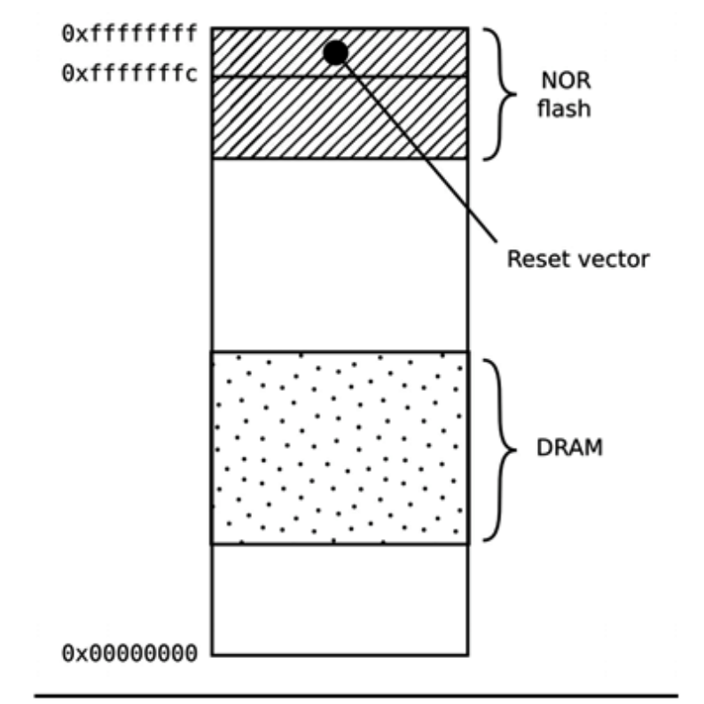
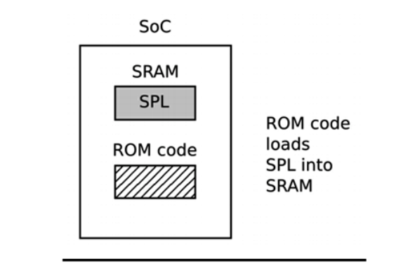
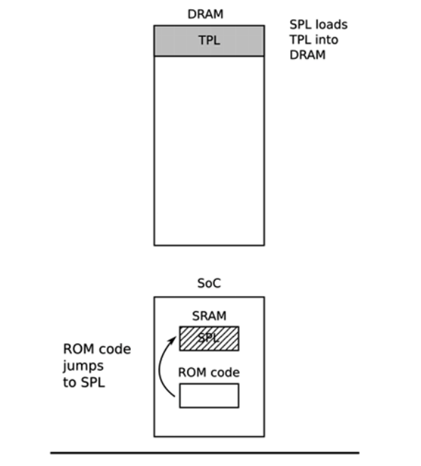
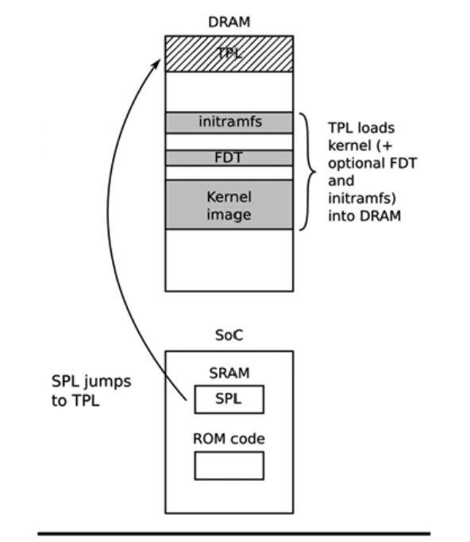

# 关于Bootloaders

Bootloader（引导加载程序）是嵌入式Linux的第二个元素。它负责启动系统并加载操作系统内核。在本章中，我们将研究Bootloader的角色，特别是它如何使用所谓设备树（也称为扁平化设备树或者FDT）的数据结构将控制权从自身传递给内核。我将介绍设备树的基础知识，因为这将帮助你遵循设备树中描述的连接将其与实际的硬件关联起来。
我将介绍流行的开源Bootloader U-Boot，并向您展示如何使用它来启动目标设备，以及如何自定义它，以便它可以在新设备上运行，以使用BeagleBone Black为例。
在本章中，我们将介绍以下主题：
- Bootloader有什么作用
- 启动顺序
- 从Bootloader转移到内核
- 设备树简介
- U-Boot

让我们开始吧！

## 技术要求
为完成本章节的示例程序，确保你满足如下要求：
- 一个基于Linux的主机系统，安装了设备树编译器、git、make、patch和u-boot-tools或等效工具
- 来自第二章“工具链学习”的适用于BeagleBone Black的Crosstool-NG工具链
- microSD 卡和读卡器
- USB转TTL 3.3V转接头
- BeagleBone Black
- 5V1A的直流电源

本章的所有代码都可以在本书的GitHub存储库的Chapter03文件夹中找到：https://github.com/PacktPublishing/MasteringEmbedded-Linux-Programming-Third-Edition。

## Bootloader是干啥的？
在嵌入式Linux系统中，bootloader主要做两件事：将系统初始化到基础状态和加载内核。事实上，第一个任务在某种程度是第二个任务的附属，因为它只需要让加载内核所需的系统工作。
当执行bootloader的第一行时，在通电或者重启之后，系统通常处于非常小的状态。DRAM控制器未设置，因此无法访问主存储器。同样，其他接口也不可用，因此不可以通过NAND闪存控制器、MMC控制器等访问的存储也不可用。通常情况下，开始阶段位唯一可用的资源是单个CPU，一些片上的静态资源和boot ROM。
系统引导程序由几个阶段的代码组成，每个阶段都会使更多的系统进行下一步运行。引导加载程序的最后一步是将内核加载到RAM中，并为其创建一个运行环境。引导加载程序和内核之间的接口细节是特定于架构的，但是不论是哪种，它都必须做两件事。首先，引导加载程序必须传递包含有关硬件配置信息的结构指针。其次，它必须将传递内核命令行的指针。
内核命令行是一个控制内核行为的文本字符串。一旦内核启动，bootloader就不需要了，它使用的内存也可以被回收了。
Bootloader的一项辅助工作是提供一种维护模式来更新启动配置，将新的启动镜像加载到内存，也可能会运行诊断程序。这通常会由一个简单的命令行用户接口来控制，常常是通过串口的。

### 启动顺序
几年前，在更简单的时代，只有一件重要的事就是将bootloader放在处理器的重置向量处的非易失性存储器中。NOR flash在当时非常常见，因为它可以直接映射到地址空间所有它是理想的存储方式。下图展示了这样的配置，重置向量在闪存的顶端0xfffffffc。Bootloader是链接的，所以在该位置有一条跳转指令，指向bootloader的开头：


从那时候起，在NOR闪存运行的bootloader可以初始化DRAM控制器使得主存储器（**DRAM**）可用，再将自身复制到DRAM中。一旦完全运行，bootloader就可以将内核从flash加载到DRAM中，并将控制权转移给它。
然而，一旦你离开了简单的线性可寻址存储介质（比如 NOR flash），启动顺序就会变成一个复杂的多阶段过程。每个SoC的细节都非常具体，但他们都会经历一下的阶段。
#### 阶段1 - ROM code
在缺乏可靠的外部存储器的情况下，重置或者通电后立即运行的程序必须存储在SoC芯片上，这也被称为ROM code。它在制造时就被加载到芯片中，因此ROM code是专有的，不能被开源代码等效取代。通常，它不包括初始化存储器控制器的代码，因为DRAM配置是高度特定于设备的，因此它只能使用不需要存储器控制器的SRAM（Static Random Access Memory）。
大多数嵌入式SoC设计都有少量的SRAM片上存储器，大小从4KB到几百KB不等：


ROM code能够将来自几个预编程位置之一的小块代码加载到SRAM中。例如，TI OMAP和Sitara试图从NAND闪存的前几页加载代码，或者从SPI（Serial Peripheral Interface）连接的闪存加载代码，或者从MMC设备的第一扇区（可以是eMMC芯片或者SD卡）加载代码，也可以从MMC设备第一分区上名为MLO的文件加载代码。如果从所有内存设备读取失败，则尝试从以太网、USB或者UART读取字节流；后来主要是作为在生产过程中将代码加载到闪存的一种方式提供的，而不是拥有以正常操作。大多数嵌入式SoC都有一类似方式工作的ROM code。在SoC中，SRAM并不够大，无法加载诸如U-Boot之类的完整bootloader，因此必须有一个称为SPL（secondary program loader）的中间加载程序。
在ROM code阶段结束时，SPL出现在SRAM中，并且ROM code跳转到SPL的开头。

#### 阶段2 - SPL
SPL必须设置内存控制器和其他重要部件，为TPL（Tertiary Program Loader）加载到DRAM做准备。SPL的功能受到SRAM大小的限制。它可以从存储设备列表中读取程序，正如ROM code一样，再次使用从闪存设备开始的预编程偏移。如果SPL内置了文件系统驱动程序，那么它可以从磁盘分区读取易读的文件名，比如u-boot.img。SPL通常不允许任何用户交互，但它可以打印版本信息和进度信息，你可以在控制台上看到这些信息。
下图解释了第2阶段的结构：


上图显示了从ROM code到SPL的跳转。当SPL到SRAM中执行时，它将TPL加载到DRAM中。在第二阶段结束后，TPL会存在在DRAM中，并且SPL会跳转到这块区域。
SPL可能是开源的，就像TI x-loader和Atmel AT91 Bootstrap的情况一样，但它们通常包含制造厂作为二进制blob提供的专有代码。

#### 阶段3 - TPL
在这个时候，我们可以运行一个完整的bootloader，例如U-Boot，我们将在本章稍后介绍它。通常这里有一个简单的命令行界面，让你可以执行维护任务，如将新的boot和内核镜像加载到闪存中，以及加载和启动内核，还有一种方法可以在无用户干预的情况下自动加载内核。
下图解释了第3阶段的结构：


上图展示了从SRAM中的SPL到DRAM的TPL的跳转。当TPL执行时，它将内核加载到DRAM中。如果需要，如果需要的话我们还可以选择将FDT和/或初始RAM附加到镜像中。无论哪种方式，当第三阶段结束后，内存中都应该有一个内核等待启动。
嵌入式bootloader通常在内核运行后就从内存里消失了，并且也不会在系统操纵中出现。在此之前，TPL需要将boot的控制权交给内核。

## 从bootloader到内核
当bootloader将控制权转移给内核的时候，它必须将一些基础的信息传递过去，包括如下内容：
- __machine number__，会被PowerPC和Arm平台在没有设备树支持的时候使用，来区分SoC的类型
- 已知的硬件信息，包括（至少应包括）物理RAM的大小和位置以及CPU的时钟速度
- 内核命令行
- 可选的，设备树二进制的大小和位置
- 可选的，初始RAM盘（initial RAM disk）的大小和位置，也被称为initial RAM file system（initramfs）

内核命令行是一个文本的ASCII字符串来控制Linux的行为，比如通过指定包含根文件系统的设备名称。我们将会在下一章节了解它的细节。常见的做法是以RAM盘提供根文件系统，在这种情况下，bootloader的责任是将RAM盘的内容载入内存。我们将在第五章“ 建立根文件系统”中讲述如何创建初始RAM盘。
这种传递信息的方式依赖于特定的架构并且在近年来也发生了变化。例如，在PowerPC，bootloader仅仅只需要传递一个板信息结构体的指针，而在Arm中，它传递一个指向A tags列表的指针。对于A tags，在内核代码的Documention/arm/Booting中有对这种格式的良好的介绍。
在这两种情况中，传递的信息量都非常有限，大部分信息都要在运行时发现或者作为平台信息硬编码到内核中。平台数据的广泛使用意味着每个板都必须为该平台配置和修改内核。需要一种更好的办法，也就是设备树。在Arm世界，随着Linux3.8的发布，从2013年2月开始真正摆脱A tags。如今，几乎所有的Arm系统都使用设备树来收集有关硬件平台细节的信息，从而允许单个内核二进制文件在各种平台运行。
既然我们已经了解了bootloader的功能、启动顺序的阶段以及它如何将控制权转移给内核，那么让我们学习如何配置bootloader，使其在流行的嵌入式SoC上运行。

## 设备树介绍
如果你正在使用Arm或者PowerPC的SoC，你几乎肯定会碰到设备树。本节旨在让你快速了解它是什么以及它是如何工作的。在本书的整个过程中，我们将反复回顾设备树的主题。
设备树是定义计算机系统硬件组成的一种灵活方式。请记住，设备树是静态数据而不是可执行代码。尽管可以将设备树与内核镜像绑定来适应无法单独加载的bootloader，但通常设备树由bootloader加载并传递给内核。
这种格式来自于Sun Microsystems bootloader也被称为OpenBoot，后来被标准化为开放固件标准也就是IEEE标准IEEE1275-1994。它被用于基于PowerPC的Macintosh计算机，因此是PowerPC Linux端的合理选择。之后，他又被许多Arm Linux实现大规模采用，并在一定范围被MIPS、MicroBlaze、ARC和其他架构采用。
我建议你去https://www.devicetree.org 了解更多信息。

### 设备树基础
Linux中包含了大量的设备树源文件在arch/$ARCH/boot/dts，并且这也是一个好的起点来学习设备树。在U-boot下的arch/$ARCH/dts下也有一小部分的源文件。如果你在第三方获得硬件，那dts是板级支持包的一部分，因此你应该与其他源文件同时收到它。
设备树将计算机系统表示为在层次结构中连接在一起的组件的集合，就像树。设备树以一个根节点开始，该根节点由正斜杠/表示，它包含表示系统硬件的后续节点。每个节点都有一个名称，并包含许多形式为name=“value”的特性。下面是一个简单的例子：
```shell
/dts-v1/;
/{
    model = "TI AM335x BeagleBone";
    compatible = "ti,am33xx";
    #address-cells = <1>;
    #size-cells = <1>;
    cpus {
        #address-cells = <1>;
        #size-cells = <0>;
        cpu@0 {
            compatible = "arm,cortex-a8";
            device_type = "cpu";
            reg = <0>;
        };
    };
    memory@0x80000000 {
        device_type = "memory";
        reg = <0x80000000 0x20000000>; /* 512 MB */
    };
};
```

在这里，我们有一个根节点，它包含了一个cpus节点和一个内存节点。cpus节点只包含了一个名为cpu@0的节点。这些节点的名称中往往包括一个@，后面紧跟着一个地址可以将该节点与同类型的其他节点分开来。当节点有reg属性时，必须要有@。
根节点与CPU节点都拥有兼容（compatible）属性。Linux内核使用该属性来寻找匹配的设备驱动，通过将其与每个设备驱动在of_device_id结构体导出的字符串进行比较（更多信息参阅第11章“连接设备驱动”）。

|重要提示：按照惯例，兼容属性的值由制造商名称和组件名称组成，以减少不同制造商制造的类似设备之间的混淆；也就是，ti，am33xx和arm，cortex-a8。在有多个驱动程序可以处理此设备的情况下，兼容属性有多个值也是很常见的。他们会首先列出了最合适的。|
---

CPU节点和memory节点都具备device_type属性，该属性描述设备的类型。节点的名称往往来源于device_type。

### reg属性
前面展示的memory和cpu节点都有reg属性，该属性是指寄存器空间中的一些系列单元。reg属性由表示实际物理地址和范围大小（长度）的两个值组成。两者都被写成0个或多个被称为单元的32位整数。因此，之前看到的memory节点指的是从0x80000000，长度为0x20000000的单个内存块。
当地址或者大小不能用32位整数表示的时候，对reg属性的理解就会变得复杂。例如，在一个64位寻址的设备上，你需要分别的两个单元对地址和大小进行表示：
```shell
/{
    #address-cells = <2>;
    #size-cells = <2>;
    memory@80000000 {
    device_type = "memory";
    reg = <0x00000000 0x80000000 0 0x80000000>;
    };
};
```

有关所需单元格数量的信息保存在祖先节点的#address-cells和#size_cells属性中。换句话说，你必须追溯节点的层次结构来找到#address-cells和#size_cells才能理解reg属性。如果该属性没有定义，那每个值都默认为1，但设备树的编写依赖于默认值是一个不好的做法。
现在，让我们回到cpu和cpus节点。CPU也有地址：在4核设备中，它们可能会被寻址为0、1、2、3。这可以被理解为一个没有深度的一维数组，所以这个大小是0。所以你可以看到，在cpus节点中#address cells=<1>和#size cells=<0>，而在其子节点cpu@0中，我们给它的reg属性分配了一个单独值，reg=<0>。

### 标签和中断
到目前为止，我们所描述的设备树结构都假设有一个单一的组件层次结构，但实际上有几个。除了组件和系统其它部分的明显数据连接外，它还可以连接到终端控制器、时钟源和电压调节器。为了表示这种连接，我们可以向节点添加标签，还可以引用其它节点的标签。这些标签有时被称为phandles，因为在编译设备树的时候，具有来自另一个节点的引用的节点会在一个称为phandle的属性中分配一个唯一的数值。如果你反编译设备树二进制文件，你可以看到它们。
以一个包含可以生成中断的LCD控制器和一个中断控制器的系统为例：
```shell
/dts-v1/;
{
    intc: interrupt-controller@48200000 {
        compatible = "ti,am33xx-intc";
        interrupt-controller;
        #interrupt-cells = <1>;
        reg = <0x48200000 0x1000>;
    };
    lcdc: lcdc@4830e000 {
        compatible = "ti,am33xx-tilcdc";
        reg = <0x4830e000 0x1000>;
        interrupt-parent = <&intc>;
        interrupts = <36>;
        ti,hwmods = "lcdc";
        status = "disabled";
    };
};
```

在这里，我们有一个带有intc标签的interrupt-controller@48200000节点。interrupt-controller属性表示其为中断控制器。与所有中断控制器一样，它有一个#interrupt-cells属性来表示它需要多少个单元来表示中断源。在这里，只有一个单元用来表示中断请求（IRQ）编号。其它中断控制权可能会使用更多的单元来表示中断，例如可以区分其是边缘触发还是水平触发。中断单元的序号与它们代表的含义在各自的中断控制器中被绑定。设备树的绑定可以在Linux源码中查看，具体在Documentation/devicetree/bindings/文件夹下。
关于lcdc@4830e000节点，它有一个interrupt-parent属性，它以标签的形式指明了连接到的中断控制器。它还有一个interrupts属性，值为36。注意这个节点也有它自己的标签lcdc，可以被别的地方使用。每个节点都可以有一个标签。

### 设备树包含文件
许多硬件在同一系列的SoC之间和使用同一SoC的板之间是通用的。这反映在设备树中，通用部分将拆分为包含文件，通常扩展名为.dtsi。Open Firmware标准将/include/定义为要使用的机制，如vexpress-v2p-ca9.dts中的这个片段所示：
```shell
/include/ "vexpress-v2m.dtsi"
```

通过仔细查看内核中的dts文件，你会发现从C语言引入的include语句；例如，在am335x-boneblack.dts:
```
#include "am33xx.dtsi"
#include "am335x-bone-common.dtsi"
```

下面是一个am33xx.dtsi的例子：
```
#include <dt-bindings/gpio/gpio.h>
#include <dt-bindings/pinctrl/am33xx.h>
#include <dt-bindings/clock/am3.h>
```

最后，include/dt-bindings/pinctrl/am33xx.h中包含了一些常见的C语言宏：
```c
#define PULL_DISABLE (1 << 3)
#define INPUT_EN (1 << 5)
#define SLEWCTRL_SLOW (1 << 6)
#define SLEWCTRL_FAST 0
```

如果使用Kbuild系统构建设备树源，则所有的问题都被解决，该系统可以使用C语言的预处理器，CPP，所有的#include和#define都会被处理为适合设备树编译器的文本。这种动机在前面的例子中有说明，这意味着设备树源可以使用和内核代码相同的常量定义。
当我们使用任何语法来包含文件时，节点都会重叠在一起并形成一个复合的树，其中外层的定义可以扩展或者修改内层的。例如，所有am33xx SoC的am33xx.dtsi都有第一个MMC控制器的接口，如下所示：
```
mmc1: mmc@48060000 {
    compatible = "ti,omap4-hsmmc";
    ti,hwmods = "mmc1";
    ti,dual-volt;
    ti,needs-special-reset;
    ti,needs-special-hs-handling;
    dmas = <&edma_xbar 24 0 0
        &edma_xbar 25 0 0>;
    dma-names = "tx", "rx";
    interrupts = <64>;
    reg = <0x48060000 0x1000>;
    status = "disabled";
};
```

注意，这里的status状态是disabled，这意味着不应该有设备驱动绑定到它，并且它还有一个mmc1的标签。
BeagleBone和BeagleBone-Black都有一个连接到mmc1的microSD卡接口。这就是为什么在am335x-bone-common.dtsi中，相同的节点被其标签引用；即&mmc1:
```
&mmc1 {
    status = "okay";
    bus-width = <0x4>;
    pinctrl-names = "default";
    pinctrl-0 = <&mmc1_pins>;
    cd-gpios = <&gpio0 6 GPIO_ACTIVE_LOW>;
};
```

status属性被设为okay，这就导致MMC设备驱动在BeagleBone的两个变体上的运行时与此接口绑定。此外，对标签的引用&mmc1_pins会被添加到引脚设置中。遗憾的是，这里没有足够的空间来描述引脚控制和引脚复用。你可以在Linux代码的Documentation/devicetre/bindings/pinctrl目录找到一些信息。
然而，mmc1接口连接到BeagleBone Black上的不同电压调节器。这使用am335x-boneblack.dts表示，这里你可以看到另一个对mmc1的引用，它通过vmmcsd_fixed标签与电压调节器关联起来：
```
&mmc1 {
    vmmc-supply = <&vmmcsd_fixed>;
};
```

像这样，对设备树文件进行层次划分，可以为我们提供更大的灵活性以及更少的冗余代码。

### 设备树编译
Bootloader与内核实际需要的是设备树的二进制形式，所以必须使用设备树编译器对设备树文件进行编译，这就是dtc。因此，dtc文件就被称为设备树二进制文件或者设备树blob。
Linux代码中就有一个dtc的副本，以scripts/dtc/dtc的形式存在，在很多的发行版中也可以以一个包提供。你可以使用它编译一个简单的设备树（不适用#include的设备树），如下：
```
$ dtc simpledts-1.dts -o simpledts-1.dtb
DTC: dts->dts on file "simpledts-1.dts"
```

请注意，dtc除了基本的语法检查之外，不会提供有效的错误信息，这意味着调试源文件中的一个拼写错误都将是一个漫长的过程。
如果希望构建更复杂的示例，你必须使用Kbuild内核，如第4章“配置和构建内核所示”。
与内核类似，bootloader可以使用设备树来初始化嵌入式SoC和其他外设。当你从大容量存储设备（如QSPI flash）中加载内核时，设备树至关重要。虽然嵌入式Linux提供了bootloader的选择，但我们只介绍其中的一种。接下来我们将深入研究bootloader。

## U-Boot
我们将重点关注U-Boot，因为它提供了数量可观的处理器架构和单板设备支持。它已经存在很长时间了，并且有一个良好的社区。
U-Boot，或称全名Das U-Boot最初是一个用于嵌入式PowerPC板的开源bootloader。然后，它被移植到基于Arm的板子上，后来又移植到其它架构，包括MIPS和SH。它由Denx Software Engineering公司托管和维护。https://www.denx.de/wiki/U-Boot 是一个好的起点，里有很多可用的信息。还有一个邮件列表 u-boot@
lists.denx.de ，你可以在这里https://lists.denx.de/listinfo/u-boot 填写表格来订阅。

### 构建U-Boot
获取源代码是第一步。与大多数项目一样，建议的方法是克隆.git存档并切换到你打算使用的标记。本例中的标记是撰写时的最新版本：
```shell
$ git clone git://git.denx.de/u-boot.git
$ cd u-boot
$ git checkout v2021.01
```

或者，你也可以从ftp://ftp.denx.de/pub/u-boot 获取。
在这里的configs/文件夹下，有超过1000个用于常见开发板和设备的配置文件，在大多数情况下，你可以根据文件名猜测应该使用哪一个，也可以通过查看board/下的README文件来获取更详细的信息，另外从网络论坛获得帮助也是个好方法。
以BeagleBone Black为例，我们会发现可能有一个名为configs/am335x_evm_defconfig的配置文件，以及 board/ti/am335x/README下am335芯片的README文件，其中包括如下描述**The binary produced by this board supports ... Beaglebone Black**。有了这些知识，为BeagleBone Black构建U-Boot就很简单了。您需要通过设置cross_COMPILE make变量，然后使用make[board]_defconfig类型的命令选择配置文件，将交叉编译器的前缀通知U-Boot。因此，要使用我们在第2章“学习工具链”中创建的Crosstool-NG编译器构建U-Boot，您需要键入以下内容：
```shell
$ source ../MELP/Chapter02/set-path-arm-cortex_a8-linux-gnueabihf
$ make am335x_evm_defconfig
$ make
```

结果如下：
- u-boot: ELF格式下的U-Boot，适合于调试器一起使用
- u-boot.map：符号表
- u-boot.bin：二进制格式下的U-Boot，适用于你的设备
- u-boot.img：u-boot.bin加上了U-Boot头，适用于上传给一个运行中的U-Boot副本
- u-boot.srec：Motorola S-record (SRECORD or SRE)格式下的U-Boot，适用于串行连接下的传输

如前所述，BeagleBone Black同样需要一个SPL。它被同时的构建出来，名为MLO：
```shell
$ ls -l MLO u-boot*
-rw-rw-r-- 1 frank frank 108260 Feb 8 15:24 MLO
-rwxrwxr-x 1 frank frank 6028304 Feb 8 15:24 u-boot
-rw-rw-r-- 1 frank frank 594076 Feb 8 15:24 u-boot.bin
-rw-rw-r-- 1 frank frank 20189 Feb 8 15:23 u-boot.cfg
-rw-rw-r-- 1 frank frank 10949 Feb 8 15:24 u-boot.cfg.
configs
-rw-rw-r-- 1 frank frank 54860 Feb 8 15:24 u-boot.dtb
-rw-rw-r-- 1 frank frank 594076 Feb 8 15:24 u-boot-dtb.bin
-rw-rw-r-- 1 frank frank 892064 Feb 8 15:24 u-boot-dtb.img
-rw-rw-r-- 1 frank frank 892064 Feb 8 15:24 u-boot.img
-rw-rw-r-- 1 frank frank 1722 Feb 8 15:24 u-boot.lds
-rw-rw-r-- 1 frank frank 802250 Feb 8 15:24 u-boot.map
-rwxrwxr-x 1 frank frank 539216 Feb 8 15:24 u-boot-nodtb.bin
-rwxrwxr-x 1 frank frank 1617810 Feb 8 15:24 u-boot.srec
-rw-rw-r-- 1 frank frank 211574 Feb 8 15:24 u-boot.sym
```

对其它目标来说，流程也是相似的。

### U-Boot的安装
首次在板上安装bootloader需要一些外在的帮助。如果板上又硬件调试接口，比如JTAG，通常可以直接将U-Boot的副本直接加载到RAM中并使其运行。从那之后，你可以使用U-Boot的命令，以便将U-Boot复制进入flash中。这方面的内容过于细节，超出了本书的范围。
很多SoC中都设计了内置boot ROM，可以从各种外部源读取boot代码，如SD卡或者USB大容量存储。BeagleBone Black中的am335x芯片就是这样，这使得尝试新软件变得很容易。
你还需要一个SD卡将镜像写入卡中。这有两种类型，插入USB端口的外部读卡器和许多笔记本电脑上自带的内部读卡器。当卡插入读卡器的时候，Linux会分辨设备名称，lsblk是一个有用的命令，可以查找到以及分配的设备。例如，当我将一张标称8GB的microSD卡插入读卡器时，将会看到：
```shell
$ lsblk
NAME MAJ:MIN RM SIZE RO TYPE MOUNTPOINT
sda 8:0 1 7.4G 0 disk 
└─sda1 8:1 1 7.4G 0 part /media/frank/6662-6262
nvme0n1 259:0 0 465.8G 0 disk 
├─nvme0n1p1 259:1 0 512M 0 part /boot/efi
├─nvme0n1p2 259:2 0 16M 0 part 
├─nvme0n1p3 259:3 0 232.9G 0 part 
└─nvme0n1p4 259:4 0 232.4G 0 part /
```

在这里，nvme0n1是我512G的硬盘，sda是我的microSD卡。它有一个单独的分区sda1，挂载到/media/frank/6662-6262目录。

|重要提示：虽然microSD卡的外部打印了8 GB，但内部只有7.4 GB。这在一定程度上是因为所使用的单位不同。广告中的容量以gigabytes, 109为单位，但软件报告的容量以gibibytes, 230为单位。gigabytes缩写为GB，而gibibytes缩写为GiB。这同样适用于KB和KiB以及MB和MiB。在这本书中，我尝试使用正确的单位。在这个SD卡上，8GB大约是7.4GiB。|
-------

如果我使用内置SD卡槽，将会看到：
```shell
$ lsblk
NAME MAJ:MIN RM SIZE RO TYPE MOUNTPOINT
mmcblk0 179:0 1 7.4G 0 disk 
└─mmcblk0p1 179:1 1 7.4G 0 part /media/frank/6662-6262
nvme0n1 259:0 0 465.8G 0 disk 
├─nvme0n1p1 259:1 0 512M 0 part /boot/efi
├─nvme0n1p2 259:2 0 16M 0 part 
├─nvme0n1p3 259:3 0 232.9G 0 part 
└─nvme0n1p4 259:4 0 232.4G 0 part /
```

在这里，microSD卡显示为mmcblk0，分区为mmcblk0p1。请注意，你使用的microSD卡的格式可能是不同的，所以你可能会看到具有不同挂载点的不同数量的分区。格式化SD卡时，设备名称非常重要。你绝对不想把硬盘误认为是SD卡之后将其格式化。这种情况不止一次的发生在我身上。因此，我在本书的代码存档里提供了一个名为MELP/format-sdcard.sh的shell脚本，它具有不少的检查，防止我们使用错误的设备名称。它的参数是microSD卡的设备名称，在第一个示例中是sdb，在第二个示例中是mmcblk0。以下是其使用用例：
```shell
$ MELP/format-sdcard.sh mmcblk0
```

这个脚本创建了两个分区，第一个分区64MiB，格式为FAT32，将包含bootloader，第二个分区1GiB，格式为ext4，你将在第5章“构建根文件系统”中使用它。当脚本应用于任何大于32GiB的驱动器时，脚本都会终止，因此如果你使用的是更大非microSD卡，请准备对其进行修改。格式化microSD卡之后，将其从读卡器中取出，再重新插入，以便自动挂载分区。在当前版本的Ubuntu中，这两个分区应该应该被挂载为media/[user]/boot和/media/[user]/rootfs。现在，你可以将SPL和U-Boot复制进入其中，如下：
```shell
$ cp MLO u-boot.img /media/frank/boot
```

最后，卸载掉它：
```shell
$ sudo umount /media/frank/boot
```

现在，在BeagleBone板没有电源的情况下，将microSD卡插入读卡器。插入串口线。串口应该以/dev/ttyUSB0的形式出现在你的电脑。启动合适的终端程序，如gtkterm、minicom或picocom，并以每秒115200比特（bps）的速度连接到端口，无需流量控制。gtkterm可能是最容易设置和使用的：
```shell
$ gtkterm -p /dev/ttyUSB0 -s 115200
```

如果遇到权限错误，你可能需要将自己添加到dialout组并重启来使用这个端口。
按住BeagleBone Black上的Boot Switch（引导开关）按钮（离microSD插槽最近），使用外部5V电源连接器为板通电，大约5秒钟后松开按钮。您应该在串行控制台上看到一些输出，然后是U-Boot提示：
```shell
U-Boot SPL 2021.01 (Feb 08 2021 - 15:23:22 -0800)
Trying to boot from MMC1


U-Boot 2021.01 (Feb 08 2021 - 15:23:22 -0800)

CPU : AM335X-GP rev 2.1
Model: TI AM335x BeagleBone Black
DRAM: 512 MiB
WDT: Started with servicing (60s timeout)
NAND: 0 MiB
MMC: OMAP SD/MMC: 0, OMAP SD/MMC: 1
Loading Environment from FAT... *** Warning - bad CRC, using 
default environment
<ethaddr> not set. Validating first E-fuse MAC
Net: eth2: ethernet@4a100000, eth3: usb_ether
Hit any key to stop autoboot: 0 
=>
```

点击键盘上的任意键，以阻止U-Boot在默认环境下自动启动。现在我们面前有一个U-Boot提示，让我们来看看U-Boot的进度。

### U-Boot使用
在本节中，我将描述一些可以使用U-Boot执行的常见任务。
通常，U-Boot通过串行端口提供命令行界面。它提供针对每个板定制的命令提示符。在这些示例中，我将使用=>。键入help打印出在此版本的U-Boot中配置的所有命令；键入help ＜command＞可打印出有关特定命令的详细信息。
BeagleBone Black的默认命令解释器非常简单。无法通过按左键或右键进行命令行编辑；按下Tab键没有命令补全；并且通过按下向上键没有命令历史记录。按下这些键中的任何一个都会中断您当前试图键入的命令，您必须键入Ctrl+C并重新开始。唯一可以安全使用的行编辑键是退格键。作为一个选项，您可以配置一个名为**Hush**的其它shell，它具有更复杂的交互式支持，包括命令行编辑。
默认数字格式为十六进制。以以下命令为例：
```shell
=> nand read 82000000 400000 200000
```

这将从NAND闪存开始的偏移量0x400000读取0x200000字节到RAM地址0x82000000。

### 环境变量
U-Boot广泛使用环境变量来存储和传递函数之间的信息，甚至创建脚本。环境变量是存储在内存区域中的简单name=value对。变量的初始化可以在板配置头文件中进行编码，如下所示：
```shell
#define CONFIG_EXTRA_ENV_SETTINGS
"myvar1=value1"
"myvar2=value2"
[…]
```

你可以使用setenv从U-Boot命令行创建和修改变量。例如，setenv foo bar将使用bar值创建foo变量。请注意，变量名和值之间是没有‘=’的。你可以通过将字符串设置为空字符串setenv foo来删除变量。你可以使用printenv将所有变量打印到控制台，或者使用printenv foo来打印单个变量。
如果U-Boot配置了存储环境的空间，则可以使用saveenv命令进行保存。如果有原始NAND或NOR闪存，则可以为此保留一个擦除块，通常将另一个用作冗余副本以防止损坏。如果有eMMC或SD卡存储，它可以存储在保留的扇区阵列中，也可以存储在磁盘分区中名为uboot.env的文件中。其他选项包括将其存储在通过I2C或SPI接口或非易失性RAM连接的串行EEPROM中。

### Boot镜像格式
U-Boot没有文件系统。实际上，它使用64字节的报头标记信息块，以便跟踪内容。我们使用mkimage命令为U-Boot准备文件，这个工具与Ubuntu上的u-boot-tools捆绑在一起。你还可以通过在U-Boot源代码树上运行make工具获取mkimage，之后再将其作为tools/mkimage调用。
下面是该命令的用法摘要：
```shell
$ mkimage
Error: Missing output filename
Usage: mkimage -l image
        -l ==> list image header information
    mkimage [-x] -A arch -O os -T type -C comp -a addr -e ep -n name -d data_file[:data_file...] image
        -A ==> set architecture to 'arch'
        -O ==> set operating system to 'os'
        -T ==> set image type to 'type'
        -C ==> set compression type 'comp'
        -a ==> set load address to 'addr' (hex)
        -e ==> set entry point to 'ep' (hex)
        -n ==> set image name to 'name'
        -d ==> use image data from 'datafile'
        -x ==> set XIP (execute in place)
    mkimage [-D dtc_options] [-f fit-image.its|-f auto|-F] [-b <dtb> [-b <dtb>]] [-i <ramdisk.cpio.gz>] fit-image
            <dtb> file is used with -f auto, it may occur multiple times.
        -D => set all options for device tree compiler
        -f => input filename for FIT source
        -i => input filename for ramdisk file
Signing / verified boot options: [-E] [-B size] [-k keydir] [-K dtb] [ -c <comment>] [-p addr] [-r] [-N engine]
        -E => place data outside of the FIT structure
        -B => align size in hex for FIT structure and header
        -k => set directory containing private keys
        -K => write public keys to this .dtb file
        -c => add comment in signature node
        -F => re-sign existing FIT image
        -p => place external data at a static position
        -r => mark keys used as 'required' in dtb
        -N => openssl engine to use for signing
    mkimage -V ==> print version information and exit
Use '-T list' to see a list of available image types
```

例如，为Arm处理器准备内核镜像，可以使用如下命令：
```shell
$ mkimage -A arm -O linux -T kernel -C gzip -a 0x80008000 -e 0x80008000 -n 'Linux' -d zImage uImage
```

在这个例子中，指定了arm架构，指定操作系统为linux，以及镜像的类型是内核。此外，压缩方案为gzip，加载地址为0x80008000，入口点与加载地址相同。最后，镜像名称为Linux，镜像数据文件名为zImage，生成的镜像名为uImage。

### 加载镜像
通常，您会从可移动存储（如SD卡）或网络中加载镜像。SD卡在U-Boot中由MMC驱动程序处理。用于将镜像加载到内存中的典型顺序如下：
```shell
=> mmc rescan
=> fatload mmc 0:1 82000000 uimage
reading uimage
4605000 bytes read in 254 ms (17.3 MiB/s)
=> iminfo 82000000
## Checking Image at 82000000 ...
Legacy image found
Image Name: Linux-3.18.0
Created: 2014-12-23 21:08:07 UTC
Image Type: ARM Linux Kernel Image (uncompressed)
Data Size: 4604936 Bytes = 4.4 MiB
Load Address: 80008000
Entry Point: 80008000
Verifying Checksum ... OK
```

其中mmc rescan命令可以重新初始化MMC驱动，可能是为了检测最新插入的SD卡。接下来，fatload用于从SD卡的FAT格式化分区读取文件，格式如下：
```shell
fatload <interface> [<dev[:part]> [<addr> [<filename> [bytes [pos]]]]]
```

如果<interface>是mmc，正如我们的例子，<dev[:part]>是指mmc接口从0开始计数的设备号（dev）与从1开始计数的分区号（part）。因此<0:1> 是指第一个设备上的第一个分区，对于microSD卡来说是mmc0（板载的eMMC是mmc1）。存储器位置0x82000000被选择在RAM当前未被使用的区域中。如果我们打算引导这个内核，我们必须确保当内核镜像被解压并位于运行时的0x80008000时，RAM的这一区域不会被覆盖。
对于从网络加载的镜像，必须使用TFTP（Trivial File Transfer Protocol）协议。这需要你在开发系统上安装TFTP守护程序tftpd并开始运行。你还必须在PC和目标板之间配置好防火墙，允许UDP端口69的TFTP协议通过。TFTP的默认配置只运行访问/var/lib/tftpboot目录。下一步是将要传输的文件复制到该目录中。然后假设你使用的是一对静态IP地址，这就不需要进一步的网络管理了，那么加载一组内核镜像文件的命令序列应该如下：
```shell
=> setenv ipaddr 192.168.159.42
=> setenv serverip 192.168.159.99
=> tftp 82000000 uImage
link up on port 0, speed 100, full duplex
Using cpsw device
TFTP from server 192.168.159.99; our IP address is 
192.168.159.42
Filename 'uImage'.
Load address: 0x82000000
Loading:
###############################################################
###############################################################
###############################################################
###############################################################
############################################################
3 MiB/s
done
Bytes transferred = 4605000 (464448 hex)
```

最终，让我们看一下如何镜像编程到NAND flash并读回，这是由NAND命令处理的。此示例通过TFTP加载内核镜像，并将其编程到flash：
```shell
=> tftpboot 82000000 uimage
=> nandecc hw
=> nand erase 280000 400000
NAND erase: device 0 offset 0x280000, size 0x400000
Erasing at 0x660000 -- 100% complete.
OK
=> nand write 82000000 280000 400000
NAND write: device 0 offset 0x280000, size 0x400000
4194304 bytes written: OK
```

现在，你可以使用nand read命令从flash中加载镜像了：
```shell
=> nand read 82000000 280000 400000
```

一旦内核被加载进RAM，你就可以启动它了。

### 启动Linux
bootm命令启动一个正在运行的内核映像。语法如下：
```shell
bootm [address of kernel] [address of ramdisk] [address of dtb].
```

内核镜像的地址是必要的，如果内核配置不需要ramdisk和dtb的地址，他俩可以省略。如果有dtb但是没有initramfs，那么第二个地址可以用破折号（-）代替。这看起来是这样的：
```shell
=> bootm 82000000 – 83000000
```

很明显，每次通电时都要输入一长串命令来启动主板是不可接受的。让我们看看如何使引导过程自动化。

#### 使用U-Boot脚本自动启动
U-Boot在环境变量中存储一系列的命令。如果特殊变量bootcmd中包含了一个脚本，那它将在上电bootdelay seconds之后运行。如果你在串行控制台上观察，你将看到延迟的倒计时归零。在此期间，你可以按任意键来终止倒计时并进入U-Boot的交互式界面。
创建脚本的方式很简单，虽然它不容易阅读。您只需附加用分号分隔的命令，分号前面必须有\转义符。因此，例如，要从闪存中的偏移加载内核映像并启动它，可以使用以下命令：
```shell
setenv bootcmd nand read 82000000 400000 200000\;bootm 82000000
```

我们现在知道如何使用U-boot在BeagleBone Black上引导内核。但是，我们如何将U-Boot移植到一个没有BSP的新板上呢？我们将在本章的剩余部分介绍这一点。

### 移植U-Boot到一个新板
假设你的硬件部门已经创建了一个名为Nova的新板，该板基于BeagleBone Black，并且您需要将U-Boot移植到它。你需要了解U-Boot代码的布局以及板配置机制的工作原理。在本节中，我将向你展示创建现有板的变体-BeagleBone Black-你可以将其作为进一步定制的基础。有相当多的文件需要做修改。我已将它们放在同一个patch文件MELP/Chapter03/0001-BSP-for-Nova.patch中。你可以简单的将该补丁应用于U-Boot版本2021.01的干净副本，如下所示：
```shell
$ cd u-boot
$ patch -p1 < MELP/Chapter03/0001-BSP-for-Nova.patch
```

如果你想使用不同版本的U-Boot，你必须对补丁进行一些更改才能干净地应用。
本节中的其余部分将介绍如何创建patch。如果你想一步一步的执行，你需要一个没有Nova BSP patch的U-Boot 2021.01的干净副本。我们将处理的主要目录如下：
- arch：包含特定于arm、mips和powerpc目录中每个受支持体系结构的代码。在每个体系结构中，都有一个子目录用于家族的每个成员；例如，在arch/arm/cmp/中，有体系结构变体的目录，包括amt926ejs、armv7和armv8。
- board：包含特定于板的代码。如果有来自同一供应商的多个板，可以将它们一起收集到一个子目录中。因此，BeagleBone所基于的am335x EVM板的支持在板/ti/am335x中。
- commn：包含核心函数，包括命令shell和可以从中调用的命令，每个函数都位于名为cmd_[command-name].c的文件中。
- doc：包含几个自述文件，描述U-Boot的各个方面。如果您想知道如何使用U-Boot移植，这是一个很好的起点。
- include：除了许多共享的头文件外，它还包含非常重要的include/configs/子目录，您可以在其中找到大多数板配置设置

Kconfig从Kconfig文件中提取配置信息并将整个系统配置存储在名为.config的文件中，这部分内容将在第4章“配置和构建内核”中进行详细描述。每个板都有一个默认配置，存储在configs/[板名]_defconfig中。对于Nova板，我们可以先复制EVM的配置：
```shell
$ cp configs/am335x_evm_defconfig configs/nova_defconfig
```

现在，编辑configs/nova_defconfig并将CONFIG_TARGET_NOVA=y插入到CONFIG_AM33XX=y之后，如下：
```shell
CONFIG_ARM=y
CONFIG_ARCH_CPU_INIT=y
CONFIG_ARCH_OMAP2PLUS=y
CONFIG_TI_COMMON_CMD_OPTIONS=y
CONFIG_AM33XX=y
CONFIG_TARGET_NOVA=y
CONFIG_SPL=y
[…]
```

请注意，CONFIG_ARM=y导致包含arch/ARM/Kconfig的内容，CONFIG-AM33XX=y导致包括arch/ARM/mach-omap2/AM33XX/Kconfig。
接下来，插入CONFIG_SYS_CUSTOM_LDSCRIPT=y和CONFIG_SYS_LDSCRIPT=="board/ti/nova/u-boot.lds"在 CONFIG_DISTRO_DEFAULTS=y之后，如下：
```shell
[…]
CONFIG_SPL=y
CONFIG_DEFAULT_DEVICE_TREE="am335x-evm"
CONFIG_DISTRO_DEFAULTS=y
CONFIG_SYS_CUSTOM_LDSCRIPT=y
CONFIG_SYS_LDSCRIPT="board/ti/nova/u-boot.lds"
CONFIG_SPL_LOAD_FIT=y
[…]
```

我们现在已经完成了对configs/nova_defconfig的修改。

#### 板的定制文件
每个板都会有一个子目录，名为board/[board name]或者board/[vendor]/[board name]，其中应该包括如下内容：
- Kconfig：包含了板的配置选项
- MAINTAINERS：包含了这个板是否被维护以及谁在维护的记录
- Makefile：用来构建板的定制代码
- README：包含了一些关于U-Boot移植的有用信息，比如涵盖了哪些硬件范围

此外，可能存在用于板特定功能的源文件。
我们的Nova板基于BeagleBone，而BeagleBone又基于TI am335x EVM。因此，我们应该复制am335x板文件：
```shell
$ mkdir board/ti/nova
$ cp -a board/ti/am335x/* board/ti/nova
```

接下来，编辑board/ti/nova/Kconfig，并将SYS_board设置为“nova”，以便在board/ti/nova中构建文件。然后，将SYS_CONFIG_NAME也设置为“nova”，以便使用include/configs/nova.h作为配置文件:
```shell
if TARGET_NOVA

config SYS_BOARD
    default "nova"

config SYS_VENDOR
    default "ti"

config SYS_SOC
    default "am33xx"

config SYS_CONFIG_NAME
    default "nova"
[…]
```

还有另一个文件需要修改。放置在board/ti/nova/u-boot.lds，包含了对board/ti/am335x/built-in.o的硬编码引用。如下所示，修改它：
```shell
{
    *(.__image_copy_start)
    *(.vectors)
    CPUDIR/start.o (.text*)
    board/ti/nova/built-in.o (.text*)
}
```

现在，我们需要将Nova的Kconfig文件链接到Kconfig文件链中。首先，编辑arch/arm/Kconfig，并在源代码“board/tcl/sl50/Kconfig”之后插入源代码“board/ti/nova/Kconfig”，如下所示：
```shell
[…]
source "board/st/stv0991/Kconfig"
source "board/tcl/sl50/Kconfig"
source "board/ti/nova/Kconfig"
source "board/toradex/colibri_pxa270/Kconfig"
source "board/variscite/dart_6ul/Kconfig"
[…]
```

然后，编辑arch/arm/mach-omap2/am33xx/Kconfig并添加配置TARGET_AM335X_EVM之后的TARGET_NOVA选项，如下所示：
```shell
[…]
config TARGET_NOVA
    bool "Support the Nova! board"
    select DM
    select DM_GPIO
    select DM_SERIAL
    select TI_I2C_BOARD_DETECT
    imply CMD_DM
    imply SPL_DM
    imply SPL_DM_SEQ_ALIAS
    imply SPL_ENV_SUPPORT
    imply SPL_FS_EXT4
    imply SPL_FS_FAT
    imply SPL_GPIO_SUPPORT
    imply SPL_I2C_SUPPORT
    imply SPL_LIBCOMMON_SUPPORT
    imply SPL_LIBDISK_SUPPORT
    imply SPL_LIBGENERIC_SUPPORT
    imply SPL_MMC_SUPPORT
    imply SPL_NAND_SUPPORT
    imply SPL_OF_LIBFDT
    imply SPL_POWER_SUPPORT
    imply SPL_SEPARATE_BSS
    imply SPL_SERIAL_SUPPORT
    imply SPL_SYS_MALLOC_SIMPLE
    imply SPL_WATCHDOG_SUPPORT
    imply SPL_YMODEM_SUPPORT
    help
        The Nova target board 
[…]
```

所有隐含的SPL_行都是必要的，这样U-Boot才能干净无误地构建。
现在，我们已经复制并修改了Nova板的板特定文件，让我们转到头文件。

#### 配置头文件
每个板在include/configs/中都有一个头文件，其中包含大部分配置信息。该文件由板的Kconfig文件中的SYS_CONFIG_NAME标识符指定。该文件的格式在U-Boot源代码树的顶层的README文件中有详细描述。为了我们的Nova板，只需将include/configs/am335x_evm.h复制到include/configs/Nova.h中，并作一些更改，如下所示：
```
[…]
#ifndef __CONFIG_NOVA_H
#define __CONFIG_NOVA_H
include <configs/ti_am335x_common.h>
#include <linux/sizes.h>
#undef CONFIG_SYS_PROMPT
#define CONFIG_SYS_PROMPT "nova!> "
#ifndef CONFIG_SPL_BUILD
# define CONFIG_TIMESTAMP
#endif
[…]
#endif /* ! __CONFIG_NOVA_H */
```

除了用__CONFIG_NOVA_H替换__CONFIG_AM335X_EVM_H之外，唯一需要做的更改是设置一个新的命令提示符，以便我们可以在运行时识别此引导加载程序。
随着源代码树的完全修改，我们现在准备为我们的自定义板构建U-Boot。

### 构建与测试
要为Nova板构建U-Boot，请选择您刚刚创建的配置：
```shell
$ source ../MELP/Chapter02/set-path-arm-cortex_a8-linux-gnueabihf
$ make distclean
$ make nova_defconfig
$ make
```

将MLO和u-boot.img复制到您之前创建的microSD卡的引导分区，然后引导板。您应该会看到这样的输出（注意命令提示符）：
```shell
U-Boot SPL 2021.01-dirty (Feb 08 2021 - 21:30:41 -0800)
Trying to boot from MMC1
U-Boot 2021.01-dirty (Feb 08 2021 - 21:30:41 -0800)
CPU : AM335X-GP rev 2.1
Model: TI AM335x BeagleBone Black
DRAM: 512 MiB
WDT: Started with servicing (60s timeout)
NAND: 0 MiB
MMC: OMAP SD/MMC: 0, OMAP SD/MMC: 1
Loading Environment from FAT... *** Warning - bad CRC, using 
default environment
<ethaddr> not set. Validating first E-fuse MAC
Net: eth2: ethernet@4a100000, eth3: usb_ether
Hit any key to stop autoboot: 0 
nova!>
```

您可以为所有这些更改创建一个补丁，方法是将它们签入Git并使用Git-format-patch命令：
```shell
$ git add .
$ git commit -m "BSP for Nova"
[detached HEAD 093ec472f6] BSP for Nova
12 files changed, 2379 insertions(+)
 create mode 100644 board/ti/nova/Kconfig
 create mode 100644 board/ti/nova/MAINTAINERS
 create mode 100644 board/ti/nova/Makefile
 create mode 100644 board/ti/nova/README
 create mode 100644 board/ti/nova/board.c
 create mode 100644 board/ti/nova/board.h
 create mode 100644 board/ti/nova/mux.c
 create mode 100644 board/ti/nova/u-boot.lds
 create mode 100644 configs/nova_defconfig
 create mode 100644 include/configs/nova.h
$ git format-patch -1
0001-BSP-for-Nova.patch
```

生成此补丁意味着了我们对U-Boot的TPL覆盖。U-Boot也可以被配置为完全绕过引导过程的TPL阶段。接下来，让我们研究一下引导Linux的另一种方法。

#### Falcon mode
我们已经习惯了这样的想法，即引导现代嵌入式处理器需要CPU引导ROM加载SPL，SPL加载u-boot.bin，然后加载Linux内核。您可能想知道是否有一种方法可以减少步骤数量，从而简化和加快引导过程。答案是U-Boot Falcon mode。这个想法很简单：让SPL直接加载内核映像，省去了u-boot.bin。没有用户交互，也没有脚本。它只需将一个内核从flash或eMMC中的已知位置加载到内存中，向它传递一个预先准备好的参数块，然后开始运行。配置Falcon模式的细节超出了本书的范围。如果您想了解更多信息，请查看doc/README.falcon
|重要提示：Falcon mode模式是以游隼命名的，游隼是所有鸟类中速度最快的，能够在俯冲中达到每小时200英里以上的速度。|
---

## 总结
每个系统都需要一个引bootloader来激活硬件并加载内核。U-Boot受到了许多开发人员的青睐，因为它支持大量的硬件，并且很容易移植到新设备。在本章中，我们学习了如何通过串行控制台从命令行交互检查和驱动U-Boot。这些命令行练习包括使用TFTP通过网络加载内核以进行快速迭代。最后，我们学习了如何通过为Nova板生成补丁将U-Boot移植到新设备。
在过去的几年里，嵌入式硬件的复杂性和不断增加的多样性导致了设备树作为描述硬件的一种方式的引入。设备树只是系统的文本表示，它被编译成设备树二进制文件（DTB），并在加载时传递给内核。这取决于内核来解释设备树，并为它在那里找到的设备加载和初始化驱动程序。
在使用中，U-Boot非常灵活，允许从大容量存储、闪存或网络加载镜像，然后启动。在介绍了引导Linux的一些复杂事务之后，在下一章中，我们将介绍这个过程的下一个阶段，因为嵌入式项目的第三个元素内核即将开始发挥作用。

