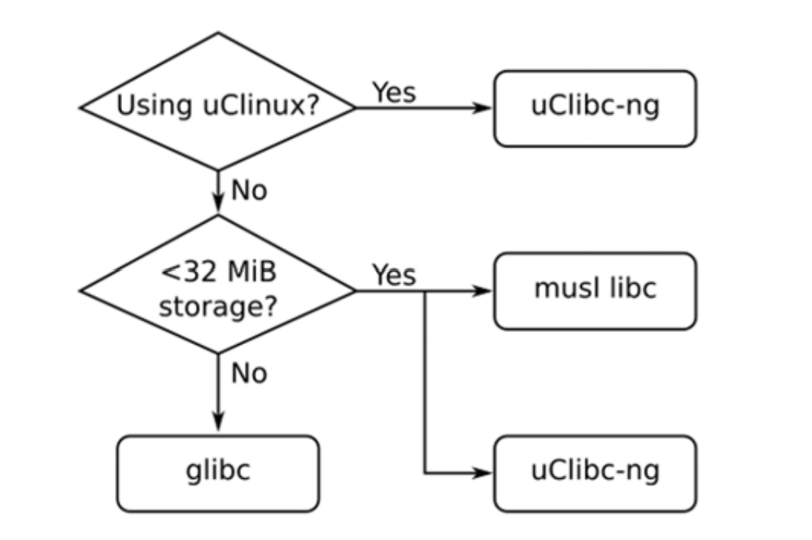

# 学习工具链
工具链是嵌入式Linux的第一个元素，也是你项目的起点。你可以使用它来编译将在你设备运行的所有代码。你在早期阶段做出的选择将对最后的结果产生深远影响。你的工具链应该能够为通过为你的处理器使用最佳的指令集来有效利用你的硬件。它应该支持你所需要的语言，并且具有可移植操作系统接口（**Portable Operating System Interface，POSIX**）和其他系统接口的可靠实现。
你的工具链应该在整个项目中保持不变。换句话说，工具链一旦选定，就需要一直使用它。项目期间编译器和开发库的不一致将会导致细微的错误。当然，如果发现有安全漏洞或者错误时还是应该更新你的工具链。
工具链的获取可以像下载和安装TAR文件一样简单，也可以像从源代码构建整个东西一样复杂。在本章中，我采用后一种方法，借助名为crosstool-NG的工具，以便展示创建工具链的详细信息。稍后，在第6章“选择构建系统”中，我将切换到使用构建系统生成的工具链，这是更常见的工具链获取的方法。当我们达到14章，从BusyBox runit开始时，我们将通过下载预构建的Linaro工具链与Buildroot一起使用来节约时间。
本章中，我们将会涉及到如下话题：
- 工具链介绍
- 寻找一个工具链
- 通过crosstool-NG工具构建一个工具链
- 剖析工具链
- 链接到库-静态链接与动态链接
- 交叉编译的艺术

## 技术要求
要按照示例进行操作，请确保您具有以下内容：
- 基于Linux的主机系统，带有autoconf、automake、bison、bzip2、cmake、flex、g++、gawk、gcc、gettext、git、gperf、help2man、libncurses5-dev、libstdc++6、libtool、libtool-bin、make、patch、python3-dev, rsync, texinfo, unzip, wget,和xz-util或者它们的等价替代。

我建议使用Ubuntu 20.04LTS或者更多版本，因为本章中的练习在撰写本文时均针对该Linux发行版进行了测试。这是在Ubuntu20.04LTS上安装所有必需软件包的命令：
```shell
$sudo  apt-get install autoconf automake bison bzip2 cmake \ 
flex g++ gawk gcc gettext git gperf help2man libncurses5-dev libstdc++6 libtool \
libtool-bin make patch python3-dev rsync texinfo unzip wget xz-utils
```

本章的所有代码都可以在本书Github存储库的Chapter02文件夹找到：https://github.com/PacktPublishing/MasteringEmbedded-Linux-Programming-Third-Edition 。

### 工具链介绍
工具链是一组可将源代码编译成可在目标设备上运行的可执行文件的工具，包括编译器、链接器和运行时库。最开始，您需要一个来构建嵌入式Linux系统的其他三个元素：bootloader、内核和根文件系统。它必须能够编译用汇编、C 和 C++编写的代码，因为这些是基本开源包中使用的语言。
通常，Linux的工具链都基于GNU（http://www.gnu.org）项目的组件，到本书写作时也是如此。然而，最近几年，**Clang**和**LLVM（Low Level Virtual Machine）** 已经发展到现在可以成为GNU工具链的可行替代。LLVM与基于GNU的工具链直接的一个主要区别是许可证，LLVM使用BSD许可证，而GNU使用GPL许可。
Clang也有一些技术优势，比如更快的编译速度和更好的诊断，与之同时GNU GCC和历史代码有良好的兼容性并且支持大类的架构和操作系统。在经历了几年的历程后，Clang现在可以编译嵌入式Linux所需的所有组件，并且是GNU的可行替代品。若要了解更多信息，请参考：https://www.kernel.org/doc/html/latest/kbuild/llvm.html。
在https://clang.llvm.org/docs/CrossCompilation.html 有一个很好的关于Clang进行交叉编译的介绍。如果您想将它用作嵌入式Linux构建系统的一部分，EmbToolkit(https://embtoolkit.org) 完全支持GNU和 LLVM/Clang工具链，并且许多人正在致力于将Clang与Buildroot和Yocto结合使用。我将在第 6 章选择构建系统中介绍嵌入式构建系统。同时，本章重点介绍GNU工具链，因为它仍然是Linux上最流行和最成熟的工具链。
一个标准的GNU工具链由三个主要部分组成：
- **Binutils**：一组实用的二进制程序，包括汇编器和链接器。它位于http://gnu.org/software/binutils。
- **GNU Compiler Collection（GCC）**：这些是C和其它语言的编译器，根据GCC的版本，包括C++、Objective-C、Objective-C++、Java、Fortran、Ada和Go。它们都使用一个共同的后端来生成汇编代码，这些代码将会被提供给GNU汇编器。它位于http://gcc.gnu.org/。
- **C库**：基于POSIX规范的标准化应用程序接口(application program interface，API)，它是应用程序与操作系统内核的主要接口。有几个C库需要考虑，我们将在本章之后看到。

除此之外，你还有需要Linux内核头文件的副本，其中包含了直接访问内核时所需的定义和常量。现在，你需要它们来编译C库，但稍后在编写与特定Linux设备交互的程序或者编译库的时候也需要它们，比如通过Linux帧缓存驱动程序显示图形。这不仅仅是在内核源代码的包含目录复制头文件的问题。这些头文件仅供在内核使用，并且包含了一些定义，如果这些定义处于原始状态编译Linux会导致冲突。
相反，您将需要生成一组经过清理的内核头文件，我在第5章构建根文件系统中对此进行了说明。
内核头文件是否从您将要使用的Linux的确切版本生成通常并不重要。由于内核接口始终向后兼容，因此只需要标头来自与您在目标上使用的内核相同或更早的内核。
大多数人会认为GNU调试器(**GNU Debugger，GDB**)也是工具链的一部分，通常在此时构建它。我将在第19章使用GDB调试中讨论GDB。
现在我们已经讨论了内核头文件并了解了工具链的组件是什么，让我们看看不同类型的工具链。

### 工具链的种类
从我们的目标考虑，总共有两种类型的工具链：
本地：此种工具链与其生成的程序在同一类型的系统（有时是同一实际系统）上运行。这是台式机与服务器上的常见情况，并且在一些种类的嵌入式设备上越来越流行。例如，运行Debian for ARM的树莓派具有自托管的本地编译器。
交叉：此工具链运行在与目标不同类型的系统，可以在台式机上快速开发，然后加载到嵌入式目标进行测试。

几乎所有嵌入式Linux开发都是使用交叉开发工具链完成的，一部分原因是大多数嵌入式设备不适合开发程序，它们缺少计算能力，内存和存储空间，而且这样可以使得主机与目标环境隔离。当目标系统与主机系统使用相同的体系结构（例如x86_64）时，第二点更加重要。在这种情况下，很容易咋主机上本地编译然后简单的将二进制文件复制到目标系统。
这在一定程度上是可行的，但是主机的发行版可能会比目标系统更频繁的进行更新，或者为目标构建代码的不同工程师使用了不同的主机开发库版本。随着时间推移，开发系统与目标系统会出现分歧，你也会违反工具链在整个项目周期应保持不变的原则。如果你可以保证主机与目标板的环境一直同步，那这种方式也是可以使用的。但是更好的办法是将主机与目标板隔离，而交叉工具链就是这样的办法。
另一方面，有一个支持本地开发的反驳观点。交叉开发产生了交叉编译目标所需的所有库和工具的负担。我们将在后面标题为交叉编译的艺术这一部分看到，交叉开发并不总是这么简单，因为许多的开源包设计时未考虑以这种方式构建。集成的构建工具，包括Buildroot和Yocto，可以通过封装规则来帮助交叉编译典型嵌入式系统中所需的一系列包。但是如果你想编译大量额外的包，本地编译可能是更好的选择。例如，使用交叉编译器为树莓派或者BeagleBone构建Debian发行版将非常困难。事实上，它们是本地编译的。
从头开始创建本地构建环境并不容易。首先你还是需要一个交叉编译器来在目标上创建本地构建环境，然后你可以使用它构建包。然后，为了在合理的时间范围内执行本地构建，你需要一个配置良好的目标板或者QEMU（Quick EMUlator）模拟目标来构建。
同时，在本章中，我将重点关注更主流的交叉编译环境，该环境相对易于设置与管理。我们将从了解一种目标CPU架构与另一种架构的区别开始。

### CPU架构
工具链必须根据目标CPU的能力来构建，其中包括以下内容：
- **CPU架构**：ARM，无内部互锁流水级的微处理器（**Microprocessor without Interlocked Pipelined Stages，MIPS**），x86_64等
- **大端或小端操作**：有些CPU可以在两种模式下运行，但每种CPU的机器码不同
- **浮点数支持**：并不是所有版本的嵌入式处理器都实现了硬件浮点单元，在这时，工具链必须配置为软件浮点库
- **应用程序二进制接口（Application Binary Interface，ABI）**：用于函数调用之间传递参数的调用约定

对于许多架构，ABI在整个处理器系列是不变的。但一个特别的例子是ARM，ARM在2000年代后期过渡到扩展应用二进制接口（**Extended Application Binary Interface，EABI**），这样以前的ABI就被称为旧应用程序二进制接口（**Old Application Binary Interface，OABI**）。虽然OABI是过时的标准，但是你还会看到对EABI的引用。此后，EABI根据浮点参数的传递方式一分为二。
最初的EABI使用通用（整数）寄存器，而较新的扩展应用程序二进制接口（**Extended Application Binary Interface Hard-Float，EABIHF**）使用浮点寄存器。EABIHF在浮点运算上明显更快，因为它消除了在整数与浮点寄存器之间的复制过程，但是它与没有浮点单元的CPU是不兼容的。这样，两种不兼容的ABI，你就必须要做出选择。
GNU在工具链中为每个工具的名称使用前缀，以标识可以生成的各种组合。它是由破折号分隔的三个或者四个组件组成的元组，如下所述：
- **CPU**：这里是CPU架构，例如ARM、MIPS或者x86_64。如果CPU有两种端模式，可以通过为小端添加的el或者大端的eb来区分。例如，小端的MIPS，mipsel，和大端的ARM，armeb。
- **供应商**：这标识了工具链的提供者。例如buildroot，poky，或unknown。有时这个组件将不被包括。
- **内核**：对我们的用途而言，内核总是Linux。
- **操作系统**：用户空间组件的名称，可能是gnu或者musl。ABI也可能附加在此处，因此对于ARM工具链，你有可能看到gnueabi、gnueabihf、musleabi或者musleabihf。

你可以使用gcc的-dumpmachine选项找到构建工具链时使用的元组。例如，你可能会在主机上看到以下内容：
```shell
$ gcc -dumpmachine
x86_64-linux-gnu
```

这个元组表示x86_64的CPU，linux的内核，gnu的用户空间。
|重要提醒：当机器上安装了本机编译器时，通常会创建指向工具链中每个工具的不带前缀的链接，以便你可以使用gcc调用C语言编译器。|
|-------------|

这是一个使用交叉编译器的例子：
```shell
$ mipsel-unknown-linux-gnu-gcc -dumpmachine
mipsel-unkonwn-linux-gcc
```

这个元组表示小端MIPS的CPU，未知的厂商，linux的内核，gnu的用户空间。

### 选择C语言库
Unix操作系统的编程接口是用C语言定义的，现在由POSIX标准定义。C语言库是该接口的实现，它是Linux通往内核的网关，如下图所示。即使你在用另一种语言（可能是Java或者Python）编写程序，各自的运行时支持库最终也必需调用C库，如下所示。


每当C语言库需要内核的服务时，它就会使用内核系统调用接口在用户空间和内核空间进行切换。也有一些办法可以绕过C语言库直接进行内核系统调用，但它很麻烦而且几乎总是没有必要的。
以下是几种可以选择的C语言库。主要的选项如下所示：
- **glibc**：这是一个标准的GNU C语言库，可以从https://gnu.org/software/libc 获取。它很庞大，截止目前还不易配置，但它是POSIX API的最完整实现。glibc基于LGPL2.1开源许可。
- **musl libc**：可以从https://musl.libc.org 获取。musl libc库相对较新，其作为GNU libc的轻量又符合标准的替代品受到广泛关注。对应RAM与存储有限的系统来说，这是一个不错的选择。它使用MIT许可证。
- **uClibc-ng**：可以从https://uclibc-ng.org 获取。这里的u其实是一个希腊字母mu，表示这是一个微控制器C语言库。它最初是为uClinux（没有内存管理单元的CPU的Linux）配套使用的，后来又被改写为与完整的Linux一起使用。uClibc-ng是原来的uClibc的一个fork分支，原来的那个库已经年久失修了。两者都基于LGPL2.1开源许可。
- **eglibc**：可以从http://www.eglibc.org/home 获取。现在已经过时了，eglibc是glibc的一个fork分支，经过修改后的它更适合嵌入式使用。除此之外，eglibc添加了配置选项和对glibc未覆盖的体系结构的支持，尤其是PowerPC e500 CPU。来自eglibc的代码库在2.20版本合回了glibc。eglibc不再维护。

那么，选择哪个呢？我的建议是只有在使用uClinux的时候选择uClibc-ng。在你的存储或者RAM非常有限的时候，可以选择musl libc。除此之外，请使用glibc，可以参考如下流程图：


你对C语言库的选择可能会限制你对工具链的选择，因为并非所有的预购建的工具链都支持所有C语言库。

## 寻找一个工具链
对于交叉开发工具链，你有三种选择：你肯呢个会找到符合你要求的现成工具链；你可以使用由嵌入式构建系统生成的工具链，这在第6章“选择构建系统”中有所介绍；或者你可以自己创建一个，如本章后面所述。
预构建的交叉工具链是一个很有吸引力的选择，因为你只需要下载并安装就可以了。但是这样会受限于该特定工具链的配置，并且也依赖你获取工具链的组织或个人。
通常来说，他将会是如下中的一个：
- SoC或者板的供应商。大部分供应商会提供一个Linux的工具链。
- 致力于为给定架构提供系统级支持的联盟。例如Linaro( https://www.linaro.org )具有针对ARM架构的预构建工具链。
- 第三方的Linux工具供应商，例如Mentor Graphics，TimeSys，或者Monta Vista。
- 你的Liunx桌面发行版提供的交叉工具包。例如，基于Debian的发行版都有可以交叉编译ARM、MIPS、PowerPC目标的包。
- 由集成嵌入式构建工具提供的二进制SDK。Yocto项目有一些例子https://downloads.yoctoproject.org/releases/yocto/yocto-[version]/toolchain 。
- 来自你忘记出处的论坛链接。

在所有的这些情况里，你都必须确认预构建的工具链是不是满足你的要求。它是否使用了你喜欢的C语言库？考虑到我在第一章“开始”中对支持和更新的评价，供应商是否会为你提供安全修复与错误更新。如果你对其中任何一个答案是否定的，那么你应该考虑自己构建工具链。
不幸的是，构建一个工具链不是一件容易的事。如果你想要完全自己完成，去看一下Cross Linux From Scratch( https://trac.clfs.org )。你将会找到一步一步的说明去创建每个组件。
一种简单的替代方式是使用crosstool-NG，它将流程封装到一组脚本中，并且具有menu驱动的前端。当然，你仍需要相当程度的知识才能做出正确的选择。
使用Buildroot或者Yocto等构建系统更简单，因为它们会在构建过程总生成工具链。这是我的推荐方案，正如我在第6章“选择构建系统”中所展示的那样。
随着crosstool-NG的兴起，构建自己的工具链无疑是一个有效的选择。让我们看看接下来如何做到这一点。

## 使用crosstool-NG构建工具链
几年前，Dan Kegel编写了一套用于生成交叉开发工具链的脚本和makefile( http://kegel.com/crosstool/ )并将其称之为crosstool。在2007年，Yann E.Morin在此基础上创建了crosstool的下一代，crosstool-NG(https://crosstool-ng.github.io )。现在，它是迄今为止从源代码创建独立交叉工具链的最便捷方式。
在这一部分，我们将使用crosstool-NG为BeagleBone Black和QEMU构建工具链。

### 安装crosstool-NG
在你从源码构建crosstool-NG之前，你需要在主机安装一个本地的工具链与一些构建工具。你可以在本章最开始的技术要求部分获得crosstool-NG 构建与运行时依赖的完整列表。
接下来，从crosstool-NG的Git仓库获取当前的版本。在我的例子里，我使用的是1.24.0版本。提取它并创建前端菜单系统ct-ng，如下命令所示：
```shell
$ git clone https://github.com/crosstool-ng/crosstool-ng.git
$ cd crosstool-ng
$ git checkout crosstool-ng-1.24.0
$ ./bootstrap
$ ./configure --prefix=${PWD}
$ make
$ make install
```

--prefix=${PWD}选项意味着程序将会被安装到当前的目录下，这样可以避免安装到默认的路径/usr/local/share下,因为这样需要root权限。
我们现在拥有了一个可用的crosstool-NG来构建交叉工具链。输入bin/ct-ng 可以启动crosstool菜单。

## 为BeagleBone Black构建工具链
Crosstool-NG可以构建许多不同的工具链组合。为了使初始配置更容易，它还附带了一组涵盖许多常见情况的示例。使用bin/ct-ng samples可以生成列表。
BeagleBone Black有一个TI公司AM335x型SoC，它包含了一个ARM Cortex A8内核和一个VFPv3浮点单元。由于BeagleBone Black有足够的RAM和存储空间，我们可以使用glibc作为C语言库。最接近的示例是arm-cortex_a8-linux-gnueabi。
你可以通过在名称前加上show-来查看默认配置，如此处所示：
```shell
$ bin/ct-ng show-arm-cortex_a8-linux-gnueabi
[G...] arm-cortex_a8-linux-gnueab
Languages : C,C+
OS : linux-4.20.8
Binutils : binutils-2.32
Compiler : gcc-8.3.0
C library : glibc-2.29
Debug tools : duma-2_5_15 gdb-8.2.1 ltrace-0.7.3 strace-4.26
Companion libs : expat-2.2.6 gettext-0.19.8.1 gmp-6.1.2 isl-0.20 libelf-0.8.13 libiconv-1.15 mpc-1.1.0 mpfr-4.0.2 ncurses-6.1 zlib-1.2.11
Companion tools :
```

这是一个与我们的需求相近的匹配，除了它用了eabi二进制接口，这样会把浮点数传递进整形寄存器。我们更愿意使用硬件浮点寄存器，这样可以加速float和double参数类型的函数调用。你可以稍后更改这一配置，现在你可以先选择这个目标配置：
```shell
$ bin/ct-ng arm-cortex_a8-linux-gnueabi
```

在这里，你可以使用配置菜单命令menuconfig查看配置并进行更改：
```shell
$ bin/ct-ng menuconfig
```

菜单系统基于Linux内核的menuconfig，因此任何配置过内核的人都应该熟悉用户界面的导航。如果没有，请参阅第四章“配置和构建内核”，了解menuconfig的说明。
此时我建议你进行三项配置更改：
- 在**Path and misc**选项中，禁用**Render the toolchain read-only**（CT_PREFIX_DIR_RO）
- 在**Target选项**|**浮点数**，选择**hardware**(**FPU**)(CT_ARCH_FLOAT_HW)
- 在**Target选项**,在**Use specific FPU**输入neno
  
如果你想在工具链安装后将库添加到工具链，那么第一个选项就是必须的，我们将在稍后的“与库链接”部分进行描述。出于对前面描述的原因，第二个选项需要选择eabihf二进制接口。第三个选项是成功构建Linux内核必需的。括号里的名称是存储在配置文件中的配置标签。完成更改后，退出menuconfig菜单并保存配置。
现在，你可以使用crosstool-NG根据你的选择获取、配置和构建组件，方法是键入命令：
```shell
$ bin/ct-ng build
```

构建大约需要半小时，之后你会在~/x-tool/arm-cortex_a8-linux-gnueabihf中找到工具链：
下一步，让我们为QEMU构建一个工具链。

## 为QEMU编译工具链
在QEMU目标上，你将模拟具有ARM926EJ-S处理器内核的ARM多功能PB评估板，这个处理器内核包含了ARMv5TE指令集。你需要生成符合规范的crosstool-NG工具链。该过程与BeagleBone Black的过程非常相似。
你需要首先运行bin/ct-ng list-samples以找到一个好的基本配置。没有精确匹配到，所以使用通用的目标arm-unknown-linux-gnueabi。如下所示选择它，首先运行distclean确保没有以前的构建遗留下的残余：
```shell
$ bin/ct-ng distclean
$ bin/ct-ng arm-unknown-linux-gnueabi
```

与Beagle Black一样，你还可以查看配置并使用配置菜单命令bin/ct-ng menuconfig进行更改。只需要一个改变：
- 在**Path and misc**选项中，禁用**Render the toolchain read-only**（CT_PREFIX_DIR_RO）

现在，你就可以通过命令来构建一个工具链了：
```shell
$ bin/ct-ng build
```

和以前一样，构建大约需要半个小时。工具链将安装在~/x-tools/arm-unknown-linux-gnueabi中。
你将需要一个有效的交叉工具链来完成下一节的练习。

## 剖析工具链
为了了解典型工具链中的内容，我想检查一下你刚创建的crosstool-NG工具链。这些示例使用ARM Cortex A8工具链，它具有前缀arm-cortex_a8-linux-gnueabihf-。如果你是为QEMU目标构建了ARM926EJ-S工具链，那么前缀将为arm-unknown-linux-gnueabi。
ARM Cortex A8工具链位于目录~/x-tools/arm-cortex_a8-linux-gnueabihf-gcc。要使用它，你需要使用如下命令将目录添加到你的路径：
```shell
$ PATH=~/x-tools/arm-cortex_a8-linux-gnueabihf/bin:$PATH
```

现在你可以运行一个简单的helloworld项目，C语言的版本就像这样：
```C
#include <stdio.h>
#include <stdlib.h>
int main (int argc, char *argv[])
{
 printf ("Hello, world!\n");
 return 0;
}
```

你可以这样编译它:
```shell
$ arm-cortex_a8-linux-gnueabihf-gcc helloworld.c -o helloworld
```

你可以通过使用file命令打印文件的类型来确认它已经被交叉编译：
```shell
$ file helloworld
helloworld: ELF 32-bit LSB executable, ARM, EABI5 version 1 
(SYSV), dynamically linked, interpreter /lib/ld-linux-armhf.
so.3, for GNU/Linux 4.20.8, with debug_info, not stripped
```

现在你可以确认你的交叉编译成功了，让我们仔细看看它。

### 了解你的交叉编译器
想象一下，你刚收到一个工具链，并且想了解更多有关它的配置方式的信息。查询gcc可以了解很多，例如，要查找版本你可以用--version：
```shell
$ arm-cortex_a8-linux-gnueabihf-gcc --version
arm-cortex_a8-linux-gnueabihf-gcc (crosstool-NG 1.24.0) 8.3.0
Copyright (C) 2018 Free Software Foundation, Inc.
This is free software; see the source for copying conditions. 
There is NO warranty; not even for MERCHANTABILITY or FITNESS 
FOR A PARTICULAR PURPOSE.
```

要查找它的配置方式，请使用-v:
```shell
$ arm-cortex_a8-linux-gnueabihf-gcc -v
Using built-in specs.
COLLECT_GCC=arm-cortex_a8-linux-gnueabihf-gc
COLLECT_LTO_WRAPPER=/home/frank/x-tools/arm-cortex_a8-linux-gnueabihf/libexec/gcc/arm-cortex_a8-linux-gnueabihf/8.3.0/
lto-wrapper
Target: arm-cortex_a8-linux-gnueabihf
Configured with: /home/frank/crosstool-ng/.build/arm-cortex_
a8-linux-gnueabihf/src/gcc/configure --build=x86_64-build_
pc-linux-gnu --host=x86_64-build_pc-linux-gnu --target=arm-cortex_a8-linux-gnueabihf --prefix=/home/frank/x-tools/
arm-cortex_a8-linux-gnueabihf --with-sysroot=/home/frank/x-tools/arm-cortex_a8-linux-gnueabihf/arm-cortex_a8-linux-gnueabihf/sysroot --enable-languages=c,c++ --with-cpu=cortex-a8 
--with-float=hard --with-pkgversion='crosstool-NG 1.24.0' 
--enable-__cxa_atexit --disable-libmudflap --disable-libgomp 
--disable-libssp --disable-libquadmath --disable-libquadmath-support --disable-libsanitizer --disable-libmpx --with-gmp=/
home/frank/crosstool-ng/.build/arm-cortex_a8-linux-gnueabihf/
buildtools --with-mpfr=/home/frank/crosstool-ng/.build/
arm-cortex_a8-linux-gnueabihf/buildtools --with-mpc=/home/
frank/crosstool-ng/.build/arm-cortex_a8-linux-gnueabihf/
buildtools --with-isl=/home/frank/crosstool-ng/.build/
arm-cortex_a8-linux-gnueabihf/buildtools --enable-lto --with-host-libstdcxx='-static-libgcc -Wl,-Bstatic,-lstdc++,-Bdynamic 
-lm' --enable-threads=posix --enable-target-optspace --enable-plugin --enable-gold --disable-nls --disable-multilib --with-local-prefix=/home/frank/x-tools/arm-cortex_a8-linux-gnueabihf/
arm-cortex_a8-linux-gnueabihf/sysroot --enable-long-long
Thread model: posix
gcc version 8.3.0 (crosstool-NG 1.24.0)
```

那里有很多输出，但需要注意的有趣事项如下：
- --with-sysroot=/home/frank/x-tools/arm-cortex_a8-linux-gnueabihf/arm-cortex_a8-linux-gnueabihf/sysroot：这是默认的sysroot目录；可以在后续章节获得解释
- --enable-languages=c,c++：使用此项配置，我们同时使能了C与C++两种语言支持
- --with-cpu=cortex-a8：程序是为ARM Cortex A8内核生成的
- --with-float=hard：为浮点单元生成操作码并使用VFP寄存器作为参数
- --enable-threads=posix: 这里使能了POSIX线程

这些是编译器的默认配置。你可以在gcc命令行覆盖其中的大多数。例如，如果要针对不同的CPU进行编译，可以在命令行中添加-mcpu来覆盖已经配置的设置 --with-cpu，如下所示：
```shell
$ arm-cortex_a8-linux-gnueabihf-gcc -mcpu=cortex-a5 helloworld.c -o helloworld
```

你可以使用--target打印出可用的体系架构的范围，如下所示：
```shell
$ arm-cortex_a8-linux-gnueabihf-gcc --target-help
```

你可能想知道此时获得完全正确的配置是否重要，因为你始终可以按照上面的方法更改它。答案取决于你预期使用它的方法。如果你计划为每一个目标创建一个新的工具链，那么在开始的时候就设置好所有是有意义的，因为它会降低以后出错的风险。稍微往前跳到第6章，选择构建系统，我称之为Buildroot哲学。另一方面，如果你想构建一个通用的工具链，并且准备在为特定目标构建时提供正确的设置，那么你应该使基础工具链通用，这是Yocto处理事务的方式。之前的示例遵守的是Buildroot理念。

### sysroot、库与头文件
工具链中的sysroot是一个包含了多个子目录的目录，这些子目录将会对应库文件，头文件以及其他的配置文件。它可以被--with-sysroot=设置，或者使用命令行--sysroot=配置，你可以通过-print-sysroot命令查看sysroot的默认位置：
```shell
$ arm-cortex_a8-linux-gnueabihf-gcc -print-sysroot
/home/frank/x-tools/arm-cortex_a8-linux-gnueabihf/arm-cortex_a8-linux-gnueabihf/sysroot
```

你可以在sysroot中找到如下子目录：
- lib：包含了C语言库的共享对象与动态链接器/加载器，ld-linux
- usr/lib：C语言库的静态库文件，以及随后可能安装的其他任何库
- usr/include：包含所有库的头文件
- usr/bin：包含了在目标运行的实用程序，例如ldd命令
- usr/share：用以本地化与国际化
- sbin：提供ldconfig工具，用于优化库加载路径

很明显，其中一些在开发主机上需要用于编译程序，而其他一些如共享库与ld-linux，在目标板运行时需要。

### 工具链中的其他工具
下面是调用GNU工具链的各种其他组件的命令列表，以及简要说明：
- addr2line：通过读取可执行文件中的调试符号表，将程序地址转换为文件名和数字。在解码系统崩溃报告时非常有用
- ar：用于创建静态库的实用程序集合
- as：这是GNU的汇编器
- c++fit：这被用于分解C++和Jaca符号
- cpp：这是C预处理器，用于扩展#define、#include和其他类似指令。你很少需要单独使用它
- elfedit：这被用于更新ELF文件的ELF头
- g++：这是GNU C++的前端，它会假设源代码中包含C++代码
- gcc：这是GNU C的前端，它会假设源代码中包含C代码
- gcov：这是一个代码覆盖工具
- gdb：这是GNU的调试器
- gprof：这是一个程序分析工具
- ld：这是GNU的链接器
- nm：它可以从目标文件中列出符号
- objcopy：它可以用来复制与翻译对象文件
- objdump：它可以用来显示对象文件的信息
- ranlib：在静态库创建或者修改索引，加快链接过程
- readelf：显示ELF格式下的对象文件的信息
- size：列出节大小与总大小
- strings：显示出文件中的可打印字符串
- strip：它用来去除目标文件的调试符号表，从而使其更小。通常，你会剥离所有放在目标板上的可执行代码。

我们现在将从命令行工具切换回C语言库的主题。

### 查看C语言库的组件
C语言库并不是一个单独的库文件，它由4个部分组成，共同实现POSIX API：
- libc：包含知名的POSIX函数的主要C语言库，例如printf、open、close、read、write等
- libm：包含cos、exp、log等数学函数
- libpthread：包含所有以pthread_开头的POSIX线程函数
- librt：其中包含了对POSIX的实时扩展，包括共享内存和异步I/O

排名第一的libc总是会被链接进来，而其他的则必须用-l显式链接。-l的线束是去掉了lib的库名。例如，通过sin()计算正弦函数的程序将使用-lm与libm进行链接：
```shell
$ arm-cortex_a8-linux-gnueabihf-gcc myprog.c -o myprog -lm
```

你可以通过readelf命令来验证任意一个程序链接到了哪个库上：
```shell
$ arm-cortex_a8-linux-gnueabihf-readelf -a myprog | grep "Shared library"
0x00000001 (NEEDED) Shared library: [libm.so.6]
0x00000001 (NEEDED) Shared library: [libc.so.6] 
```

共享库需要一个运行时链接器，你可以这样将其显式出来：
```shell
$ arm-cortex_a8-linux-gnueabihf-readelf -a myprog | grep "program interpreter"
[Requesting program interpreter: /lib/ld-linux-armhf.so.3]
```

我有一个非常有用的list-libs脚本，你可以在本书代码的MELP/list-libs找到它，它有这些命令：
```shell
#!/bin/sh
${CROSS_COMPILE}readelf -a $1 | grep "program interpreter"
${CROSS_COMPILE}readelf -a $1 | grep "Shared library"
```

除了C语言库的4个组件外，我们还可以链接到其他库文件。我们将在下一节研究如果做到这一点。

## 链接到库-静态链接与动态链接
你为Linux编写的任何应用程序都将与libc链接，无论是C还是C++。这是基础，你甚至不需要告诉gcc或者g++，因为它总是这样做。你可能想要链接的其他库就需要使用-l选项明确命名。
库可以通过两种不同的方式链接：静态链接意味着你的应用程序调用的所有库函数与其依赖项都从库文件中提取并保存到你的可执行文件中；动态链接则意味着，对库文件以及这些文件中函数的引用是在代码中生成的，但是实际链接发生在运行时。你可以在MELP/Chapter02/library中的书籍代码存档中找到示例代码。
我们将从静态链接开始。

### 静态链接
静态链接在某些情况下很有用。比如，如果你在构建一个仅包含BusyBox和一些脚本文件的小型系统，静态链接BusyBox会更简单，并且避免复制运行时库和链接器。它还会更小，因为你只链接应用程序所使用的代码，而不是提供整个C语言库。如果需要在包含运行时库的文件系统可用之前运行程序，静态链接也很有用。
你可以静态链接所有库通过在命令行添加 -static
```shell
$ arm-cortex_a8-linux-gnueabihf-gcc -static helloworld.c -o helloworld-static
```

您会注意到二进制文件的大小急剧增加：
```shell
$ ls -l
total 4060
-rwxrwxr-x 1 frank frank   11816 Oct 23 15:45 helloworld
-rw-rw-r-- 1 frank frank     123 Oct 23 15:35 helloworld.c
-rwxrwxr-x 1 frank frank 4140860 Oct 23 16:00 helloworld-static 
```

静态链接从库文档中提取代码，通常命名为lib[name].a。在前面的例子中，它是libc.a，他位于[sysroot]/usr/lib中：
```shell
$ export SYSROOT=$(arm-cortex_a8-linux-gnueabihf-gcc -print-sysroot)
$ cd $SYSROOT
$ ls -l usr/lib/libc.a
-rw-r--r-- 1 frank frank 31871066 Oct 23 15:16 usr/lib/libc.a
```

请注意，export SYSROOT=$(arm-cortex_a8-linux-gnueabihf-gcc -print-sysroot)的含义是把sysroot的路径放在shell变量SYSROOT中，这样使得例子更清晰一些。
创建静态库就行使用ar命令创建目标文件的存档一样简单。如果我有两个名为test1.c和test2.c的源文件，并且我想创建一个名为libtest.a的静态库，那么我需要执行：
```shell
$ arm-cortex_a8-linux-gnueabihf-gcc -c test1.c
$ arm-cortex_a8-linux-gnueabihf-gcc -c test2.c
$ arm-cortex_a8-linux-gnueabihf-ar rc libtest.a test1.o test2.o
$ ls -l
total 24
-rw-rw-r-- 1 frank frank 2392 Oct 9 09:28 libtest.a
-rw-rw-r-- 1 frank frank  116 Oct 9 09:26 test1.c
-rw-rw-r-- 1 frank frank 1080 Oct 9 09:27 test1.o
-rw-rw-r-- 1 frank frank  121 Oct 9 09:26 test2.c
-rw-rw-r-- 1 frank frank 1088 Oct 9 09:27 test2.o
```

之后，我可以通过如下的方法将libtest链接到我的helloworld程序中：
```shell
$ arm-cortex_a8-linux-gnueabihf-gcc helloworld.c -ltest -L../libs -I../libs -o helloworld
```

接下来，我们通过动态链接重新创建相同的程序。


### 共享库
部署库的更常见方式是作为在运行时链接的共享对象，这可以更有效的利用存储和系统内存，因为只需要加载一个代码副本。它还可以更轻松的更新库文件，而无需重新链接所有使用它们的程序。
共享库的目标代码必须与位置无关，以便运行时链接器可以自由的将其定位到内存中的下一个空闲地址。为此，将-fPIC参数添加到gcc，然后使用-shared参数选项链接它：
```shell
$ arm-cortex_a8-linux-gnueabihf-gcc -fPIC -c test1.c
$ arm-cortex_a8-linux-gnueabihf-gcc -fPIC -c test2.c
$ arm-cortex_a8-linux-gnueabihf-gcc -shared -o libtest.so test1.o test2.o
```

这样就创建了共享库，libtest.so。要将应用程序与此库链接，你可以添加-ltest，与上一节提到的静态情况完全相同，但是这次代码不包含在可执行文件中。相反，存在对运行时链接程序必须解析的库的引用：
```shell
$ arm-cortex_a8-linux-gnueabihf-gcc helloworld.c -ltest -L../libs -I../libs -o helloworld
$ MELP/list-libs helloworld
[Requesting program interpreter: /lib/ld-linux-armhf.so.3]
 0x00000001 (NEEDED) Shared library: [libtest.so.6]
 0x00000001 (NEEDED) Shared library: [libc.so.6]
```

该程序的运行时链接器是/lib/ld-linux-armhf.so.3。它必须存在于目标的文件系统中。链接器将在默认搜索路径（/lib和/usr/lib）下查找libtest.so。如果你还希望它在另外的目录中查找库，你可以在LD_LIBRARY_PATH shell变量中放置一个以冒号分隔的路径列表：
```shell
$ export LD_LIBRARY_PATH=/opt/lib:/opt/usr/lib
```

因为共享库和它们所链接的可执行文件是分开的，所有在部署它们的时候，我们需要了解它们的版本。

### 理解共享库的版本号
共享库的好处之一是它们可以独立于使用它们的程序进行更新。
库的更新有两种情况：
- 以向后兼容的方式修复错误或者增加新的特性
- 破坏与当前应用程序兼容性的更新

GNU/Linux有一个程序控制方案来处理这两种情况。
每个库都有一个发布版本和一个接口号。发布版本只是附加到库名称的字符串；例如，JPEG图像库libjpeg目前的版本是8.2.2，因此该库被命名为libjpeg.so.8.2.2。有一个名为libjpeg.so的符号链接到libjpeg.so.8.2.2，因此在你使用-ljpeg的时候，你将链接到当前版本。如果你安装8.2.3版本，链接将会更新这样就能链接到新的版本。
现在假设版本9.0.0出现并且打破了向后兼容性。来自libjpeg.so的链接仙子指向libjpeg.so.9.0.0，然后新的应用程序将会与新的版本链接。当libjpeg的接口更改时可能会抛出需要开发人员修复的编译错误。
目标上任何未重新编译的程序都会以某种方式失败，因为它们在使用旧的接口。这是一个称为soname的对象的帮助。soname在构建库时对接口编好进行编码，并在运行时链接程序加载库时使用。它的格式是\<library name>.so\<interface number>。对于libjpeg.so.8.2.2，soname是libjpeg.so.8，因为你构建libjpeg共享库时的接口号是8：
```shell
$ readelf -a /usr/lib/x86_64-linux-gnu/libjpeg.so.8.2.2 | grep SONAME
0x000000000000000e (SONAME) Library soname: [libjpeg.so.8]
```
用它编译的任何程序都将在运行时请求libjpeg.so.8，这将是目标上指向libjpeg.so.8.2.2的符号链接。当安装libjpeg 9.0.0版本时，它的soname将为libjpeg.so.9，因此可能在同一系统上安装同一库的两个不兼容版本。与libjpeg.so.8.\*.\*链接的程序将加载libjpeg.so.8，而与libjpeg.so.9.\*.\*链接的程序将加载libjpeg.so.9。
这也就是为什么在查看/usr/lib/x86_64-linux-gnu/libjpeg*时，你可以在其中找到一下四个文件：
- libjpeg.a：这是用于静态链接的库存档
- libjpeg.so->libjpeg.seo.8.2.2：这是一个符号链接，用于动态链接
- libjpeg.so.8->libjpeg.so.8.2.2：这是一个符号链接，在运行时加载库时使用
- libjpeg.so.8.2.2：这是编译时和运行时使用的实际共享库

前两个只有在主机上构建时需要，后两个在目标板运行时需要。
虽然您可以直接从命令行调用各种GNU交叉编译工具，但这种技术并不能超越helloworld这样的玩具示例。为了真正有效地进行交叉编译，我们需要将交叉工具链与构建系统相结合。

## 交叉编译的艺术
拥有一个有效的交叉工具链是旅途的起点而不是终点。在很多时候，您将需要开始交叉编译目标所需的各种工具、应用程序和库。其中许多都是开源包，每个包都有自己的编译方法和独特之处。
有一些常见的构建系统，包括：
- 纯makefile，其中工具链通常由make变量CROSS_COMPILE控制
- GNU构建系统，称为Autotools
- CMake（https://cmake.org）

即使是构建基本的嵌入式Linux系统，也是需要Autotools和makefile的。CMake是一种跨平台的工具，近年来已经受到广泛的应用，尤其是在C++社区。在本小节，我们将介绍这三种构建工具。

### 简单的makefiles
一些重要的包非常容易交叉编译，包括Linux内核、U-Boot引导加载程序和BusyBox。对于其中的每一个，只需要将工具链前缀放在make变量CROSS_COMPILE中，例如arm-cortex_a8-linux-gnueabi-。需要留意最后的破折号。
所以，编译BusyBox时，你只要输入：
```shell
$ make CROSS_COMPILE=arm-cortex_a8-linux-gnueabihf-
```
或者，你可以将其设置为shell的变量：
```shell
$ export CROSS_COMPILE=arm-cortex_a8-linux-gnueabihf-
$ make
```

在U-Boot和Linux的情况下，您还必须将make变量ARCH设置为它们支持的机器架构之一，我将在第3章“关于Bootloader”和第4章“配置和构建内核”中介绍这一点。
Autotools和CMake都可以生成makefile。Autotools只生成makefile，而CMake支持其他方式来构建项目，这取决于我们所针对的平台（在我们的案例中特指Linux）。让我们先看看使用Autotools的交叉编译。

### Autotools
Autotools这个名称指的是一组在许多开源项目中用作构建系统的工具。这些组成部分以及相应的项目页面如下：
- GNU Autoconf（https://www.gnu.org/software/autoconf/autoconf.html）
- GNU Automake（https://www.gnu.org/savannah-checkouts/gnu/automake/）
- GNU Libtool（https://www.gnu.org/software/libtool/libtool.html）
- Gnulib（https://www.gnu.org/software/gnulib/）

Autotools的作用是消除由编译系统的不同带来的差异性，可能是不同版本的编译器或者不同版本的库，亦或者不同位置的头文件以及其他包的依赖关系。
使用Autotools的包会附带一个名为configure的脚本，该脚本可以检查依赖项并且根据发现的结果生成makefile。configure脚本还会为你提供启用或者禁用某些功能的机会。你可以通过运行./configure --help获得可供选择的选项/配置。
在本地操作系统上，通常使用如下的三个命令来配置、构建、和安装软件包：
```shell
$ ./configure
$ make
$ sudo make install
```

Autotools也能够处理交叉开发。您可以通过设置这些shell变量来影响已配置脚本的行为:
- CC：C语言编译器命令
- CFLAGS：C语言编译器附加标志
- CXX：C++编译器命令
- CXXFLAGS：C++编译器附加标志
- LDFLAGS：链接器附加标志；例如，你有一个非标准库路径\<lib-dir\>，你可以通过添加-L \<lib-dir\>将其添加到库搜索路径中
- LIBS：包含了传递给链接器的附加库列表；例如，-lm代表数学库
- CPPFLAGS：包含C/C++预处理器标志；例如，您可以添加-I \<include-dir\>来搜索非标准目录\<include-dir\>中的头文件
- CPP：C语言使用的预处理器

有时候只需要设置CC变量就足够了，如下：
```shell
$ CC=arm-cortex_a8-linux-gnueabihf-gcc ./configure
```

在其他时候，这将导致这样的错误：
```shell
[…]
checking for suffix of executables... 
checking whether we are cross compiling... configure: error: in 
'/home/frank/sqlite-autoconf-3330000':
configure: error: cannot run C compiled programs.
If you meant to cross compile, use '--host'.
See 'config.log' for more details
```

失败的原因是，configure经常通过编译代码片段并运行它们的方式来发现工具链的功能，而交叉编译的程序是无法在本机运行的。

|重要提示：在交叉编译的时候将--host=\<host\>传递给configure，以便其在系统搜索针对指定\<host\>平台的交叉编译工具链。这样，configure就不会试图运行非本机代码片段作为配置步骤的一部分|
|---|
Autotools在编译一个包的时候会涉及到三种机器的定义：
- 构建机：生成包的计算机，默认为当前计算机
- 主机：程序将在其运行的计算机。对于本机编译，此项为空，默认为与构建机相同的机器。当你进行交叉编译的时候，将其设置为工具链的元组
- 目标机：程序将为其生成代码的计算机，你可以在构建交叉编译器的时候设置此选项

所以在交叉编译的时候，只需要覆盖主机，如下：
```shell
$ CC=arm-cortex_a8-linux-gnueabihf-gcc ./configure --host=arm-cortex_a8-linux-gnueabihf
```

最后需要注意的是，默认的安装目录是\<sysroot\>/usr/local/\*。你通常会将其安装到\<sysroot\>/usr/\*中，这样头文件和库就可以从它们的默认位置获取。
配置典型Autotools软件包的完整命令如下所示：
```shell
$ CC=arm-cortex_a8-linux-gnueabihf-gcc ./configure --host=arm-cortex_a8-linux-gnueabihf --prefix=/usr
```

让我们深入了解Autotools，并使用它交叉编译一个流行的库。

#### 一个例子-SQLite
SQLite库实现了一个叫简单的关系数据库，在嵌入式设备上非常流行。你首先应该获得它的副本：
```shell
$ wget http://www.sqlite.org/2020/sqlite-autoconf-3330000.tar.gz
$ tar xf sqlite-autoconf-3330000.tar.gz
$ cd sqlite-autoconf-3330000
```

下一步，运行configure脚本：
```shell
$ CC=arm-cortex_a8-linux-gnueabihf-gcc ./configure --host=arm-cortex_a8-linux-gnueabihf --prefix=/usr
```

这似乎奏效了！如果它失败了，将会有错误消息打印到终端并记录在config.log中。请注意，已经创建了几个makefile，所以现在可以构建它：
```shell
$ make
```

最后，通过设置make变量DESTDIR将其安装到工具链中。如果你不这样做，它将尝试将其安装到主机的/usr目录中，这不是你想要的：
```shell
$ make DESTDIR=$(arm-cortex_a8-linux-gnueabihf-gcc -print-sysroot) install
```

你有可能会发现最终命令失败了，并且显示是文件权限错误。crosstool-NG工具链往往是默认只读的，这就是为什么在构建它的时候将CT_PREFIX_DIR_RO设置为y很有用。另一个常见的问题是工具链安装在系统目录中，比如/opt或者/usr/local。在这种情况下，运行install时是需要root权限的。
安装成功后，你会发现各种文件都已经添加到工具链中了：
- \<sysroot\>/usr/bin:sqlite3：这是你可以安装并且运行到目标板上的SQLite命令行接口
- \<sysroot\>/usr/lib:libsqlite3.so.0.8.6，libsqlite3.so.0，libsqite3.so，libsqlite3.la，libsqlite3.a：这是静态库和动态库
- \<sysroot\>/usr/lib/pkgconfig:sqlite3.pc：这是一个包配置文件，它将会在后面介绍到
- \<sysroot\>/usr/lib/include:sqlite3.h，sqlite3ext.h：这是一些头文件
- \<sysroot\>/usr/share/man/man1:sqlite3.1：这是使用手册

现在你可以通过在编译的时候加入-lsqlite3链接选项来使用sqlite3库了。
```shell
$ arm-cortex_a8-linux-gnueabihf-gcc -lsqlite3 sqlite-test.c -o sqlite-test
```

在这里，sqlite-test.c是一个假设的程序，它调用sqlite的程序。自从sqlite3安装到sysroot中，编译器将找到头文件和库文件，没有任何问题。如果他们安装在其他地方，你就需要添加-L \<lib-dir\>和-l \<include-dir\>。
当然，这里也会有所谓的运行时依赖关系，你必须将适当的文件安装到目标目录中，如第5章“构建根文件系统”中所述。
为了交叉编译一个库或者包，首先需要对其依赖项进行交叉编译。Autotools依赖于一种名为pkg config的实用程序来搜集有关Autotools交叉编译的包的重要信息。

#### 包的配置
跟踪包依赖关系相当复杂。软件包配置实用工具pkg-config(https://www.freedesktop.org/wiki/Software/pkg-config/)通过在[sysroot]/usr/lib/pkgconfig中保留Autotools包的数据库，帮助跟踪安装了哪些包以及每个包需要哪些编译标志。例如，SQLite3的一个名为SQLite3.pc，它包含其他需要使用它的包所需的基本信息：
```shell
$ cat $(arm-cortex_a8-linux-gnueabihf-gcc -print-sysroot)/usr/lib/pkgconfig/sqlite3.pc
# Package Information for pkg-config
prefix=/usr
exec_prefix=${prefix}
libdir=${exec_prefix}/lib
includedir=${prefix}/include
Name: SQLite
Description: SQL database engine
Version: 3.33.0
Libs: -L${libdir} -lsqlite3
Libs.private: -lm -ldl -lpthread 
Cflags: -I${includedir}
```

您可以使用pkg config以一种可以直接提供给gcc的形式提取信息。对于像libsqlite3这样的库，您需要知道库名称（--libs）和任何特殊的C标志（--cflags）：
```shell
$ pkg-config sqlite3 --libs --cflags
Package sqlite3 was not found in the pkg-config search path.
Perhaps you should add the directory containing 'sqlite3.pc'
to the PKG_CONFIG_PATH environment variable
No package 'sqlite3' found
```

哎呀！这失败了，因为它正在查找主机的sysroot，而libsqlite3的开发包尚未安装在主机上。您需要通过设置PKG_CONFIG_LIBDIR shell变量将其指向目标工具链的sysroot：
```shell
$ export PKG_CONFIG_LIBDIR=$(arm-cortex_a8-linux-gnueabihf-gcc -print-sysroot)/usr/lib/pkgconfig
$ pkg-config sqlite3 --libs --cflags
-lsqlite3
```

现在的输出是-lsqlite3。在这种情况下，你已经知道了，但通常你不会，所以这是一种有价值的技术。要编译的最终命令如下：
```shell
$ export PKG_CONFIG_LIBDIR=$(arm-cortex_a8-linux-gnueabihf-gcc -print-sysroot)/usr/lib/pkgconfig
$ arm-cortex_a8-linux-gnueabihf-gcc $(pkg-config sqlite3 --cflags --libs) sqlite-test.c -o sqlite-test
```

许多configure脚本读取pkg config生成的信息。这可能会导致交叉编译时出现错误，我们将在下面看到。

#### 交叉编译的问题
sqlite3是一个很好的包，并且对交叉编译支持良好，但并非所有的包都是这样的。典型的痛点如下：
- 某些库自制的构建系统如zlib，其configure脚本的行为与上一节描述的Autotools configure不同
- Configure直接从主机读取pkg-config信息、头文件、和其他文件，并未考虑--host覆盖
- 脚本坚持尝试运行交叉编译的代码

每种情况都需要仔细分析错误和配置脚本的附加参数，以提供正确的信息，或者对代码进行修补以完全避免问题。请记住，一个包可能由许多依赖项，尤其是对于使用GTK和Qt的图形界面或者多媒体内容的程序。例如，mplayer是一种流行的播放多媒体内容的工具，它依赖了100多个库。对它们的构建可能需要数周的努力。
因此，我并不建议以这种方法手动交叉编译目标的组件，除非是没有其它的选择或者要构建的包比较少。更好的办法是使用Buildroot或者Yocto之类的构建工具，或者通过为目标体系结构设置本地构建环境来完全避免这个问题。现在你可以理解为什么像Debian这样的发行版总是以本机方式编译。

## CMake
CMake更像是一个元构建系统，因为它依赖于底层平台的本地工具来构建软件。在Windows上，CMake可以为为Microsoft Visual Studio生成项目文件，在macOS上，它可以为Xcode生成项目文件。与每个主要平台的主要IDE集成并不是一项简单的任务，它解释了CMake作为领先的跨平台构建系统解决方案的成功。CMake也在Linux上运行，在那里它可以与您选择的交叉编译工具链一起使用。
要为本机Linux操作系统配置、构建和安装软件包，请运行以下命令：
```shell
$ cmake .
$ make
$ sudo make install
```

在Linux上，本机构建工具是GNU make，因此CMake默认生成makefile供我们使用。通常，我们希望执行源代码外构建，以便对象文件和其他构建工件与源文件保持分离。
要在名为_build的子目录中配置源代码外生成，请运行以下命令：
```shell
$ mkdir _build
$ cd _build
$ cmake ..
```

这将在CMakeLists.txt所在的项目目录中的_build子目录中生成makefile。CMakeLists.txt文件对CMake来说相当于基于Autotools的项目的配置脚本。
然后，我们可以从_build目录中的源代码构建项目，并像以前一样安装包：
```shell
$ make
$ sudo make install
```

CMake使用绝对路径，因此一旦生成生成文件，就无法复制或移动_build子目录，否则任何后续的生成步骤都可能失败。请注意，CMake默认将软件包安装到系统目录（如/usr/bin）中，即使是源代码外的构建也是如此。
要生成makefile以便make将包安装在_build子目录中，请用以下命令替换以前的cmake命令：
```shell
$ cmake .. -D CMAKE_INSTALL_PREFIX=../_build
```

我们不再需要使用sudo进行安装，因为我们不需要提升权限即可将包文件复制到_build目录中。
同样，我们可以使用另一个CMake命令行选项来生成用于交叉编译的makefile：
```shell
$ cmake .. -D CMAKE_C_COMPILER="/usr/local/share/x-tools/arm-cortex_a8-linux-gnueabihf-gcc"
```

但是，使用CMake进行交叉编译的最佳实践是创建一个工具链文件，该文件除了设置其他针对嵌入式Linux的相关变量外，还设置CMake_C_COMPILER和CMake_CXX_COMPILER。
当我们以模块化的方式设计软件时，通过在库和组件之间强制定义明确的API边界，CMake的效果最好。
以下是CMake中一次又一次出现的一些关键术语：
- target：一种软件组件，如库或可执行文件
- properties：包括生成目标所需的源文件、编译器选项和链接库
- package：一个CMake文件，它为构建配置外部目标，就好像它是在CMakeLists.txt中定义的一样

例如，如果我们有一个名为dummy的基于CMake的可执行文件，它需要依赖SQLite，那么我们可以定义以下CMakeLists.txt：
```CMake
cmake_minimum_required (VERSION 3.0)
project (Dummy)
add_executable(dummy dummy.c)
find_package (SQLite3)
target_include_directories(dummy PRIVATE ${SQLITE3_INCLUDE_DIRS})
target_link_libraries (dummy PRIVATE ${SQLITE3_LIBRARIES})
```

find_package命令搜索一个包（在本例中为SQLite3）并导入它，以便可以将外部目标作为依赖项添加到虚拟可执行文件的target_link_libraries列表中进行链接。
CMake为流行的C和C++包提供了许多查找器，包括OpenSSL、Boost和protobuf，使本地开发比仅使用纯makefile更有效率。
PRIVATE限定符可防止诸如头文件和标志之类的详细信息泄漏到伪目标之外。当构建的目标是库而不是可执行文件时，使用PRIVATE更有意义。将目标视为模块，并在使用CMake定义自己的目标时尽量减少其暴露的表面积。只有在绝对必要时才使用PUBLIC限定符，并将INTERFACE限定符用于仅头文件的库。
将应用程序建模为target之间具有边的依赖关系图。这个图不仅应该包括应用程序直接链接到的库，还应该包括任何可传递的依赖项。为了获得最佳结果，请删除图中出现的任何循环或其他不必要的独立性。通常最好在开始编码之前进行此练习。一点规划就可以区分一个干净、易于维护的CMakeLists.txt和一个无人愿意触及的难以理解的混乱。


## 总结
工具链始终是您的起点；随之而来的一切都取决于是否有一个可工作、可靠的工具链。
您可以只从一个工具链开始，该工具链可能是使用crosstool-NG构建的，也可能是从Linaro下载的，并使用它来编译目标上所需的所有包。或者，您可以使用Buildroot或Yocto等构建系统，将工具链作为源代码生成的分发的一部分。小心作为硬件包的一部分免费提供给您的工具链或分发版；它们通常配置不良并且没有得到维护。
一旦有了工具链，就可以使用它来构建嵌入式Linux系统的其他组件。在下一章中，您将了解bootloader，它使您的设备开始真正的运行，并开始引导过程。我们将使用我们在本章中构建的工具链来构建BeagleBone Black的工作bootloader。

## 延展阅读
以下是在撰写本文时记录交叉工具链和构建系统的最新技术的几个视频：
- A Fresh Look at Toolchains and Crosscompilers in 2020, by Bernhard "Bero" Rosenkränzer: https://www.youtube.com/watch?v=BHaXqXzAs0Y
- Modern CMake for modular design, by Mathieu Ropert: https://www.youtube.com/watch?v=eC9-iRN2b04
