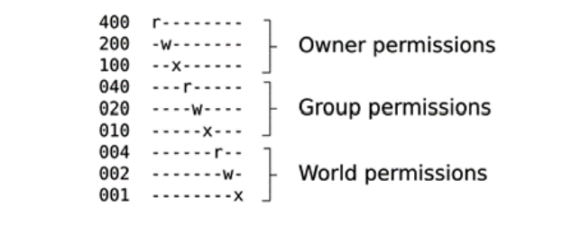

# 构建一个根文件系统
根文件系统是嵌入式Linux的第4个也是最后一个组件。当你读完这一节后，你将能够去构建、启动、以及运行一个简单的嵌入式Linux系统。
这里我将介绍的技术一般被称为**roll your own**或者**RYO**。在嵌入式Linux的早期阶段，这是创建根文件系统的唯一办法。现在RYO仍然在一些场景下有所使用，例如RAM或者存储空间非常受限时，快速的demo，或者你的一些需求不被标准的构建系统包含到的情况。不过，这些场景都是比较少出现的。我要强调一下本章节的目的主要是为了教学，这并不代表它可以用于日常的构建，你应该使用下一章介绍的内容来做这件事。
第一个目标是创建一个最小化根文件系统给我们提供一个命令行提示符。之后基于此，我们将添加脚本来启动其他程序和配置网卡以及用户权限。这里有针对BeagleBone Black和QEMU目标的可用的例子。知道如何从scratch构建根文件系统是一个非常有用的技能，它能帮助你理解当我们在后续章节更复杂的例子做了些什么。
在这一章节，我们将会包含如下的主题：
- 根文件系统里应该有什么？
- 将根文件系统移动到目标
- 创建一个启动initramfs
- init程序
- 配置用户账户
- 一个管理设备节点的更佳办法
- 配置网络
- 使用设备表创建文件系统镜像
- 使用NFS挂载根文件系统
- 使用TFTP加载内核

## 技术要求
为了能够实现例子，请确认你有如下列表：
- 一个基于Linux的主机系统
- 一个microSD卡以及读卡器
- SD卡已经基于第四章“配置与构建内核”为BeagleBone Black做好了准备
- 基于第四章“配置与构建内核”，有适合QEMU的zImage和DTB
- USB转3.3V TTL的转换线
- BeagleBone Black
- 5V1A的直流电源
- 网线与NFS和TFTP的端口

本章所有的代码都可以在本书GitHub仓库的*Chapter05*文件夹中找到：https://github.com/PacktPublishing/Mastering-Embedded-Linux-Programming-Third-Edition

## 根文件系统里应该有什么？
内核将会通过bootloader或者内核命令行中的root=parameter参数设定的挂载块设备，得到一个指向根文件系统或者initramfs的指针。一旦内核拥有了根文件系统，内核就会启动第一个程序，默认的第一个程序名是init，正如第四章中*早期用户空间*中介绍的一样。之后，只考虑内核，它的任务就以及完成了。接下来就轮到了init程序来开始启动其他的程序然后唤醒整个系统。
为了制作一个最小化根文件系统，你需要如下组件：
- init：它将通过运行一系列的脚本来启动所有的程序。我将会在第13章“启动 - init程序”中介绍init工作的细节
- Shell：你需要一个shell来给你命令行提示符以及更重要的运行被init或者其他程序调用的shell脚本
- 守护进程：守护进程是一个提供服务给其他进程的后台运行程序。比较好的例子是系统日志的守护进程（syslogd）和ssh的守护进程（sshd）。init程序必须开启许多流行的守护进程来为主要的系统应用提供支持。事实上，init本身自己就是一个守护进程，它会给其他守护进程提供服务
- 动态库：大部分程序都将链接到动态库，所以这些动态库都需要在根文件系统有存储
- 配置文件：对init和其它守护进程的配置将会以一系列文本存储起来，一般放在/etc目录下
- 设备节点：这是一些特殊文件来允许访问各种设备驱动程序
- proc和sys：这是两个伪文件系统能将内核数据结构展示为文件和目录的层次结构。很多程序和库函数都依赖于/proc和/sys
- 内核模块：如果你配置了你的内核的一些部分为模块，那它们也需要被安装到根文件系统中，通常的位置在/lib/modules/[kernerl version]

此外，还有一些为完成预期工作特定于设备的应用程序，以及它们生成的运行时数据文件。
|重要提示：在一些情况下，你可以将上面的大多数程序压缩为一个静态链接的程序，并且直接直接启动这个程序而不是init。例如，如果你的程序名为/myproj，你可以将一下命令添加到内核命令行init=/myproj。我只遇到过一次这样的配置，在一个安全系统中fork系统调用被禁止了，因此无法启动任何其他程序。这样方法的缺点是你无法使用通常在嵌入式设备中使用的许多工具，必须自己做每件事。|
|-----|

### 目录布局
有趣的是，除了init=或者rdinit=指定的程序名之外，Linux内核并不关心文件和目录的布局，所以你可以随意的把东西放在你喜欢的任何地方。例如，将运行Android的设备的文件布局与桌面Linux发行版的文件布局进行比较，你会发现它们完全不同。
然而，许多程序都希望某些文件位于某些特定位置，如果设备都使用类似的布局，这对开发者有帮助，安卓例外。大多数Linux系统的基本布局在文件层次结构标准（Filesystem Hierarchy Standard ，FHS）中定义，该标准在https://refspecs.linuxfoundation.org/fhs.shtml 。FHS涵盖了大大小小所有Linux操作系统的实现。嵌入式设备倾向于根据其需求使用子集，但通常都包含如下内容：
- /bin：对所有用户都至关重要的程序
- /dev：设备节点以及一些特殊的文件
- /etc：系统配置文件
- /lib：重要的动态库，例如组成C库的那些
- /proc：关于进程信息显示为虚拟文件
- /sbin：对系统管理员重要的程序
- /tmp：放置临时或者易失文件的地方
- /usr：其他额外的程序、库、以及系统管理员实用程序，分别放在/usr/bin，/usr/lib，和/usr/sbin目录
- /var：可以在运行时修改的文件和目录的层次结构，例如日志消息，其中的一些会在启动之后保留

这里有一些微妙的区别。/bin和/sbin之间的区别只是后者不需要包含在非root用户的搜索路径中。对于Red Hat衍生发行版的用户对此将非常熟悉。/usr的意义在于，它可能和根文件系统位于一个不同的分区中，因此它不能包含启动系统所需的任何内容。

### 临时目录
你应该首先在主机上创建一个临时目录，在这里你就可以组装最终传输到目标的文件。在以下示例中，我使用了~/rootfs。你需要在其中创建目录的主体结构，例如这样：
```shell
$ mkdir ~/rootfs
$ cd ~/rootfs
$ mkdir bin dev etc home lib proc sbin sys tmp usr var
$ mkdir usr/bin usr/lib usr/sbin
$ mkdir -p var/log
```

为了看的更清楚，你可以像下面例子一样使用tree命令并且使用-d选项来仅仅显示文件夹：
```shell
$ tree -d
.
├── bin
├── dev
├── etc
├── home
├── lib
├── proc
├── sbin
├── sys
├── tmp
├── usr
│ ├── bin
│ ├── lib
│ └── sbin
└── var
 └── log
```

正如我们所看到的，不是所有的目录都具有相同的文件权限，并且目录中每个文件可能具有比目录更严格的权限。

### POSIX文件访问权限
每个进程，在这里的上下文就代表了一个正在运行的程序，都属于一个用户或者一个或者多个用户组。用户是由一个称为user ID或者UID的32位数字表示的。有关用户的信息，包括从UID到用户名的映射，都保存在/etc/passwd中。同样，组是由group ID或称GID表示的，这里的信息会被保存到/etc/group中。总是有一个UID为0的root用户以及一个GID为0的root组。root用户也被称为超级用户，因此在默认配置中，它绕过了大多数的权限检查，可以访问系统中的所有资源。基于Linux系统的安全性，主要考虑的就是限制对root账户的使用。
每个文件以及每个文件夹也都一个所有者并且只属于一个组。进程对文件或者目录的访问权限由一组访问权限标志（称为文件模式）控制。这里共有3个3-bit长的集合表示，其中第一个集合适用于文件的所有者，第二个适用于与文件相同组的成员，第三个适用于其它的所有人。这些bit位用以表示文件的读取（r）、写入（w）和执行（x）权限。由于3个bit刚好代表一个8进制数，所有通常用8进制表示这些bit，如下图所示：


除此之外，还有可能会在最前面上有第4个二进制数，它代表了特殊的含义：
- SUID（4）: 如果进程是可执行的，则会在程序运行时将进程的有效UID更改为文件所有者的有效UID
- SGID（2）：与SUID类似，这会将进程的有效GID更改为文件组的有效GID
- Sticky（1）：在目录中，它将限制删除，因此一个用户无法删除另一个用户的文件。这通常设置在/tmp和/var/tmp上。

SUID可能是最常被使用的。它可以为非root用户提供一个临时权限提升，以超级用户的身份执行任务。一个很好的例子是ping程序，ping打开了一个底层的套接字，这是一个特权操作。为了让普通用户使用ping，这个程序被root拥有并且设置了SUID位，以便在运行ping的时候，无论你的UID是什么，它都会使用UID 0执行。
要设置此前导八进制数字，请使用chmod命令中的4、2、1值。例如，为了在你的临时根目录中设置/bin/ping的SUID，你需要在755之前添加一个4，类似于：
```shell
$ cd ~/rootfs
$ ls -l bin/ping
-rwxr-xr-x 1 root root 35712 Feb 6 09:15 bin/ping
$ sudo chmod 4755 bin/ping
$ ls -l bin/ping
-rwsr-xr-x 1 root root 35712 Feb 6 09:15 bin/ping
```

请注意，第二个ls命令将模式的前3位显示为rws，而之前他它们是rwx。s表示SUID以及被设置。

### 临时目录中的文件所有权权限
出于安全和稳定的原因，将注意力放到即将放置到目标设备上的文件的所有权和权限至关重要。一般来说，你希望限制敏感资源只能由root用户访问，并尽可能少的使用root用户运行程序。最好使用非root用户运行程序，这样如果它们受到外部攻击，它们会尽可能少的向攻击者提供系统资源。例如：名为/dev/mem的设备节点运行访问系统内存，这在某些程序中是必要的。但是，如果每个人都可以读写，那么就没有安全性，因为每个人都可以访问内存的所有内容。因此，/dev/mem应该由root拥有属于root组，并且具有600的模式，该模式拒绝所有者之外的所有人的读写访问。
不过，临时目录有问题。你在那里创建的文件将归你所有，但当它们安装在设备上时，它们应该属于特定的所有者和组，主要是root用户。一个明显的解决方案是在这个阶段使用以下命令将所有权更改为root：
```shell
$ cd ~/rootfs
$ sudo chown -R root:root *
```

问题是，你需要root权限才能运行chown命令，从那时起，你需要成为root才能修改临时目录的任何文件。在你意识到这点以前，你正在以root身份登录进行你所有的开发，这不是一个好主意。这是一个我们稍后再讨论的问题。

### 根文件系统的程序
现在，是时候开始用基本程序和它们所需的支持库、配置和数据文件填充根文件系统了。我将首先概述你需要的程序类型。
#### init程序
init是第一个运行的程序，因此它是根文件系统的重要组成部分。在本章中，我们将使用BusyBox提供的简单init程序。

#### Shell
我们需要一个shell来运行脚本，并且也给我们一个命令提示符，以便我们可以和系统交互。交互式shell在生产环境上可能不是必须的，但它对开发、调试和维护很有用。嵌入式系统常用的Shell有多种：
- bash：这是在桌面Linux上我们都知道并喜欢的大家伙。它是一个Unix Bourne shell的超集，增加了许多扩展和bashisms
- ash：同样基于Bourne shell，它与BSD系列UNIX有着悠久的历史。BusyBox有一个ash的版本，并且经过扩展，它与bash的兼容性更好。因为它比bash更小，所以在嵌入式系统中非常受欢迎
- hush：这是一个非常小的shell，我们在第三章中简要介绍了它。它在内存很少的设备非常有用。有一个hush版本的BusyBox

|注意：如果你希望在目标板上使用ash或者hush，你需要在目标板上测试你的脚本。非常常见的一个问题是，你有时在主机上编写脚本只用bash做了测试，当你把脚本复制到目标板时它就不工作了。|
|----|

列表中的下一个将是系统工具程序。

#### 系统工具程序
Shell知识启动其他程序的一种方式，而shell脚本需要运行一系列程序别去具有流控制和传递程序间信息的列表。为了使shell发挥作用，你需要一些Unix命令行基于的系统工具程序。即便是一个根文件系统，你也需要大约50个系统工具程序。这样会带来两个问题，首先你需要跟踪他们的源代码并进行交叉编译，这是一个相当艰巨的工作。其次，由此产生的程序将占用几十M字节，这在嵌入式Linux只有几M字节的早期确实是个大问题。为了解决这个问题，BusyBox因此而生。

#### BusyBox救援赶到！
BusyBox的起源与嵌入式Linux无关。该项目是由Bruce Perens在1996年为debian安装程序而发起的，这样他就可以从1.44MB的软盘启动Linux。巧合的是，这大约是当代设备上存储的大小，因此嵌入式Linux社区很快就接受了它。自那以后，BusyBox一直是嵌入式Linux的核心。
BusyBox是从头开始编写的，用于执行那些重要的Linux系统工具程序的基本功能。开发人员利用了80:20法则：程序中最有用的80%是由20%的代码实现的。因此，BusyBox工具实现了桌面等效功能的一个子集，但他们所做的工作足以应付大多数情况。
BusyBox所使用的另一个技巧是将所有工具组合成一个二进制文件，从而可以轻松的在他们之间共享代码。它的工作原理是这样的：BusyBox是一个小程序的合集，每个程序都以[applet]_main导出其main函数。例如，cat命令是在coreutils/cat.c中实现的，并导出cat_main。BusyBox本身的main函数将根据参数将调用分配到正确的小程序。
所以，要读取文件，你可以使用要运行的小程序的名称启动BusyBox，后跟小程序所需的任何参数，如下所示：
```shell
$ busybox cat my_file.txt
```

你还可以在不带参数的情况下运行BusyBox，以获取已编译的所有小程序的列表。
以这种方式使用BusyBox相当笨拙，让BusyBox运行cat小程序的更好办法是创建一个从/bin/cat到/bin/BusyBox的符号链接：
```shell
$ ls -l bin/cat bin/busybox
-rwxr-xr-x 1 root root 892868 Feb 2 11:01 bin/busybox
lrwxrwxrwx 1 root root 7 Feb 2 11:01 bin/cat -> busybox
```

当你在命令行中输入cat时，BusyBox就是实际运行的程序。BusyBox只需要通过argv[0]传入的可执行文件的路径，也就是/bin/cat，就可以提取到应用程序名cat，再进行表查找将cat与cat_main进行匹配。这些都是在libbb/appletlib.c中完成的，本节给了简化的代码。
```shell
applet_name = argv[0];
applet_name = bb_basename(applet_name);
run_applet_and_exit(applet_name, argv);
```

BusyBox有300多个小程序，包括一个init程序，几个不同复杂度的shell，以及用于大多数管理任务的实用程序。甚至还有一个简化版本的vi编辑器，你可以用来更改设备上的文本文件。一个典型的BusyBox二进制程序通常只有启用几十个小程序。
总之，BusyBox的典型安装由的那个程序组成，每个小程序都有一个符号链接，但是它的行为会像是多个独立的程序的合集。

#### 构建BusyBox
BusyBox使用与内核相同的Kconfig和Kbuild系统，因此交叉编译非常简单，你可以通过克隆BusyBox的git仓库并切换到你想要的版本（1_31_1是本文撰写时的最新版本）来获取源代码，如下所示：
```shell
$ git clone git://busybox.net/busybox.git
$ cd busybox
$ git checkout 1_31_1
```

你也可以从https://busybox.net/downloads/ 下载相应的TAR文件。
然后，从默认配置开始配置BusyBox，它几乎启用了BusyBox的所有功能：
```shell
$ make distclean
$ make defconfig
```

在这个时候，你可能想运行make menuconfig来微调配置。例如，你几乎肯希望在BusyBox Settings | Installation Options（CONFIG_PREFIX）中设置安装目录以指向暂存目录。然后，你可以按照通常的方式进行交叉编译。如果你的目标是BeagleBone Black，请使用以下命令：
```shell
$ make ARCH=arm CROSS_COMPILE=arm-cortex_a8-linux-gnueabihf-
```

如果，你的目标是Versatile PB的QEMU模拟器，请使用以下命令：
```shell
$ make ARCH=arm CROSS_COMPILE=arm-unknown-linux-gnueabi-
```

无论是哪种情况，结果都是可执行的BusyBox，对于这样的默认配置构建，大小约为900K。如果这个对你太大了，你可以通过更改配置来去除你不需要的程序。
要将BusyBox安装到临时区域中，请使用以下命令：
```shell
$ make ARCH=arm CROSS_COMPILE=arm-cortex_a8-linux-gnueabihf- install
```

这将把二进制文件复制到CONFIG_PREFIX中配置的目录，并创建到它的所有符号链接。
现在，我们将研究Busybox的替代方案，即ToyBox。

#### ToyBox - BusyBox的替代方案
BusyBox并不是你的唯一选择。此外，还有ToyBox，你可以在http://landley.net/toybox/ 找到。这个项目是由Rob Landley发起的，他之前是BusyBox的维护人员。ToyBox的目标与BusyBox相同，但是更对的强调遵守标准，特别是POSIX-2008与LSB 4.1，而较少的强调与标准GNU扩展的兼容性。ToyBox比BusyBox小，部分原因是因为它实现的小程序更少。它的许可证是BSD而不是GPLv2，这使得它与有BSD许可的操作系统（如Android）更好的兼容性。因此ToyBox提供在所有的新的Android设备的使用。截止到最新的0.8.3版本，ToyBox可以构建出一个完整的Linux系统，你只需要给出Linux和ToyBox的代码就可以引导到命令行提示符。

### 根文件系统中的库
程序通常都会链接到库，你可以静态的链接到库，这样目标设备上就不会存在库。但是如果你有两个或者三个以上的程序，这会占用大量不必要的存储空间。因此，你需要将共享库从工具链中复制到暂存目录。你知道应该有哪些库吗？
一种选择是从工具链中的sysroot目录中复制所有的.so文件。与其试图预测要包含那些库，不如假设你的镜像最终需要所有库。这当然是合乎逻辑的，如果你正在创建一个供其他人用于一系列应用程序的平台，那么这将是正确的方法。不过，请注意，完整的glibc是相当大的。在crosstool-NG构建的的glibc2.22的情况下，库、区域支持与其他支持文件将来到33MiB。当然，你可以使用musl-libc或者uClibc-ng来减小它。
另一种选择是只挑选你需要的库，为此你需要一种能够分辨库依赖关系的方法。使用第2章“学习工具链”中的一些知识，我们可以使用readelf命令执行此任务：
```shell
$ cd ~/rootfs
$ arm-cortex_a8-linux-gnueabihf-readelf -a bin/busybox | grep 
"program interpreter"
[Requesting program interpreter: /lib/ld-linux-armhf.so.3]
$ arm-cortex_a8-linux-gnueabihf-readelf -a bin/busybox | grep 
"Shared library"
0x00000001 (NEEDED) Shared library: [libm.so.6]
0x00000001 (NEEDED) Shared library: [libc.so.6]
```

第一个readelf命令在BusyBox二进制文件中搜索包含程序解释器的行。第二个readelf命令在BusyBox二进制中搜索包含共享库的行，现在，你需要在工具链中的sysroot目录中找到这些文件，并将它复制到暂存目录中。请记住，你可以这样找到sysroot：
```shell
$ arm-cortex_a8-linux-gnueabihf-gcc -print-sysroot
/home/chris/x-tools/arm-cortex_a8-linux-gnueabihf/arm-cortex_a8-linux-gnueabihf/sysroot
```

为了减少键入的数量，我将在shell变量中保留一个副本：
```shell
$ export SYSROOT=$(arm-cortex_a8-linux-gnueabihf-gcc -print-sysroot)
```

如果您查看sysroot中的/lib/ld-linux-armhf.so.3，您会发现它实际上是符号链接：
```shell
$ cd $SYSROOT
$ ls -l lib/ld-linux-armhf.so.3
lrwxrwxrwx 1 chris chris 10 Mar 3 15:22 lib/ld-linux-armhf.so.3 -> ld-2.22.so
```

对libc.so.6和libm.so.6重复此练习，您将得到一个包含三个文件和三个符号链接的列表。现在，您可以使用cp-a复制每一个，这将保留符号链接：
```shell
$ cd ~/rootfs
$ cp -a $SYSROOT/lib/ld-linux-armhf.so.3 lib
$ cp -a $SYSROOT/lib/ld-2.22.so lib
$ cp -a $SYSROOT/lib/libc.so.6 lib
$ cp -a $SYSROOT/lib/libc-2.22.so lib
$ cp -a $SYSROOT/lib/libm.so.6 lib
$ cp -a $SYSROOT/lib/libm-2.22.so lib
```

对每个程序重复此过程。
|提示：这样做只是为了获得尽可能小的嵌入式占用。您可能会错过通过dlopen（3）调用加载的库，这些调用主要是插件。当我们在本章后面配置网络接口时，我们将看到一个带有名称服务交换机（NSS）库的示例。|
|----|

#### 通过strip来缩减大小
程序与库在编译的时候通常都会带有一些用于调试与分析的符号表信息。你几乎不会在生产环境上用到它们。一个快速并且简单的方法就是剥离这些符号表信息来节省空间。下面的例子展示了strip之前的libc：
```shell
$ file rootfs/lib/libc-2.22.so
lib/libc-2.22.so: ELF 32-bit LSB shared object, ARM, EABI5 
version 1 (GNU/Linux), dynamically linked (uses shared libs), 
for GNU/Linux 4.3.0, not stripped
$ ls -og rootfs/lib/libc-2.22.so
-rwxr-xr-x 1 1542572 Mar 3 15:22 rootfs/lib/libc-2.22.so
```

现在，让我们看一看strip之后的结果：
```shell
$ arm-cortex_a8-linux-gnueabihf-strip rootfs/lib/libc-2.22.so
$ file rootfs/lib/libc-2.22.so
rootfs/lib/libc-2.22.so: ELF 32-bit LSB shared object, ARM, 
EABI5 version 1 (GNU/Linux), dynamically linked (uses shared 
libs), for GNU/Linux 4.3.0, stripped
$ ls -og rootfs/lib/libc-2.22.so
-rwxr-xr-x 1 1218200 Mar 22 19:57 rootfs/lib/libc-2.22.so
```

在这个例子里，我么节省了324372字节，对比strip之前节省了大约20%。
|提示：对内核模块使用strip要当心。一些符号对于模块加载器来重定位模块代码是必要的，因此如果对模块strip，模块将无法加载。使用此命令可以在删除调试调试符号的前提下保留重定位的符号，strip --strip-unneeded \<模块名称\>|
|----|

### 设备节点
Linux中的大多数设备都由设备节点表示，这符合UNIX的哲学，即一切皆文件（除了网卡，它是套接字）。设备节点可以指块设备或者字符设备。块设备是大容量存储设备，例如SD卡或者硬盘。除了网卡，其他的一切几乎都是字符型设备。设备节点的习惯位置是/dev目录。例如，一个串口可以由名为/dev/ttyS0的设备节点表示。
设备节点通常是使用mknod（make node的缩写）创建的：
```shell
mknod \<name\> \<type\> \<major\> \<minor\>
```

mknod的参数如下:
- name 是你想创建的节点的名称
- type 可以是代表字符设备的c或者代表块设备的b
- major和minor是一对数字，可以用于内核将文件请求路由到对应的设备驱动程序。在内核源码的Documentation/devices.txt文件中有一些标准major和minor列表

你需要创建所有你想要在系统中使用的设备对应的设备节点。你可以使用mknod命令手动完成此任务，如我说的那样。也可以使用后续介绍的设备管理器中的一种来自动创建它们。
在一个真正的最小化根文件系统，使用BusyBox你只需要两个节点：console和null完成启动。console只需要允许它的拥有者root访问，所以访问权限是600（rw-------）。null节点应该是每个人都可以读写的，所有模式是666（rw-rw-rw-）。你可以使用mknod的-m选项来设置创建节点时的模式。你需要是root用户才可以创建设备节点，如下：
```shell
$ cd ~/rootfs
$ sudo mknod -m 666 dev/null c 1 3
$ sudo mknod -m 600 dev/console c 5 1
$ ls -l dev
total 0
crw------- 1 root root 5, 1 Mar 22 20:01 console
crw-rw-rw- 1 root root 1, 3 Mar 22 20:01 null
```

你可以使用标准的rm命令来删除节点。并没有所谓的rmnod命令，因为节点一旦创建，它就只是普通的文件。


### proc和sysfs文件系统
proc和sysfs是两个伪文件系统，它们提供了了解内核内部工作的窗口。它们都将内核数据表示为目录层次结构中的文件：当你读取一个文件时，你看到的内容不是来自磁盘存储；它已经被内核中的一个函数动态格式化。有些文件也是可写的，这意味着使用你新写的数据调用内核函数，如果它的格式正确并且你有足够的权限，它将修改存储在内核内存中的值。换句话说，proc和sysfs提供了另一种与设备驱动程序和其他内核代码交互的方式。proc和sysfs文件系统应该安装在/proc和/sys目录：
```shell
# mount -t proc proc /proc
# mount -t sysfs sysfs /sys
```

尽管它们在概念上非常相似，但他们执行的功能不同。proc从早期就是Linux的一部分。它最初的目的是向用户空间公开有关进程的信息，因此而得名。为此，每个进程都有一个名为/proc/\<PID\>的目录，其中包含有关进程状态的信息。进程列表命令，ps，可以读取这些文件并生成其输出。此外，还有一些文件提供有关内核其它部分的信息，例如，/proc/cpuinfo可以表面cpu的信息，/proc/interrupts包含有关中断的信息，等等。
最后，在/proc/sys中，有一些文件是用于显示和控制内核子系统的状态和行为，特别是调度、内存管理和网络。手册页面是你将在proc文件夹里找到的文件的最佳参考，你可以通过输入man 5 proc来查看该目录。
另一方面，sysfs的作用是向用户空间呈现内核驱动程序模型。它导出设备和设备驱动程序相关的文件层次结构，以及它们的连接方式。我在第11章“与设备驱动程序的接口”中描述与设备驱动的交互时，我将更详细的介绍Linux驱动程序模型。

#### 文件系统挂载
mount命令运行我们将一个文件系统连接到另一个文件系统的目录中，从而形成文件系统的层次结构。位于顶部的文件系统被称为根文件系统，它在内核启动时由内核挂载。mount命令的格式如下：
```shell
mount \[-t vfstype\] \[-o options\] device directory
```

mount 的参数如下所示：
- vfstype 代表文件系统的类型
- options 是以逗号分隔的mount选项列表
- device 表示文件系统所在的块设备节点
- directory 表示你想挂载文件系统的目录

在-o后你可以给很多的设置选项；可以通过查看mount（8）的man手册来获得更多信息。例如，如果你想挂载一个第一个分区中包含ext4文件系统的SD卡到/mnt目录，你需要输入如下命令：
```shell
# mount -t ext4 /dev/mmcblk0p1 /mnt
```

假设挂载成功了，你就可以在/mnt目录下看到存储在SD卡上的文件。在某些情况下，你可以省略文件系统类型，而让内核检测设备来判断。如果挂载失败了，你可能需要首先卸载分区，防止你的Linux发行版被设置为插入SD卡时自动挂载SD卡上的所有分区。
看看挂载proc文件系统的例子，有一点是不一样的：这里没有设备节点，比如/dev/proc，这是因为它是一个伪文件系统，而不是真正的文件系统。但是mount命令需要一个设备参数，因此我们必须给出一个字符串，设备应该放在哪里，但是这个字符串是什么并不重要。下面两个指令实现了完全相同的效果：
```shell
# mount -t proc procfs /proc
# mount -t proc nodevice /proc
```

procfs和nodevice字符串在挂载的时候都被忽略了。在挂载伪文件系统时，使用文件系统类型来代替设备是非常常见的。

### 内核模块
如果你使用了内核模块，那它们也需要被安装到根文件系统中。可以使用modules_install内核make目标，正如我们在第四章“配置与构建内核”中看到的那样。这样会将它们与modprobe命令所需的配置文件一起复制到/lib/modules/\<kernel version\>目录。
请注意，你刚刚在内核和根文件系统中创建了一个依赖关系，如果更新其中一个，则必须更新另外一个。
现在我们知道了如何从SD卡挂载文件系统，让我们看看挂载根文件系统的不同选项。替代选项（ramdisk和NFS）可能会让你大吃一惊，尤其是如果你是嵌入式Linux的新手。ramdisk可以保护原始源镜像不受损坏和磨损。我们将在第九章“创建存储策略”中了解有关闪存的更多信息，网络文件系统允许更快的开发，因为文件更改可以立即传播到目标。

## 移动根文件系统到目标板
在你的暂存目录创建了一个骨架根文件系统之后，下一个任务是将其移动到目标板上。接下来，我将描述三种可能性：
- initramfs: 也被称为ramdisk，这是一个由bootloader加载到RAM的文件系统镜像。ramdisk非常容易创建，并且不依赖与大容量存储设备。当主的根文件系统需要更新时，它们可以在回退维护模式中使用。甚至它们可以用作小型嵌入式设备的主根文件系统，并且在主流的Linux发行版中通常被用作早期用户空间。请注意，根文件系统的内容是不稳定的，当系统下次启动时，你在运行时对根文件所做的任何修改都将丢失。你需要另一种存储类型来存储长期数据，如配置参数。
- Disk image: 这是根文件系统的一个副本，已格式化并且准备加载带目标上的大容量存储设备上。例如，它可以是准备复制到SD卡的ext4格式的镜像，也可以是准备通过bootloader加载到闪存的jffs2格式的镜像。创建磁盘镜像可能是最常见的选项。有关不同类型的大容量存储的更多信息，请参阅第九章“创建存储策略”。
- Network filesystem: 临时目录可以通过NFS服务器导出到网络，并在启动时由目标挂载。这通常是在开发阶段完成的，而不是重复创建磁盘镜像并将其加载到大容量存储设备上，这是一个相当缓慢的过程。

我将从ramdisk开始，并用它来说明对根文件系统的一些改进，例如添加用户名和设备管理器来自动创建设备节点。然后我将向你展示如何创建磁盘镜像，以及如何使NFS在网络上挂载根文件系统。


## 创建一个boot initramfs
初始文件系统或者initramfs是一个压缩的cpio文件。cpio是一种旧的Unix文件格式，很像TAR和ZIP但是更容易解码，因此在内核中只需要很少的代码支持。你需要使用CONFIG_BLK_DEV_INITRD配置你的内核来支持initramfs。
碰巧的是，有三种不同的方法可以创建boot ramdisk：独立的cpio文件，嵌入内核镜像的cpio文件，内核构建系统在构建过程中的设备表。第一种选择提供了最大的灵活性，因为我们可以随心所欲的混合和匹配内核与ramdisk。然而，这也意味着要处理两个文件而不是仅一个，并且并非所有的bootloader都具备加载单独ramdisk的功能。稍后我将向你展示如何在内核中构建一个。

### 独立的initramfs
下面的指令序列创建了文件，对其压缩，并添加了一个U-Boot头用于为加载到目标板做准备：
```shell
$ cd ~/rootfs
$ find . | cpio -H newc -ov --owner root:root > ../initramfs.cpio
$ cd ..
$ gzip initramfs.cpio
$ mkimage -A arm -O linux -T ramdisk -d initramfs.cpio.gz uRamdisk
```

uRamdisk文件的最终大小约为2.9MB，没有内核模块的情况下。再加上内核zImage文件的4.4MB和U-Boot的440KB，总共需要7.7MB的存储空间来引导这个板。我们离启动这一切的1.44MB还要一点距离。如果大小真的有问题，你可以使用以下选项之一：
- 通过舍弃一些你不需要的驱动和功能缩小内核
- 通过舍弃一些你不需要的功能缩小BusyBox
- 静态编译BusyBox

现在我们已经组装了initramfs，让我们启动这个文件吧。

### 启动initramfs
我们能做的最简单的事就是在控制台上运行一个shell，这样我们就可以与目标进行交互。我们可以在内核命令行中添加rdinit=/bin/sh来实现这一点。接下来的两个部分展示了如何为QEMU和BeagleBone Black做到这一点。

#### 启动QEMU
QEMU有一个名为-initrd的选项，用于将initramfs加载到内存中。在第四章“配置和构建内核”中，你应该已经有一个zImage，它是使用arm-unknown-linux-gnueabi工具链和Versatile PB的设备树二进制文件编译的。从本章中，你应该已经创建了initramfs，其中包括使用了相同工具链编译的BusyBox。现在，你可以使用MELP/Chapter05/run-qemu-initramfs.sh或者使用下面的命令：
```shell
$ QEMU_AUDIO_DRV=none qemu-system-arm -m 256M -nographic -M versatilepb -kernel zImage -append "console=ttyAMA0 rdinit=/bin/sh" -dtb versatile-pb.dtb -initrd initramfs.cpio.gz
```

你需要获得一个带有提示符/ #的根shell。

#### 启动BeagleBone Black
对于BeagleBone Black，我们需要第四章“配置和构建内核”中准备的microSD卡，以及使用arm-cortex_a8-linux-gnueabihf工具链构建的根文件系统。将你在本节前部分创建的uRamdisk复制到mocroSD卡上的引导分区，然后使用它将BeagleBone Black引导到能获得U-Boot提示符的位置。然后，使用如下命令：
```shell
fatload mmc 0:1 0x80200000 zImage
fatload mmc 0:1 0x80f00000 am335x-boneblack.dtb fatload mmc 0:1 0x81000000 uRamdisk
setenv bootargs console=ttyO0,115200 rdinit=/bin/sh
bootz 0x80200000 0x81000000 0x80f00000
```

如果一切顺利，你将在串行控制台获得一个带/#提示的根shell。完成后，我们将需要在两个平台挂载proc。

##### 挂载proc
你会发现，在这两个平台上，ps命令都不起作用。这是因为proc文件系统尚未挂载。尝试安装它：
```shell
# mount -t proc proc /proc
```

现在，再运行一次ps你可以看到进程的列表。
这个设置的一个改进是编写一个shell脚本来挂载proc，以及在启动时需要完成的任何其它操作。然后，你可以在启动时运行此脚本，而不是/bin/sh。以下片段介绍了它的工作原理：
```shell
#!/bin/sh
/bin/mount -t proc proc /proc
# Other boot-time commands go here
/bin/sh
```

最后一行/bin/sh启动了一个新的shell，它为你提供了一个交互式根shell提示符。以这种方式使用shell作为init对于快速的编程的非常方便的，例如，你想用损坏的init程序来拯救系统时。然而对于大多数情况，你将使用init程序，我们将在本章稍后介绍该程序。但是，在此之前，我想看一下另外两种加载initramfs的方法。

#### 在内核镜像中构建initramfs
到目前为止，我们以及创建了一个压缩的initramfs作为一个单独的文件，并使用bootloader将其加载到内存中。有些bootloader无法以这种方式加载initramfs文件。为了应对这些情况，可以将Linux配置为将initramfs合并到内核镜像中。要做到这一点，请更改内核配置，并将CONFIG_INTRAMFS_SOURCE设置为你之前创建的cpio文件的完整路径。如果你使用的是menuconfig，则它位于General Setup | Initramfs source file（s）。请注意，它必须是以cpio结尾的未压缩cpio文件，而不是gzip版本。然后，构建内核。
启动和之前一样，只是没有ramdisk文件。对于QEMU，命令如下：
```shell
$ QEMU_AUDIO_DRV=none qemu-system-arm -m 256M -nodraphic -M versatilepb -kernel zImage -append "console=ttyAMA0 rdinit=/bin/sh" -dtb cersatile-pb.dtb
```

对于BeagleBone Balck，在U-Boot提示符中输入下面的命令：
```shell
fatload mmc 0:1 0x80200000 zImage
fatload mmc 0:1 0x80f00000 am335x-boneblacl.dtb
setenv bootargs console=ttyO0,115200 rdinit=/bin/sh
bootz 0x80200000 - -x80f00000
```

当然，每次更改根文件系统中的内容，必须记住重新生成cpio文件然后重新构建内核。

#### 使用设备表来构建一个initramfs
设备表是一个文本文件，列出了文件、目录、设备节点和指向文件或者文件系统镜像的链接。压倒性的优势在于它允许你在没有root权限的时候创建属于root用户或者其他UID的文件。你甚至可以在不需要root权限的情况下创建设备节点。所有的这些都是可能的，因为它仅仅是普通的数据文件。只有当Linux在启动时对其进行扩展时，才能使用你指定的属性创建真正的文件和目录。
内核有一个功能，允许我们在创建initramfs时使用设备表。你编写设备表文件，然后将CONFIG_INITRAMFS_SOURCE指向它。然后，当你构建内核的时候，它会根据设备表的指令创建cpio文件。在上面的所有时间都不需要root权限。
以下是我们简单rootfs的设备表，但缺少BusyBox的能让我们更容易管理的大多数符号链接：
```shell
dir /bin 775 0 0
dir /sys 775 0 0
dir /tmp 775 0 0
dir /dev 775 0 0
nod /dev/null 666 0 0 c 1 3
nod /dev/console 600 0 0 c 5 1
dir /home 775 0 0
dir /proc 775 0 0
dir /lib 775 0 0
slink /lib/libm.so.6 libm-2.22.so 777 0 0
slink /lib/libc.so.6 libc-2.22.so 777 0 0
slink /lib/ld-linux-armhf.so.3 ld-2.22.so 777 0 0
file /lib/libm-2.22.so /home/chris/rootfs/lib/libm-2.22.so 775 0 0
file /lib/libc-2.22.so /home/chris/rootfs/lib/libc-2.22.so 775 0 0
file /lib/ld-2.22.so /home/chris/rootfs/lib/ld-2.22.so 755 0 0
```

语法非常明显：
- dir \<name\> \<mode\> \<uid\> \<gid\>
- file \<name\> \<location\> \<mode\> \<uid\> \<gid\>
- nod \<name\> \<mode\> \<uid\> \<gid\> \<dev_type\> \<maj\> \<min\>
- slink \<name\> \<target\> \<mode\> \<uid\> \<gid\>

dir、nod、slink命令会在initramfs cpio文档里创建一个文件系统对象，并设置名称、模式、用户ID、组ID。file指令将文件从源位置复制到cpio文档里，并设置模式、用户ID、组ID。
内核源代码中usr/gen_initramfs_list.sh脚本可以帮助更容易的从头创建initramfs设备表，这个脚本可以从给定的目录中创建设备表。例如，要为rootfs目录创建initramfs设备表，并将用户ID 1000和组ID1000拥有的所有文件的所有权更改为用户和组ID为0，可以使用如下命令：
```shell
$ bash linux-stable/scripts/gen_initramfs_list.sh -u 1000 -g 1000 rootfs > initramfs-device-table
```

使用此脚本的-o选项可以创建一个压缩的initramfs文件，该文件的格式取决于-o之后的文件扩展名。
请注意，这个脚本仅适用于bash shell。如果你有一个带有不同默认shell的系统，就像大多数Ubuntu配置一样，你会发现脚本失败了。因此，在前面给出的命令中，我明确使用bash脚本来运行脚本。

#### 老的initrd格式
Linux ramdisk有一种较旧的格式，称之为initrd。它是Linux2.6之前唯一可用的格式，如果你使用的是Linux的无MMU变体uClinux，则仍然需要它。它相当晦涩难懂，我在此不作赘述。在内核代码中的Documentation/initrd.txt中有更多的信息。
一旦我们的initramfs启动，系统就需要开始运行程序。运行的第一个程序就是init程序，让我们来看一看。

## init程序
