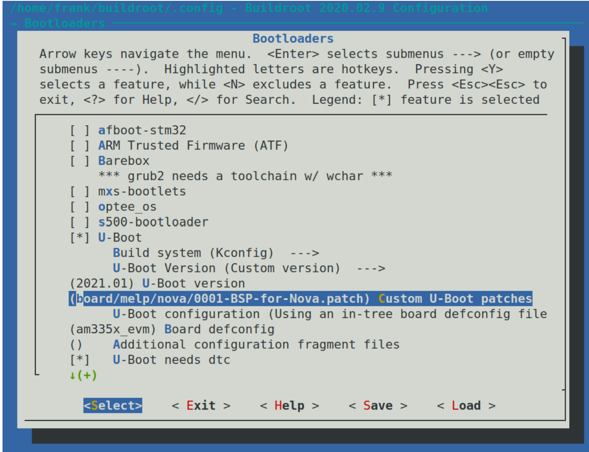
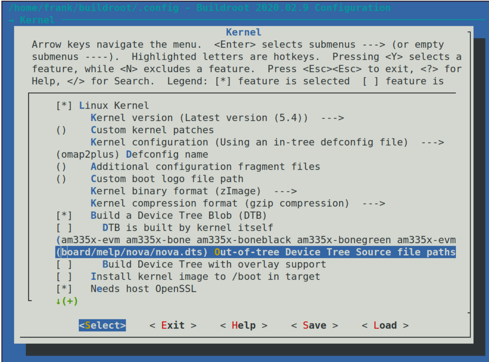
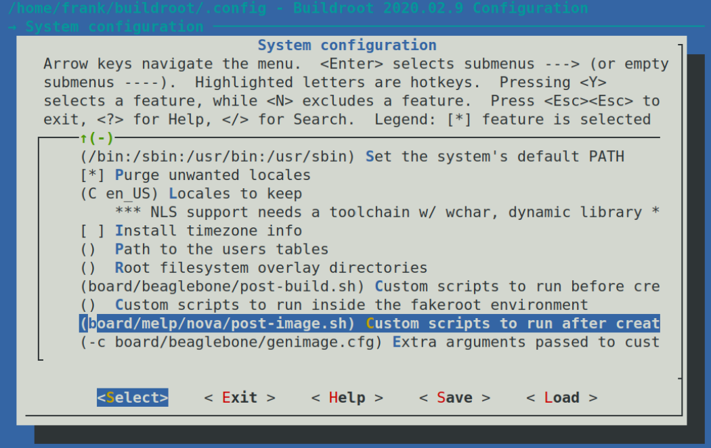

# 选择一个构建系统
在前面的一些章节，我们介绍了嵌入式Linux设备的四个组件，然后一步步的构建了工具链、bootloader、内核和根文件系统，之后将它们组合为一个简单的嵌入式Linux系统。它们有很多很多的步骤。现在，是时候来看一个尽可能自动化的简单方法来处理这些流程了。我们将看嵌入式构建系统如何起到帮助以及考察其中的两个：Buildroot和Yocto。两个都是复杂且灵活的工具，需要一整本书来全面描述它们是怎么工作的。在本章中，我只想向你展示构建系统背后的一般思想。我将向你展示如何构建一个简单的设备镜像以获得整个系统的整体感觉，然后使用前几章的Nova板示例以及黑莓派4进行一些有用的更改。
本章中，将会包含如下话题：
- 构建系统比较
- 分发二进制文件
- 介绍Buildroot
- 介绍Yocto

让我们开始吧！

## 技术要求：
为了能跟随本章的例子，确保你有如下：
- 一个基于Linux的主机系统，并且至少有60GB的可用硬盘空间
- Linux上的Etcher
- microSD卡及读卡器
- USB转3.3V TTL串口转换器
- 黑莓派4
- 用于网络连接的以太网电缆和端口
- BeagleBone Black
- 5V1A直流电源

本章的所有代码可以在GitHub仓库（https://github.com/PacktPublishing/Mastering-Embedded-Linux-Programming-Third-Edition）的Chapter06文件夹找到。

## 构建系统比较
我在第五章“构建根文件系统”介绍了如何手动创建系统的流程，称之为RYO（Roll Your Own）流程。它的优点是你可以完全的控制软件，你可以根据自己的喜好定制它。如果你想让它做一些真正奇怪但是创新的事情，如果你想将内存减小到尽可能小，那RYO就是你的菜。但是在绝大多数情况下，手动构建是浪费时间，并且会产生劣质的并且无法维护的系统。
构建系统的思路是将我迄今为止描述的所有步骤自动化。构建系统应该能从上游源代码构建以下部分或者全部内容：
- 工具链
- bootloader
- 内核
- 根文件系统

从上游源代码构建有很多重要的原因。这意味着你可以在没有任何外部依赖的情况下随时重新构建，这会让你放心。这也意味着，你拥有用于调试的源代码，并且你满足许可证要求，在必要时将代码发分发给用户。
然后，为了完成这些内容，构建系统应该能够做如下的内容：
- 从上游下载源代码，可以从源代码控制系统下载，也可以作为压缩文件下载，并在本地缓存
- 应用补丁程序来启用交叉编译、修复依赖于体系结构的错误、应用本地配置策略等
- 构建各种各样的组件
- 创建一个暂存目录并且组装根文件系统
- 创建多种格式的镜像文件，可以用来加载到目标板上

其他的一些有用的东西如下：
- 添加您自己的包，例如包含应用程序或内核更改
- 选择各种根文件系统配置：大小、支不支持图像或者其他特性
- 创建一个独立的SDK你可以分发给其他开发者这样其他开发者不需要安装完整的构建系统
- 跟踪你选择的大量的包的开源许可证
- 有一个用户友好的用户接口

在所有情况下，它们将系统的组件封装到包内，其中一些包用于主机，另一些包用于目标板。每个包都由一组规则定义，以获取源、构建源、并将其安装到正确的位置。包之间存在依赖关系，构建机制用于解决依赖关系并构建所需要的包的集合。
开源构建系统在过去几年已经相当成熟。你可以找到很多，包括如下：
- Buildroot：这是一个使用GNU Make和Kconfig的易用系统（https://buildroot.org）
- EmbToolkit：这是迄今为止唯一一个支持LLVM/Clang的开箱即用的构建系统，用于生成根文件系统和工具链（https://www.embtoolkit.org）
- OpenEmbedded：这个是一个强力的系统，也是Yocto和其他系统的核心组件（https://openembedded.org）
- OpenWrt：这是一个面向无线路由器的构建工具，支持开箱即用的运行时包管理（https://openwrt.org）
- PTXdist：这是一个由Pengutronix赞助的开源构建系统（https://www.ptxdist.org）
- Yocto：这是通过元数据、工具和文档扩展了OpenEmbedded核心，可能是最流行的构建系统（https://www.yactoproject.org）

我将集中介绍其中的两个：Buildroot和Yocto。它们以不同的方式处理问题，并且有不同的目标。
Buildroot的主要目标是创建根文件系统镜像，因此而得名，尽管它同时可以构建bootloader、内核镜像和工具链。它易于安装和配置，并且可以快速生成目标镜像。
另一方面，Yocto在定义目标系统方面更为通用，因此它可以构建复杂的嵌入式设备。默认情况下，每个组件都可以使用RPM格式生成一个二进制包，然后将这些包组成文件系统镜像。此外，你可以在文件系统镜像中安装包管理器，这允许你在运行时更新包。换句话说，你在使用Ycoto系统构建时，实际上就是在创建你自己的自定义Linux发行版。请记住，启用运行时包管理还意味着配置和运行你自己的相应包存储库。

## 分发二进制文件
在大多数情况下，主流Linux发行版是由RPM或者DEB格式的二进制（预编译）包构建的。RPM是Red Hat包管理器的标准，通常用于Red Hat、SUSE、Fedora和其他基于它们的发行版。Debian和Debian派生的发行版，包括Ubuntu和Mint，使用称之为DEB的包管理器格式。此外，还有一种特定于嵌入式设备的轻量级格式，称之为ltsy包合适或者IPK，它基于DEB。
在设备上包含包管理器的能力是构建系统之间的一大区别。一旦在目标设备上有了包管理器，就可以轻松的将新包部署到其中并更新现有包。我将在第10章“更新现场软件”中讨论这一点的含义。

## 介绍Buildroot
Buildroot的当前版本能够构建工具链、bootloader、内核和根文件系统。它使用GNU Make作为主要的构建工具。有很好的在线文档https://buildroot.org/docs.html ，它包括Buildroot用户手册在https://buildroot.org/downloads/manual/manual.html 。

### 背景
Buildroot是最早的构建系统之一。它最初是uClinux和uClibc项目的一部分，作为生成用于测试的小型根文件系统的一种方式。它在2001年末成为一个单独的项目，并一直发展到2006年，之后进入了一个相当休眠的阶段。然而，在2009年Peter Korsgaard接管管理工作以来，它一直在快速发展，增加了对基于glibc的工具链的支持，并大大增加了包和目标板的数量。
作为另一个有趣的问题，Buildroot也是另一个流行的构建系统OpenWrt的祖先（http://wiki.openwrt.org ），于2004年左右从Buildroot分支而来。OpenWrt的主要重点是为无线路由器生成软件，因此软件包组合面向网路基础设施。它还有一个使用IPK格式的运行时包管理器，可以在不完全重新刷鞋镜像的情况下更新或者升级设备。然而，Buildroot和OpenWrt已经分歧到它们几乎是完全不同的构建系统。使用其中一个生成的包与另一个并不兼容。

### 稳定版本和长期支持
Buildrroot开发人员在每年2月、5月、8月、11月发布四次稳定版本。它们由格式\<year\>.02、\<year\>.05、\<year\>.08、\<year\>.11的Git tag进行标记。不时的，一个版本会被标记为长期支持版本，这意味着该版本将在发布后的12月内修复安全问题和其他重要错误。2017.02版本是第一个获得LTS标签的版本。

### 安装
像往常一样，你可以通过克隆仓库或者下载压缩文件来安装Buildroot。一下是获得2020.02.9版本的示例，这是撰写本文时的最新的稳定版本：
```shell
$ git clone git://git.buildroot.net/buildroot -b 2020.02.9
$ cd buildroot
```

等效的TAR压缩文件可以在https://buildroot.org/downloads获得。
接下来，你应该阅读Buildroot用户手册的系统需求部分，在https://buildroot.org/downloads/manual/manual.html ，然后确认安装了这里列出的所有软件。

### 配置
Buildroot使用内核Kconfig/Kbuild机制，我在第4章“配置和构建内核”中介绍了这个机制。你可以直接使用make menuconfig（xconfig或gconfig）从头开始配置Buildroot，也可以从100多种配置中选择一种用于各种开发板和QEMU模拟器，你可以在cinfig/目录下找到它们。输入make list-defconfigs可以列出所有默认配置。
让我们开始构建一个默认的配置，你可以用它来运行在一个Arm的QEMU模拟器上。
```shell
$ cd buildroot
$ make qemu_arm_versatile_defconfig
$ make
```

|重要提醒：你可以使用-j选项告诉make可以运行多少并行的任务：Buildroot将独立优化CPU的使用。如果你想限制作业的数量，你可以运行make menuconfig并在Build选项下查看。|
|---|

构建会使用半个小时到一个小时或者更久，取决于你主机的性能和你的网络情况。它将下载大约220MiB的代码，并将消耗大约3.5GiB的磁盘空间，完成后你将发现有两个新目录被创建了：
- dl/: 这里包含了Buildroot构建的上游代码的压缩包
- output/：这里包含了所有中间和最终编译的源

你可以在output/中看到如下内容：
- build/：这里你可以看到每个组件的构建目录
- host/：这里包含了Buildroot运行在主机上需要的一些工具，包括工具链的可执行文件（在/host/usr/bin）
- images/：这里是很重要的，因为这里包含了构建的结果。取决于你的配置，这里你可以找到bootloader、内核、和一个或多个文件系统镜像
- staging/：这里是一个指向工具链的sysroot的符号链接。这里的名称有一点让人困惑，因为他不是指向我们在第5章“构建根文件系统”中说的那个暂存区域
- target/：这里是根目录的暂存区域。需要注意你不能将这里当做根文件系统像它表示的那样，因为这里的文件所有权是错误的。Buildroot会使用一个我们之前提到的设备表来设置所有权和权限，当文件系统镜像被创建到image/目录下时

### 运行
一些示例配置在board/目录中有相应的条目，其中包含了自定义配置和有关咋目标板上安装结果的信息。对于你刚刚构建的系统，相关的文件在board/qemu/arm-cersatile/readme.txt，它告诉你该如何启动qemu。假设你已经安装了qemu system arm，如第一章所述，你可以使用如下命令运行它：
```shell
$ qemu-system-arm -M versatilepb -m 256 \
-kernel output/images/zImage \
-dtb output/images/versatile-pb.dtb \
-drive file=output/images/rootfs.ext2,if=scsi,format=raw \
-append "root=/dev/sda console=ttyAMA0,115200" \
-serial stdio -net nic,model=rtl8139 -net user
```

在本书的代码仓里包含了这个脚本，MELP/Chapter06/run-qemu-buildroot.sh 。当QEMU启动的时候，你应该会看到内核启动消息出现在启动QEMU的同一个终端窗口中，然后是登录提示：
```shell
Booting Linux on physical CPU 0x0
Linux version 4.19.91 (frank@franktop) (gcc version 8.4.0 
(Buildroot 2020.02.9)) #1 Sat Feb 13 11:54:41 PST 2021
CPU: ARM926EJ-S [41069265] revision 5 (ARMv5TEJ), cr=00093177
CPU: VIVT data cache, VIVT instruction cache
OF: fdt: Machine model: ARM Versatile PB
[…]
VFS: Mounted root (ext2 filesystem) readonly on device 8:0.
devtmpfs: mounted
Freeing unused kernel memory: 140K
This architecture does not have kernel memory protection.
Run /sbin/init as init process
EXT4-fs (sda): warning: mounting unchecked fs, running e2fsck 
is recommended
EXT4-fs (sda): re-mounted. Opts: (null)
Starting syslogd: OK
Starting klogd: OK
Running sysctl: OK
Initializing random number generator: OK
Saving random seed: random: dd: uninitialized urandom read (512 
bytes read)
OK
Starting network: 8139cp 0000:00:0c.0 eth0: link up, 100Mbps, 
full-duplex, lpa 0x05E1
udhcpc: started, v1.31.1
random: mktemp: uninitialized urandom read (6 bytes read)
udhcpc: sending discover
udhcpc: sending select for 10.0.2.15
udhcpc: lease of 10.0.2.15 obtained, lease time 86400
deleting routers
random: mktemp: uninitialized urandom read (6 bytes read)
adding dns 10.0.2.3
OK
Welcome to Buildroot
buildroot login:
```

使用root登录，不需要密码。
你将看到，除了带有内核引导消息的窗口外，QEMU还启动了一个黑色窗口。它在那里显示目标板的图形帧缓存区。在这种情况下，目标板从不下入帧缓存区，这就是它显示为黑色的原因。要关闭QEMU，请按Ctrl+Alt+2进入QEMU控制台，然后键入quit，或者只关闭帧缓存区窗口。

### 瞄准真正的硬件
为黑莓派4配置和构建一个可启动的镜像的步骤与Arm QEMU几乎一样。
```shell
$ cd buildroot
$ make clean
$ make raspberrypi4_64_defconfig
$ make
```

当构建完成后，镜像会被写到output/images/sdcard.img。post-image.sh脚本和genimage-raspberrypi4-64.cfg配置文件是用来写镜像文件的，两个文件都位于board/raspberrypi/目录。为了将sdcard.img写入microSD卡并在黑莓派4上启动它，遵循以下原则：
- 将microSD卡插入你的Linux主机
- 启动Etcher
- 点击Etcher的Flash from file
- 选择你为黑莓派4构建的镜像并且打开
- 在Etcher点击Select target
- 选择你第一步插入的microSD卡
- 在Etcher中点击Flash写入镜像
- 当写入完成后弹出microSD卡
- 将microSD卡插入黑莓派4
- 通过USB-C接口向黑莓派4供电

将黑莓派4接入以太网并观察网络指示灯闪烁确认已经成功启动。为了在其中使用ssh，你需要在Buildroot镜像配置中添加一个ssh服务器，比如dropbear或者openssh。

### 创建一个自定义BSP
接下来，让我们使用Buildroot为我们的Nova板创建一个板级支持包（BSP，Board Support Package），使用前面章节相同版本的U-Boot和Linux。你可以看到我在MELP/Chapter06/Buildroot中所作的更改。
建议存储更改的位置如下所示：
- board/\<organization\>/\<device\>：这里包含了所有的补丁、二进制blob、额外的构建步骤、Linux、U-Boot和其它组件的配置文件
- configs/\<device\>_defconfig：包含板的默认配置
- package/\<organization\>/\<package_name\>：这是你为该板放置所有附加包的地方

让我们开始创建一个目录来存放这些Nova板的改变：
```shell
$ mkdir -p board/melp/nova
```

下一步，清理之前构建的残留，这个步骤在你每次更改配置后都需要做一次：
```
$ make clean
```

现在，让我们选择BeagleBone的配置，这是我们即将使用的Nova配置的基础：
```shell
$ make beaglebone_defconfig
```

这个make beaglebone_defconfig命令配置Buildroot构建BeagleBone Black的目标镜像。这个配置是一个很好的起点，但是我们需要为我们的Nova板做一些修改。让我们通过修改为Nova使用的U-Boot补丁开始。

#### U-Boot
在第三章“关于Bootloader”中，我们基于2021.01版本的U-Boot并且使用了MELP/Chapter03/0001-BSP-for-Nova.patch这个补丁创建了一个bootloader。我们可以配置Buildroot来使用相同的版本并且使用我们的补丁文件。最开始，我们将这个补丁文件复制到board/melp/nova，然后使用make menuconfig来选定U-Boot版本到2021.01，设定补丁文件为board/melp/nova/0001-BSP-for-Nova.patch，设置板名为Nova，就像下面的截图一样：


我们还需要一个U-Boot脚本来从SD卡加载设备树和内核。我们可以将这个文件到board/melp/nova/uEnv.txt。它需要包含以下命令：
```shell
bootpart=0:1
bootdir=
bootargs=console=ttyO0,115200n8 root=/dev/mmcblk0p2 rw rootfstype=ext4 rootwait
uenvcmd=fatload mmc 0:1 88000000 nova.dtb;fatload mmc 0:1 82000000 zImage;bootz 82000000 - 88000000
```

请注意，尽管有可见的换行，bootargs和uenvcmd都是在单行定义的。rootfstype=ext4 rootwait 是bootargs的一部分，而bootz 82000000 - 88000000是uenvcmd的一部分。
现在，我们已经对Nova板的U-Boot做了配置和补丁，下一步是配置和补丁内核。

### Linux
在第四章“配置和构建内核”，我们基于Linux5.4.50并使用MELP/Chapter04/nova.dts这个新的设备树。将这个设备树复制到board/melp/nova，修改Buildroot内核配置到5.4版本，然后指定设备树为board/melp/nova/nova.dts。如下所示：


我们还必须更改用于内核头的内核系列，以便它们与正在构建的内核相匹配：


现在我们已经完成了，让我们开始构建系统镜像吧，完成内核和根文件系统构建。

### 构建
在构建的最后阶段，Buildroot使用了一个名为genimage的工具为SD卡创建一个镜像，我们可以将目录复制到SD卡中。我们需要一个配置文件来正确的布置镜像文件。我们将此文件命名board/melp/nova/genimage.cfg，并填充如下：
```shell
image boot.vfat {
    vfat {
        files = {
            "MLO",
            "u-boot.img",
            "zImage",
            "uEnv.txt",
            "nova.dtb",
        }
    }
    size = 16M
}

image sdcard.img {
    hdimage {
    }

    partition u-boot {
        partition-type = 0xC
        bootable = "true"
        image = "boot.vfat"
    }

    partition rootfs {
        partition-type = 0x83
        image = "rootfs.ext4"
        size = 512M
    }
}
```

这里会创建一个名为sdcard.img的文件，它包含两个部分分别是u-boot和rootfs。第一个包含了boot.vfat包含的启动文件，第二个包含了名为rootfs.ext4的根文件系统镜像，它是Buildroot生成的。
最后，我们需要创建一个post-image.sh脚本，它会调用genimage，然后常见一个SD卡镜像。我们将会把如下放到board/melp/nova/post-image.sh：
```shell
#!/bin/sh
BOARD_DIR="$(dirname $0)"

cp ${BOARD_DIR}/uEnv.txt $BINARIES_DIR/uEnv.txt

GENIMAGE_CFG="${BOARD_DIR}/genimage.cfg"
GENIMAGE_TMP="${BUILD_DIR}/genimage.tmp"

rm -rf "${GENIMAGE_TMP}"

genimage \
    --rootpath "${TARGET_DIR}" \
    --tmppath "${GENIMAGE_TMP}" \
    --inputpath "${BINARIES_DIR}" \
    --outputpath "${BINARIES_DIR}" \
    --config "${GENIMAGE_CFG}"
```

这将会把uEnv.txt脚本复制到output/image目录，并且将会使用我们的配置文件运行genimage。
需要注意还要运行post-image.sh脚本，不然构建会在最终报错：
```shell
$ chmod +x board/melp/nova/post-image.sh
```

现在我们可以再次运行make menuconfig并深入到这个节目。在这个界面中，向下导航到创建文件系统镜像之前要运行的自定义脚本，并输入post-image.sh脚本的路径，如这个屏幕截图所示：


最后，你只需要输入make就可以为Nova板构建一个Linux了。当构建结束之后，你会在output/images/目录下看到这些文件（还有一些其他的DTB）：
```shell
nova.dtb sdcard.img rootfs.ext2 u-boot.img
boot.vfat rootfs.ext4 uEnv.txt MLO
rootfs.tar bzImage
```

为了测试，将SD卡插入读卡器并使用Etcher将output/images/sdcard.img写入到SD卡，就像在树莓派4一样。这里不需要像之前一样格式化内存，因为genimage会生成我们所需的内存布局。
当Etcher结束，将SD卡插入BeagleBone Black然后上电同时按下Boot按钮来从SD卡加载。你会看到，启动的时候使用的是你选择的U-Boot、Linux和Nova设备数。
当它显示你的Nova板已经按照你的配置工作后，你最好将配置保存下来，这样可以方便你或者其他人之后再次使用，你可以使用如下命令：
```shell
$ make savedefconfig BR2_DEFCONFIG=configs/nova_defconfig
```

现在，你有了一个Nova板的Buildroot配置。之后，你可以通过如下命令来找到这个配置：
```shell
$ make nova_defconfig
```

你已经成功的而配置了Buildroot。现在，你是不是想往里添加自己的代码?在下一节我们将会学习怎么做。


### 加入你自己的代码
假设你已经开发了一个程序，并且希望将它包含在构建之中。你有两种选择：首先，你可以使用自己的构建系统单独构建它，然后将二进制文件覆盖到最终构建中。其次，你可以创建一个Buildroot包，该包可以从菜单选择然后像其它包一样构建它。

#### 覆盖
覆盖只是一个目录结构，在构建过程的后期阶段复制到Buildroot根文件系统的顶部。它包含了可执行文件、库和你想要包含的其他内容。请注意，任何编译后的代码都必须与运行时部署的库兼容，这反过来意味着它必须使用Buildroot相同的编译器进行编译。使用Buildroot工具链非常容易。只需要将其添加到PATH:
```shell
$ PATH=\<path_to_buildroot\>/output/host/usr/bin:$PATH
```

工具链的前缀是\<ARCH\>-linux-。所以，编译一个简单程序，你只要像这样：
```shell
$ PATH=/home/frank/buildroot/output/host/usr/bin:$PATH
$ arm-linux-gcc helloworld.c -o helloworld
```

使用正确的工具链编译程序后，只需将可执行文件和其他支持文件安装到暂存区域，然后将其标记为Buildroot的覆盖。对于helloworld示例，你可以将其放在board/melp/nova目录中：
```shell
$ mkdir -p board/melp/nova/overlay/usr/bin
$ cp helloworld board/melp/nova/overlay/usr/bin
```

最后，设置BR2_ROOTFS_OVERLAY来指向覆盖目录。它可以使用menuconfig中的System configuration|Root filesystem overlay directories选项来配置。

#### 增加一个包
Buildroot包（超过2000个）存储在board目录下，每个包都在自己的子目录中。一个包至少要包含两个文件：Config.in其中包含了使包在配置菜单中可见的Kconfig代码段，以及名为\<package_name\>.mk的Makefile。
|重要提示：Buildroot包中不包含代码，只包含通过下载tarball、执行git pull或者获取上游源所需的任何操作来获取代码的说明。|
|---|

Makefile以Buildroot所期望的格式编写，并包含允许Buildroot下载、配置、编译和安装程序的指令。编写一个新的包的Makefile是一项复杂的操作，在Buildroot用户手册中有详细介绍：https://buildroot.org/downloads/manual/manual.html 。这里有一个示例，向你展示如何为本地存储的简单程序创建包，例如我们的helloworld程序。
首先使用配置文件Config.in创建包/helloworld/子目录，如下所示：
```shell
config BR2_PACKAGE_HELLOWORLD
    bool "helloworld"
    help
        A friendly program that prints Hello World! Every 10s
```

第一行一定要是BR2_PACKAGE_\<uppercase package name\>格式。下面跟着一个bool和包的名字，它将会出现在配置菜单中，以允许用户来选择这个包。help部分是可选的，但是一般建议有，这样可以自解释。
下面，将新包链接到Target Packages菜单，通过编辑package/Config.in然后再使用这个配置文件，就像这样：
```shell
menu "My programs"
    source "package/helloworld/Config.in"
endmenu
```

你可以将新的helloworld包附加到一个已经存在的子目录中，但是创建一个新的只包含它的子目录再把它插入到“Audio and video applications”菜单会更清晰。
在将“My programs”菜单插入package/Config.in后，创建一个Makefile，package/helloworld/helloworld.mk来提供Buildroot所需的数据：
```shell
HELLOWORLD_VERSION = 1.0.0
HELLOWORLD_SITE = /home/frank/MELP/Chapter06/helloworld
HELLOWORLD_SITE_METHOD = local

define HELLOWORLD_BUILD_CMDS
    $(MAKE) CC="$(TARGET_CC" LD="$(TARGET_LD)" -C $(@D) all
endef

define HELLOWORLD_INSTALL_TARGET_CMDS
    $(INSTALL) -D -m -0755 $(@D)/helloworld $(TARGET_DIR)/usr/bin/helloworld
endef

$(eval $(generic-package))
```

你可以在本书代码MELP/Chapter06/buildroot/package/helloworld中找到我的helloworld包，并可以在MELP/Chapter06/helloworld中找到该程序的源代码。代码的位置被硬编码为本地路径名。在更现实的情况下，你可以从源代码系统或者某种中央服务器获取代码：Buildroot用户手册中有关于如何做到这一点的详细信息，其他包中也有很多示例。

#### 许可证合规性
Buildroot基于一个开源软件，它编译的包也是如此。在项目过程的某个时刻，你应该检查许可证，你可以用过运行如下命令来执行此操作：
```shell
$ make legal-info
```

信息会被搜集到output/legal-info/。host-manifest.csv中有用于编译主机工具的许可证摘要，在目标上的manifest.csv中也有。README文件和Buildroot用户手册中有更多信息。
我们将在第14章中再次访问Buildroot。现在让我们切换构建系统开始学习Yocto。

## Yocto项目简介
Yocto项目比Buildroot更为复杂。它不仅可以像Buildroot那样构建工具链、Bootloader、内核和根文件系统，还可以使用在运行时安装的二进制包为你生成整个Linux发行版。构建过程是围绕一组配方构建的，类似于Buildroot包，但使用Python和shell脚本的组合编写。Yocto项目包括一个名为BitBake的任务调度程序，它可以根据配方生成你配置的任何内容。网站上有很多在线文档https://www.yoctoproject.org 。

### 背景
如果你先了解了Yocto的背景，那Yocto项目的结构会更有意义。其根源在于OpenEmbedded（https://openembedded.org ），而它也反过来源于一些列将Linux移植到各种便携电脑的项目，包括Sharp Zaurus和Compaq iPaq。OpenEmbedded于2003年作为这些便携计算机的构建系统而出现。不久之后，其他开发人员开始将其用于运行嵌入式Linux的设备的通用构建系统。它是由热情的程序员社区开发的，并一直在开发中。
OpenEmbedded项目使用紧凑的IPK格式创建一组二进制包，然后可以以各种方式组合以创建目标系统，并在运行时安装在目标上。它通过为每个包创建配方并使用BitBake作为任务调度程序来实现这一点。它过去和现在都非常灵活。通过提供正确的元数据，您可以根据自己的规范创建整个Linux发行版。其中众所周知的是Ångström Distribution，但是也有很多其他的。
2005年某个时候，时任OpenedHand开发人员的Richard Purdie创建了OpenEmbedded的一个fork，这个分支对包的选择更加保守，并创建了一段时间内稳定的版本。他以日本小吃的名字将次命名为poky（与hockey发音押韵）。尽管Poky是一个分支，但是OpenEmbedded和Poky继续并肩运行，共享更新，使得架构尽量保持同步。英特尔在2008年收购了Openedhand，并在2010年成立Yocto项目的时候将Poky Linux转移到Linux基金会。
从2010年开始，OpenEmbedded和Poky的通用组件已合并为一个单独的项目，称为OpenEmbeddedCore或称为OE-Core。
因此，Yocto包含了许多组成部分，其中最重要的组成部分如下：
- OE-Core：核心元数据，与OpenEmbedded共享
- BitBake：任务调度器，与OpenEmbedded和其他项目共享
- Poky：参考发行版
- Documentation：每个组件的用户手册和开发者导读
- Toaster：BitBake的web接口以及它的元数据

Yocto项目提供了一个稳定的基石，你可以按原样使用，可以在meta层进行扩展，这个我在本章后面会讨论。许多SoC的供应商都会以这种方式为设备提供BSP。meta层也可以用于创建扩展的或者不同的构建系统。有些是开源的，比如Ångström Distribution，也有一些是商业的，比如MontaVista运营商级版、Mentor Embedded Linux和Wind River Linux。Yocto项目具有兼容性测试以确保组件之间的互操作性。你将可以在各种网页上看到诸如“Yocto Project compatible”的描述。
因此，你应该将Yocto项目视为嵌入式Linux整个领域的基础，以及一个完整的构建系统。
|注意：你可能想了解yocto这个名字。yocto是10的负24次方的前缀，与micro表示10的负6次方类似。为什么将项目取名为Yocto？这在一定程度上表明它可以构建非常小的Linux系统（尽管公平的说，别的构建系统也可以），同时也在和同样基于OpenEmbedded的 Ångström Distribution比较中获胜。Ångström代表10的负10次方，与yocto相比堪称巨大。|
|---|

### 稳定版和支持
通常，Yocto项目每6个月发布一次：在4月和10月。它们主要是通过它们的代码名称来了解的，但了解Yocto项目和Poky的版本号也是有用的。以下是撰写本文时最新发布的六个版本的表格：
|代码名称|发布时间|Yocto版本|Poky版本|
|---|---|---|---|
|Gatesgarth|2020.10|3.2|24|
|Dunfell|2020.4|3.1|23|
|Zeus|2019.10|3.0|22|
|Warrior|2019.4|2.7|21|
|Thud|2018.11|2.6|20|
|Sumo|2018.4|2.5|19|

稳定版本支持当前发布周期和下一个周期的安全和关键错误修复。换而言之，每个版本在发布后都支持大约12个月。此外，Dunfell是Yocto的第一个LTS版本。LTS的指定意味着Dunfell将会在2年内获得缺陷修复和更新。因此，未来的计算是每两年选择一次Yocto的LTS版本。
与Buildroot相同，如果你希望获取支持，可以更新到下一个稳定版本，也可以对你的版本进行手动补丁。你还可以选择由操作系统供应商（如Mentor Graphics、Wind River和许多其他公司）为Yocto提供数年的商业支持。现在，让我们学习如何安装Yocto。

### 安装Yocto
要获得Yocto的副本，请克隆存储库，选择代码名称作为分支，在本例中是dunfell：
```shell
$ git clone -b dunfell git://git.yoctoproject.org/poky.git
```

定期运行git pull从远程分支获取最新的错误修复和安全补丁是一种很好的做法。
阅读Yocto项目快速构建指南的兼容Linux发行版和构建主机包部分（https://www.yoctoproject.org/docs/current/
brief-yoctoprojectqs/brief-yoctoprojectqs.html ）。确保Linux发行版的基本软件包都已经安装在你的主机上。下一步是配置。

### 配置
与Buildroot一样，让我们从QEMU Arm模拟器开始。首先，获取一个脚本来设置环境：
```shell
$ source poky/oe-init-build-env
```

这将为您创建一个名为build/的工作目录，并使其成为当前目录。所有配置以及任何中间和目标映像文件都将放在此目录中。每次要处理此项目时，都必须获取此脚本的源代码
您可以选择一个不同的工作目录，将其作为参数添加到oe-init-build-env；例如：
```shell
$ source poky/oe-init-build-env build-qemuarm
```

这将使您进入build-qemuarm/目录。通过这种方式，您可以有多个构建目录，每个目录用于不同的项目：您可以通过传递给oe-init-build-env的参数来选择要使用的目录。
最初，构建目录只包含一个名为conf/的子目录，其中包含该项目的以下配置文件：
- local.conf：其中包含要构建的设备和构建环境的规范
- bblayers.conf：其中包含要使用的meta层的路径。稍后我将描述层的概念

现在，我们只需要通过删除此行开头的注释字符（#），将conf/local.conf中的MACHINE变量设置为qemuarm：
```shell
MACHINE ?= "qemuarm"
```

现在我们已经为第一次使用Yocto构建镜像做好准备了。

### 构建
要真正执行构建，需要运行BitBake，告诉它要创建哪个根文件系统映像。一些常见的图像如下：
- core-image-minimal：这是一个小的基于控制台的系统，可用于测试并作为自定义镜像
- core-image-minimal-initramfs：与core-image-minimal相似，但是构建为一个ramdisk
- core-image-x11：这是一个通过X11服务器和xterminal终端应用程序支持图形的基本镜像
- core-image-full-cmdline：此基于控制台的系统提供了标准的CLI体验，并对目标硬件完全支持

通过给BitBake最后一个目标，它将向后工作，并首先构建所有依赖项，从工具链开始。目前，我们只想创建一个最小的图像，看看它是如何工作的：
```shell
$ bitbake core-image-minimal
```

构建可能需要一些时间（可能超过一个小时），即使有几个CPU核心和大量的RAM。它将下载大约10GiB的源代码，并消耗大约40GiB的磁盘空间。完成后，你将可以在构建目录中找到几个新的目录，包括Downloads/和tmp/，前者包含为构建下载的所有源代码，后者包含大多数构建工件。你应该会在tmp/下看到如下内容：
- work/：包含库构建目录和根文件系统的暂存区
- depoly/：这包含了最终会被部署的二进制文件
- deploy/images/\[machine name\]/：包bootloader、内核和根文件系统，这些都会被运行在目标板上
- deploy/rpm：包含了组成镜像的RPM包
- deploy/licenses/：包含了从没个软件包中提取的许可证文件

当构建结束后，我们可以在QEMU中引导最终的镜像。

### 在QEMU目标上运行


