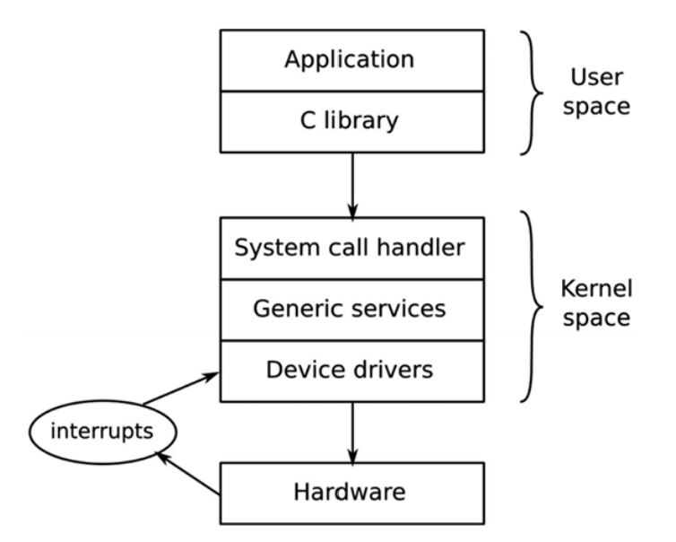
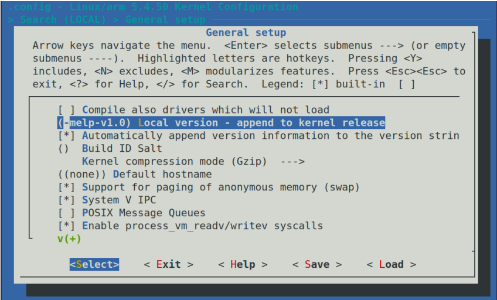

# 配置与构建内核
内核是嵌入式Linux的第三个组件。它负责管理硬件的资源与接口，因此它几乎可以影响到最终软件构建的各个方面。它通常是根据你的特定的硬件配置进行定制的，尽管正如我们在第三章“关于Bootloader”中所看到的，设备树允许你创建一个根据设备树的内容对特定硬件进行定制的通用内核。
在本章中，我们将研究如何为板获取内核，并且如何配置和编译它。我们将再次研究Bootstrap，这次重点关注内核所发挥的作用。我们还将研究设备驱动以及它们怎么从设备树中获取信息。
我们将会涉及到如下主题：
- 内核是做什么的？
- 内核的选择
- 内核的构建
- 内核的启动
- 移植内核到一个新板

## 技术要求
要按照示例进行操作，请确保您具有以下内容：
- 基于Linux的主机系统
- 第2章 “学习工具链”中的crosstool-NG工具链
- microSD卡读卡器和卡
- 第3章“关于引导加载程序”中安装了U-Boot的microSD卡
- USB转TTL3.3V串行电缆
- 树莓派 4
- 5V3A的USB-C电源
- BeagleBone Black
- 一个5V1A的直流电源

本章的所有代码都可以在本书的GitHub存储库的Chapter04文件夹中找到：https://github.com/PacktPublishing/MasteringEmbedded-Linux-Programming-Third-Edition。

## 内核是做什么的？
Linux始于1991年，当时Linus Tovalds开始为基于Intel 386和486的个人计算机编写操作系统。他的灵感来自4年前由Andrew S. Tanenbaum编写的Minix操作系统。Linux 在很多方面与 Minix 不同;主要区别在于它是一个 32 位虚拟内存内核，代码是开源的，后来在 GPL v2 许可证下发布。他于 1991 年 8 月 25 日在 comp.os.minix 新闻组的一篇著名帖子中宣布了这一消息，该帖子开头如下：
_Hello everybody out there using minix—I'm doing a (free) operating system (just a hobby, won't be big and professional like GNU) for 386(486) AT clones. This has been brewing since April, and is starting to get ready. I'd like any feedback on things people like/dislike in minix, as my OS resembles it somewhat (same physical layout of the filesystem (due to practical reasons) among other things)._
严格准确地说，Linus没有编写操作系统，而是编写了一个内核，内核只是操作系统的一个组件。为了创建一个带有用户空间命令和shell命令解释器的完整操作系统，他使用了GNU项目中的组件，特别是工具链，C库和基本的命令行工具。这种区别今天仍然存在，并为Linux的使用方式提供了很大的灵活性。
Linux内核可以与GNU用户空间结合使用，以创建一个在桌面和服务器上运行的完整Linux发行版，有时称为 GNU/Linux;它可以与Android用户空间结合使用以创建众所周知的移动操作系统，也可以与基于BusyBox的小型用户空间结合使用以创建紧凑的嵌入式系统。
与此形成对比的是BSD操作系统、FreeBSD、OpenBSD和NetBSD，其中内核、工具链和用户空间被组合成一个代码库。通过删除工具链，可以在没有编译器或头文件的情况下部署更精简的运行时映像。通过将用户空间与内核分离，您可以在初始化系统（runit 与systemd）、C 库（musl与glibc）和包格式（.apk与.deb）方面获得选择。
内核有三个主要工作：管理资源、与硬件接口以及提供向用户空间程序提供有用抽象级别的 API，如下图所示：


在**用户空间**运行的应用程序以较低的CPU特权级别运行。除了调用别的库外它们几乎做不了什么。**用户空间**与**内核空间**的主要接口是**C库**，它将用户级函数（如POSIX定义的函数）转换为内核系统调用。系统调用接口使用特定于体系结构的方法，如陷阱或者软件中断，将CPU从低权限用户模式切换到高权限内核模式，这允许访问所有内存地址和CPU寄存器。
系统调用处理程序将调用分派到适当的内核子系统：内存分配调用到内存管理子系统，文件系统调用分配到文件系统子系统，等等。其中一些调用需要底层硬件的输入，并将传递给设备驱动程序。在某些情况下，硬件本身通过引发中断来调用内核函数。
|重要提示：上图显示了内核代码的第二个入口点：硬件中断。中断只能在设备驱动程序中处理，而不能由用户空间应用程序处理。|
---

换句话说，应用程序所做的所有有用的事情都是通过内核完成的。因此，内核是系统中最重要的元素之一。因此，了解如何选择是很重要的——让我们下一步来做。

## 内核的选择
下一步是为您的项目选择内核，需要在始终使用最新版本软件的愿望与对供应商特定添加的需求以及对代码库长期支持的兴趣之间取得平衡。

### 内核开发周期
Linux的开发速度很快，每8到12周就会发布一个新版本。近年来，版本号的构造方式发生了一些改变。在2011年7月之前，有一个三个数字的版本方案，它的版本号看起来像2.6.39。中间数字表示了它是开发版本还是稳定版本，奇数（如2.1.x、2.3.x、2.5.x）是开发版本，而偶数则面向最终用户。
从2.6版本开始，长期开发分支(对应奇数)的想法被丢弃了，因为这样会导致用户更慢的更新版本。2011年7月，版本从2.6.39编程了3.0，纯粹是因为Linus觉得数字变得太大了；在这两个版本之间，Linux的功能或者体系结构并没有发生巨大的飞跃。他还利于这个机会去掉了中间的数字。从此之后，在2015年4月和2019年3月，他分别将主版本号从3升到4再到4，同样也只是为了整洁，而不是因为任何重大的架构变化。
Linus管理开发内核树。你可以像这样克隆Git树来复制：
```shell
$ git clone git://git.kernel.org/pub/scm/linux/kernel/git/torvalds/linux.git
```

这样就能linux子目录。你可以不时的git pull来保持目录的最新状态。
目前，内核开发的整个周期从两周的合并开始，在此期间，Linus接受新功能补丁。在合并窗口结束之后，稳定阶段开始了，在此期间，Linus生成每周发布的候选版本，版本号以-rc1，-rc2等结尾，通常可达-rc7或者-rc8。在这阶段，人们可以测试候选的程序并提交错误报告或者修复程序。当所有重要的错误都被修复之后，内核就会被释放。
合并窗口中包含的代码必须以及相当成熟。通常，它是从内核的许多子系统和体系结构维护者的存储库中提取的。通过保持较短的开发周期，功能可以在准备好后进行合并。如果内核维护人员认为某个功能不够稳定或者开发的不够好，那么它可以简单的推迟到下一个版本。
跟踪一个版本到另一版本的变化并不容易，你可以在Linus的Git存储仓库中读取提交日志，但由于有10000或者更多的条目，因此获得概述并不容易。值得庆幸的是，这里有Linux **KernelNewbies**网站，https://kernelnewbies.org 。你可以从中获取到每个版本的简洁概述https://kernelnewbies.org/LinuxVersions 。

### 稳定和长期支持版本
Linux的快速变化是一件好事，因为它为主线代码带来了新的功能，但它不太适合嵌入式项目的较长生命周期。内核开发人员通过两种方式来解决这一问题，即稳定版本和长期版本。主线内核（由Linus Torvalds维护）发布后，它被移到稳定树（由Greg Kroah Hartman维护）。错误修复应用于稳定内核，而主线内核则开始于下一个开发周期。稳定内核的点开发版由第三个数字标记，3.18.1、3.18.2等。在版本3之前，还要四位的release版本，如2.6.29.1、2.6.39.2等。
您可以使用以下命令获取稳定树：
```shell
$ git clone git://git.kernel.org/pub/scm/linux/kernel/git/stable/linux-stable.git
```

你可以使用git checkout来获取特定版本，例如5.4.50：
```shell
$ cd linux-stable
$ git checkout v5.4.50
```

通常，只有稳定的内核才会更新，直到下一个主线版本（8到12周后），正如你会看到在https://www.kernel.org/ 的那样。为了满足那些希望在更长时间更新的用户，并确保任何错误都会被发现和修复，一些内核被标记为长期版本并将获得至少两年的维护。每年至少会有一个长期内核发布。
在本书撰写时，https://www.kernel.org/ 上共有5个长期版本，5.4、4.19、4.14、4.9和4.4。其中最久的一个已经维护了近5年，版本为4.4.256。荣誉感以你正在构建一个必须维护很久的项目，那么最新的长期内核（如本例中的5.4）可能是一个好选择。

#### 厂商支持
在理想的情况下，您可以从https://www.kernel.org/ 下载内核并为任何支持Linux的设备配置它。然而，理想总是遥远的；事实上，主流Linux只支持许多可以运行Linux的设备中的一部分。你可以在开源项目或者为嵌入式Linux提供第三方支持的公司找到对板或者SoC的支持，比如Linaro或者Yocto。但是在很多时候，你将不得不向SoC或者板的供应商寻求可用的内核。
我们都知道，一部分供应商在对Linux的支持上更具优势。在这一点上，我建议你选择能够提供良好支持的供应商，甚至是能够不厌其烦将改动合并入主线的厂商。在Linux内核邮件列表或者提交历史记录中搜索候选SoC或者板的最近活动。当主线内核没有上游更改的时候，供应商能不能提供良好的支持主要看其口碑。一些臭名昭著的厂商只会发布一个内核代码，然后就将全部的精力转移到新的SoC去了。


#### 许可证
Linux源代码是根据GPL v2授权的，这意味着您必须以许可证中指定的方式之一提供内核的源代码。
内核许可证的实际文本在COPYING文件中。它以Linus编写的一份附录开始，该附录指出，通过系统调用接口从用户空间调用内核的代码不被视为内核的衍生作品，因此不在许可证的范围内。因此，在Linux之上运行专有应用程序是没有问题的。
然而，Linux许可有一个领域一直陷入无休止的混乱与争论：内核模块。内核模块是一段在运行时与内核动态链接的代码，从而扩展内核的功能。GPL没有区分静态链接和动态链接，因此看起来内核模块的源代码已被GPL覆盖。但是，在Linux的早期，对于这一规则的例外情况存在争议，例如与Andrew文件系统相关的部分。该代码早于Linux，因此一些人认为这不是衍生作品，所以许可证不适用。
多年来，针对其他代码段也进行了类似的讨论，结果是现在公认的做法是GPL不一定适用于内核模块。这是由内核MODULE_LICENSE宏编码的，该宏可能采用Proprietary值来表示它不是在GPL下发布的。如果你计划自己使用相同的参数，你可能想阅读一个经常被引用的电子邮件线程，标题是Linux GPL and binary module exception clause？保存在https://yarchive.net/comp/linux/gpl_modules.html 。
GPL应该被认为是一件好事，因为它保证了当我们处理嵌入式项目时，我们总是可以获得内核的源代码。如果没有它，嵌入式Linux将更难使用，而且更加碎片化。

## 编译内核
在决定了构建基于哪个内核之后，下一步就是构建它。

### 获取源代码
本书中使用的所有三个目标，树莓派4、BeagleBone Black和ARM Versatile PB，都得到了主流内核的良好支持。因此，使用从https://www.kernel.org/ 下载最新的长期内核是有意义的，在撰写本文时为5.4.50。当你自己来做这件事时，你应该检查一下是否有5.4内核的更高版本，并使用它，因为它会修复5.4.50发布后发现的错误。
|重要提示：如果有以后的长期版本，您可能需要考虑使用该版本，但要注意，可能发生了一些更改，这意味着以下命令序列不能完全按照给定的顺序工作|
---

要获取5.4.50版本Linux内核的tarball，请使用以下操作：
```shell
$ wget https://cdn.kernel.org/pub/linux/kernel/v5.x/linux-5.4.50.tar.xz
$ tar xf linux-5.4.50.tar.xz
$ tar xf linux-5.4.50.tar.xz
```

要获取更高版本，请在linux之后将5.4.50替换为所需的长期版本。
这里有很多代码。根据SLOCount实用程序的测量，5.4内核中有57000多个文件，其中包含C源代码、头文件和汇编代码，总计超过1400万行代码。尽管如此，了解代码的基本布局并大致了解在哪里查找特定组件是值得的。我们感兴趣的主要目录如下：
- arch：包含特定于体系结构的文件。每个体系结构有一个子目录
- Documentation：包含内核文档。如果想查找有关Linux某个方面的更多信息，请先查看此处
- drivers：包含数千个设备驱动程序。每种类型的驱动程序都有一个子目录
- fs：包含了文件系统的代码
- include：包含内核头文件，包括构建工具链时所需的头文件
- init：包含了内核启动代码
- kernel：包含核心功能，包括调度、锁定、定时器、电源管理和调试/跟踪代码
- mm：包含内存管理
- net：包含了网络协议
- scripts：包含许多有用的脚本，包括我在第3章“关于引导程序”中描述的设备树编译器（DTC）
- tools：包含许多有用的工具，包括Linux性能计数器工具perf，我将在第20章“分析和跟踪”中对其进行描述

随着时间的推移，您将熟悉这种结构。如果您正在寻找特定SoC的串行端口代码，您会意识到可以在drivers/ty/serial中找到它，而不是在arch/$arch/mach-foo中。因为它是一个设备驱动程序，而不是特定于CPU体系结构的东西。

### 理解内核配置 - Kconfig
Linux的优势之一是可以在很大程度上配置内核以适应不同的工作，从小型专用设备（如智能恒温器）到复杂的移动手机。在当前版本中，有成千上万的配置选项。正确配置本身就是一项任务，但在我们开始之前，我想向您展示它是如何工作的，这样您就可以更好地了解正在发生的事情。
配置机制称为Kconfig，与之集成的构建系统称为Kbuild。两者都可以在Documentation/kbuild中找到文档。Kconfig/Kbuild用于许多其他项目以及内核，包括crosstool-NG、U-Boot、Barebox和BusyBox。
配置选项在名为Kconfig的文件层次结构中声明，使用Documentation/kbuild/Kconfig-language.rst中描述的语法。
在Linux中，顶层Kconfig如下所示：
```shell
mainmenu "Linux/$(ARCH) $(KERNELVERSION) Kernel Configuration"

comment "Compiler: $(CC_VERSION_TEXT)"

source "scripts/Kconfig.include"
[...]
```

arch/Kconfig的第一行是这样的：
```shell
source "arch/$(SRCARCH)/Kconfig"
```

这一行包括依赖于体系结构的配置文件，该文件来源于其他Kconfig文件，具体取决于启用了哪些选项。
让架构发挥如此重要的作用有三个方面的含义：
- 首先，在配置Linux时，必须通过使用ARCH=[architecture]来指定架构，否则它将默认为本地机器架构
- 其次，当你设置完ARCH后，SRCARCH往往也被其决定了，所以你几乎不需要显式的指定SRCARCH
- 第三，每个架构的顶层菜单布局不同

你在ARCH中设置的值是你在arch目录中找到的子目录之一，但是例外的是ARCH=i386和ARCH=x86_64都代表arch/x86/Kconfig。
Kconfig文件由menu们组成，由menu和endmenu关键字描述。menu元素由config关键字标记。
下面是一个例子，来自 dirvers/char/Kconfig：
```shell
menu "Character devices"
[…]
config DEVMEM
    bool "/dev/mem virtual device support"
    default y
    help
    Say Y here if you want to support the /dev/mem device.
    The /dev/mem device is used to access areas of physical
    memory.
    When in doubt, say "Y".
[…]
endmenu
```

config后面的参数命名了一个变量，本例中是DEVMEM。由于此选项是bool（布尔值），因此它只能有两个值：如果启用，该变量被赋值为y，如果没启用，则根本不定义该变量。屏幕上显示的menu项的名称是bool关键字后面紧跟的字符串。
此配置项与其它所有配置项存储在.config文件中。

|提示：.config中的前导点（.）表示它是一个隐藏文件，除非键入ls-a以显示所有文件，否则ls命令不会显示它。|
---

该配置项对应的行如下所示：
```shell
CONFIG_DEVMEM=y
```

除了bool外，还有其它几种数据类型。以下是完整的列表：
- bool：可以是y或者是未曾定义
- tristate：在功能可选构建为内核模块或者构建到内核镜像中的时候使用。如果该值为m代表选择构建为内核模块，y的话表示构建入镜像，如果未定义该值代表未启用该功能
- int：使用十进制表示的整数值
- hex：使用十六进制表示的无符号整数值
- string：字符串

项之间可能存在依赖关系，由依赖关系表示，如下：
```shell
config MTD_CMDLINE_PARTS
    tristate "Command line partition tableparsing"
    depends on MTD
```

如果CONFIG_MTD未在其它地方启用，则不会显示此menu选项，因此无法选择。
也存在反向依赖关系；如果启用了select关键字，则该关键字会启用其他选项。arch/$ARCH中的Kconfig中有大量的select语句，这些语句可以启用针对于特定架构的功能，比如ARM：
```shell
config ARM
    bool
    default y
    select ARCH_CLOCKSOURCE_DATA
    select ARCH_HAS_DEVMEM_IS_ALLOWED
[…]
```

通过选择ARCH_LOCKSOURCE_DATA和RCH_AS_DEVMEM_IS_ALLOWED，我们将为这些变量分配一个y值，以便将这些特性静态地构建到内核中。
有几个配置实用程序可以读取Kconfig文件并生成.config文件。其中一些会在屏幕上显示菜单，并允许你以交互方式进行选择。menuconfig可能是大多数人熟悉的，但也有xconfig和gconfig。
要使用menuconfig，首先需要安装ncurses、flex和bison。以下命令可以在Ubuntu上安装这些前提条件：
```shell
$ sudo apt install libncurses5-dev flex bison
```

你可以通过make命令启动menuconfig，记住，在kernel里，必须指定一个架构，如下所示：
```shell
$ make ARCH=arm menuconfig
```

在这里，您可以看到带有高亮的DEVMEM配置选项的menuconfig：


选项左侧的星号（*）表示已选择将驱动程序静态构建到内核中，或者，如果它是M表示它将作为内核模块构建，以便在运行时插入内核。

|提示：你可以经常看到诸如启用CONFIG_BLK_DEV_INITRD的指令，但是由于要浏览的选项太多，可能需要一段时间才能找到设置该配置的位置。所有配置编辑器都有搜索功能。你可以在menuconfig中使用正斜杠/键来使用。在xconfig，它位于Edit菜单中，但是请确保你将搜索的配置项的CONFIG_部分去掉。|
---

由于要配置的东西太多，每次构建的时候都从一个空白的menu来开始是不合理的，所以arch/$ARCH/configs中有一组已知的可用的配置文件，每个文件都包含了对应一个SoC或者一组SoC的适当配置值。
你可以从中选择一个使用通过make[配置文件名称]命令。例如，要将Linux配置为ARMv7-a架构在各种SoC中运行，你需要输入一下内容：
```shell
$ make ARCH=arm multi_v7_defconfig
```

这是一个通用内核，运行在各种不同的板上。对于更专业的应用程序，例如，当使用供应商提供的内核时，默认配置文件是板级支持包的一部分；在构建内核之前，你需要确认具体使用的是哪一个。
还有另一个名为oldconfig的有用配置。当你将配置移动到较新的内核版本时，可以使用它。此目标会获取一个现有的.config文件，并提示你有关新配置选项的问题。将.config从旧的内核移动到新的源目录，并运行make ARCH=arm lodconfig命令使其更新。
oldconfig目标也可以用于验证手动编辑的.config文件（忽略文本“自动生成的文件”；不要编辑顶部出现的文本；有时可以忽略警告）。
如果您确实对配置进行了更改，则修改后的.config文件将成为板支持包的一部分，并且需要置于源代码控制之下。
启动内核构建时，会生成一个头文件include/generated/autoconf.h，其中包含每个配置值的#define，以便将其包含在内核源中。
既然我们已经确定了内核并学会了如何配置它，现在我们将开始定义我们的内核。

### 使用LOCALVERSION定义内核
你可以使用make kernelversion和make kernelrelease目标来发现内核的版本和分支。
```shell
$ make ARCH=arm kernelversion
5.4.50
$ make ARCH=arm kernelrelease
5.4.50
```

在运行时，这也可以使用uname命令显示，这也被用于存储内核模块的目录命名。
如果你基于默认配置进行配置修改，建议你附加自己的版本信息，你可以通过配置CONFIG_LOCALVERSION来做。例如，如果我想使用melp标记符和版本1.0标记我正在构建的版本，我会在menuconfig中定义本地版本，如下所示：


运行make kernelversion会产生与以前相同的输出，但现在如果我运行make kernelrelease，我看到以下内容：
```shell
$ make ARCH=arm kernelrelease
5.4.50-melp-v1.0
```

这是内核版本控制的一条愉快的弯路，但现在让我们回到为编译配置内核的工作上来。

#### 何时应该使用内核模块
我已经多次提到内核模块了。桌面Linux发行版广泛使用它们，因此可以在运行时加载正确的设备和内核功能，具体取决于检测到的硬件和所需的功能。如果没有它们，每一个驱动程序和功能都必须静态地链接到内核中，这使得内核变得无比巨大。
另一方面，对于嵌入式设备，硬件与内核配置通常在配置时已经确定了，因此内核模块的作用不那么明显。事实上，它还有可能造成一个问题，它在内核和根文件系统之间制造了版本依赖关系，如果其中一个更新了而另一个没有就有可能导致引导失败。因此，在嵌入式系统中通常不需要任何模块。
在以下情景中，在嵌入式系统中使用内核模块是有益的：
- 当你有专用模块的使用，基于之前章节提到的许可证问题
- 通过延迟加载非必要的驱动程序来减少启动时间
- 当你有多个需要加载的驱动程序时，静态编译将会占用太多内存。例如，你有一个支持一系列设备的USB接口，这与桌面发行版同理

接下来，让我们学习如何使用Kbuild编译带有或不带有内核模块的内核镜像。

### 编译-Kbuild
内核构建系统Kbuild是一组make脚本，它们从.config文件中读取配置信息，计算依赖关系，并编译生成内核镜像所需的一切。这个内核镜像包含所有静态链接的组件，可能是设备树二进制文件，也可能是一个或多个内核模块。依赖关系使用makefile表示，makefile位于每个具有可构建组件的目录中。例如，以下两行取自divers/char/Makefile:
```shell
obj-y += mem.o random.o
obj-$(CONFIG_TTY_PRINTK) += ttyprintk.o
```

obj-y规则无条件的编译一个文件以生成目标文件，因此mem.c和random.c始终是内核的一部分。第二行中，ttyprintk.o依赖于一个配置参数。如果CONFIG_TTY_PRINTK为y，则编译为内置；如果配置为m，则它被构建为一个模块；如果该参数未定义则根本不编译它。
对于大多数目标，只需要键入make（使用适当的ARCH和CROSS_COMPILE）即可完成任务，但一步一个脚印很有指导意义。有关CROSS_COMPILE这个make变量的含义，请参阅第2章“学习工具链”的最后一节。

#### 找到要构建的内核目标
要构建内核镜像，您需要知道bootloader所期望的内容。这是一个粗略的指南：
- **U-Boot**：传统上，U-Boot需要uImage，但是较新版本可以使用bootz命令加载zImage文件
- **x86目标**：要求bzImage文件
- **大多数其他bootloader**：需要zImage文件

下面是一个构建zImage文件的例子：
```shell
$ make -j 4 ARCH=arm CROSS_COMPILE=arm-cortex_a8-linux-gnueabihf- zImag
```

|提示：-j4选项告诉make要并行运行多少个作业，这会减少构建所需的时间。粗略的说法是在不大于CPU核心数的情况下尽可能多|
----

为支持多平台的ARM构建uImage文件存在一个小问题，这是当前一代ARM SoC内核的规范。Linux 3.7中引入了对ARM的多平台支持。它允许单个内核二进制文件在多个平台上运行，是朝着为所有ARM设备提供少量内核的方向迈出的一步。内核通过读取机器编号或引导加载程序传递给它的设备树来选择正确的平台。出现这个问题是因为每个平台的物理内存位置可能不同，因此内核的重新定位地址（通常从物理RAM开始的0x8000字节）也可能不同。
内核构建时，mkimage命令会将重定向地址编码到uImage标头中，但如果有多个重定向地址可供选择，则会失败。换句话说，uImage格式与多平台镜像不兼容。你仍然可以从多平台构建中创建uImage二进制文件，只要你给出你希望启动这个内核的特定SoC的LOADADDR。你可以在arch/$arch/mach-[your SoC]/Makefile.boot中查找加载地址，并注意zreladdr-y的值：
```shell
$ make -j 4 ARCH=arm CROSS_COMPILE=arm-cortex_a8-linux-gnueabihf- LOADADDR=0x80008000 uImage
```

无论我们的目标是哪种内核镜像格式，在生成可引导镜像之前，都会首先创建相同的两个构建工件。

#### 构建工件
一次内核构建会在最顶层目录生成两个文件：vmlinux和System.map。其中第一个，vmlinux，是ELF二进制格式的内核。如果你在编译内核的时候开启了debug模式（CONFIG_DEBUG_INFO=y），这里也会包括一些调试信息以方便你使用类似kgdb之类的调试器。你也可以使用其他的ELF二进制工具，例如你可以使用size来测量vmlinux可执行文件每个段（text、data、bss）的长度。
```shell
$ arm-cortex_a8-linux-gnueabihf-size vmlinux
    text data bss dec hex filename
14005643 7154342 403160 21563145 1490709 vmlinux
```

dec和hex项分别指十进制与十六进制表示下的文件总大小。
System.map中包含了人类可读形式的符号表。
大部分的bootloader无法直接处理ELF文件。这里还有一个额外的处理阶段来处理vmlinux并且将这些二进制文件放置到arch/$ARCH/boot中以适应各种bootloader：
- Image：被转化为原始二进制格式的vmlinux
- zImage：适用于PowerPC架构，这是Image的压缩后版本，这也意味着bootloader必须做一次解压的操作。对于其他所有的架构而言，压缩后的镜像被加载到一个代码桩上，这个桩将会对镜像进行解压与重定位
- uImage：zImage加上一个64位的U-Boot头

当构建进行时，你将会看到一系列被调用命令的概览：
```shell
$ make -j 4 ARCH=arm CROSS_COMPILE=arm-cortex_a8-linux-gnueabihf- \
zImage
    CC scripts/mod/empty.o
    CC scripts/mod/devicetable-offsets.s
    MKELF scripts/mod/elfconfig.h
    HOSTCC scripts/mod/modpost.o
    HOSTCC scripts/mod/sumversion.o
[…]
```

一些时候，当内核构建失败的情况，查看当前正在运行的命令行是非常有用的。为了实现这个目标，在命令行中增加V=1：
```shell
$ make -j 4 ARCH=arm CROSS_COMPILE=arm-cortex_a8-linux-gnueabihf- \
V=1 zImage
[…]
arm-cortex_a8-linux-gnueabihf-gcc -Wp,-MD,drivers/tty/.
tty_baudrate.o.d -nostdinc -isystem /home/frank/x-tools/
arm-cortex_a8-linux-gnueabihf/lib/gcc/arm-cortex_a8-linux-gnueabihf/8.3.0/include -I./arch/arm/include -I./arch/arm/
include/generated -I./include -I./arch/arm/include/uapi -I./
arch/arm/include/generated/uapi -I./include/uapi -I./include/
generated/uapi -include ./include/linux/kconfig.h -include 
./include/linux/compiler_types.h -D__KERNEL__ -mlittle-endian -Wall -Wundef -Werror=strict-prototypes -Wno-trigraphs 
-fno-strict-aliasing -fno-common -fshort-wchar -fno-PIE 
-Werror=implicit-function-declaration -Werror=implicit-int 
-Wno-format-security -std=gnu89 -fno-dwarf2-cfi-asm -fno-ipa-sra -mabi=aapcs-linux -mfpu=vfp -funwind-tables -marm -Wa,-mno-warn-deprecated -D__LINUX_ARM_ARCH__=7 -march=armv7-a -msoft-float -Uarm -fno-delete-null-pointer-checks -Wno-frame-address 
-Wno-format-truncation -Wno-format-overflow -O2 --param=allow-store-data-races=0 -Wframe-larger-than=1024 -fstack-protector-strong -Wno-unused-but-set-variable -Wimplicit-fallthrough 
-Wno-unused-const-variable -fomit-frame-pointer -fno-var-tracking-assignments -Wdeclaration-after-statement -Wvla 
-Wno-pointer-sign -Wno-stringop-truncation -Wno-array-bounds 
-Wno-stringop-overflow -Wno-restrict -Wno-maybe-uninitialized 
-fno-strict-overflow -fno-merge-all-constants -fmerge-
constants -fno-stack-check -fconserve-stack -Werror=date-time 
-Werror=incompatible-pointer-types -Werror=designated-init 
-fmacro-prefix-map=./= -Wno-packed-not-aligned -DKBUILD_
BASENAME='"tty_baudrate"' -DKBUILD_MODNAME='"tty_baudrate"' -c 
-o drivers/tty/tty_baudrate.o drivers/tty/tty_baudrate.c
[…]
```

在本节中，我们了解了Kbuild如何获取预编译的vmlinux ELF二进制文件并将其转换为可引导的内核映像。接下来，我们将研究如何编译设备树。

#### 编译设备树
下一步就是构建设备树，对于多平台编译多个设备树。dtbs目标根据arch/$ARCH/boot/dts/Makefile中的规则，使用该目录中的设备树源文件来构建设备树。以下是为multi_v7_defconfig构建dtbs目标的片段：
```shell
$ make ARCH=arm dtbs
[…]
    DTC arch/arm/boot/dts/alpine-db.dtb
    DTC arch/arm/boot/dts/artpec6-devboard.dtb
    DTC arch/arm/boot/dts/at91-kizbox2.dtb
    DTC arch/arm/boot/dts/at91-nattis-2-natte-2.dtb
    DTC arch/arm/boot/dts/at91-sama5d27_som1_ek.dtb
[…]
```

编译生成的.dtb文件会在源文件的相同目录下。

#### 编译模块
如果你配置了一些特定作为模块，你可以通过modules目标来构建它们：
```shell
$ make -j 4 ARCH=arm CROSS_COMPILE=arm-cortex_a8-linux-gnueabihf- \
modules
```

编译后的模块有一个.ko后缀，并且在与源代码相同的目录生成，这意味着它们分散在内核源代码树中。找到它们有点麻烦，但是你可以使用modules_install make目标来将它们安装到正确的位置。默认的位置在开发系统的/lib/modules中，这大概率不是你希望的。要将它们安装到根文件系统中的暂存区（我们将在下一节讨论根文件系统），请使用install_MOD_path提供路径：
```shell
$ make -j4 ARCH=arm CROSS_COMPILE=arm-cortex_a8-linux-gnueabihf- \
INSTALL_MOD_PATH=$HOME/rootfs modules_install
```

相对于文件系统的根目录，内核模块被放入/lib/modules/[Kernel version]目录。

#### 清理内核代码
这里有三个make目标来清理内核源代码树：
- clean：删除对象文件和大多数中间文件
- mrproper：删除所有中间文件，包括.config文件。使用此目标可以将源代码树返回克隆或者提取源代码后立刻处于的状态。如果你对这个名字感到好奇，Mr.Proper是一种在世界某些地方很常见的清洁产品。make mrproper的意义是给源代码树一个很好的清理
- distclean：这与mrproper是一样的，但是它也会删除编辑备份文件，补丁文件和其它软件开发产物

我们已经看到了内核编译步骤及其结果输出。现在让我们为手头的主板构建一些内核。

### 为树莓派4构建一个64位的内核
尽管内核的主线代码已经支持了树莓派4，但是我在写作时发现树莓派基金会的Linux fork分支（https://github.com/raspberrypi/linux）更加稳定。该fork 分支的4.19.y版本也比同一fork分支的rpi-5.4y版本更积极的维护。这种情况在不久的将来可能会发生变化，但是就目前而言，让我们坚持使用4.19.y分支。
由于树莓派4中有一个64位4核的ARM Cortex-A72 CPU，我们将使用ARM的GNU工具链，以AArch64 GNU/Linux为目标，为其交叉编译64位内核。这个预购建的工具链可以从https://developer.arm.com/tools-and-software/open-source-software/developer-tools/gnu-toolchain/gnu-a/downloads 下载：
```shell
$ cd ~
$ wget https://developer.arm.com/-/media/Files/downloads/gnu-a/10.2-2020.11/binrel/gcc-arm-10.2-202011-x86_64-aarch64-none-linux-gnu.tar.xz
$ tar xf gcc-arm-10.2-2020.11-x86_64-aarch64-none-linux-gnu.tar.xz
$ mv gcc-arm-10.2-2020.11-x86_64-aarch64-none-linux-gnu gcc-arm-aarch64-none-linux-gnu
```

gcc-arm-10.2-2020.11-x86_64-aarch64-none-linux-gnu是当前x86_64 Linux托管的交叉编译器，在撰写本文时以AArch64 GNU/Linux为目标。如果下载失败，请将前面命令中的10.2-2020.11替换为当前版本。
接下来，安装几个获取和构建内核过程中需要的包：
```shell
$ sudo apt install subversion libssl-dev
```

现在您已经安装了必要的工具链和软件包，在名为linux的目录中克隆4.19.y内核，并将一些预构建的二进制文件导出到引导子目录:
```shell
$ git clone --depth=1 -b rpi-4.19.y https://github.com/raspberrypi/linux.git
$ svn export https://github.com/raspberrypi/firmware/trunk/boot
$ rm boot/kernel*
$ rm boot/*.dtb
$ rm boot/overlays/*.dtbo
```

导航到新克隆的linux目录并构建内核:
```shell
$ PATH=~/gcc-arm-aarch64-none-linux-gnu/bin/:$PATH
$ cd linux
$ make ARCH=arm64 CROSS_COMPILE=aarch64-none-linux-gnu- bcm2711_defconfig
$ make -j4 ARCH=arm64 CROSS_COMPILE=aarch64-none-linux-gnu-
```

构建完成后，将内核映像、设备树Blob和引导参数复制到引导子目录：
```shell
$ cp arch/arm64/boot/Image ../boot/kernel8.img
$ cp arch/arm64/boot/dts/overlays/*.dtbo ../boot/overlays/
$ cp arch/arm64/boot/dts/broadcom/*.dtb ../boot/
$ cat << EOF > ../boot/config.txt
enable_uart=1
arm_64bit=1
EOF
$ cat << EOF > ../boot/cmdline.txt
console=serial0,115200 console=tty1 root=/dev/mmcblk0p2 
rootwait
EOF
```

以上这些命令都可以在脚本MELP/CChapter04/build linux-rpi4-64.sh中找到。请注意，写入cmdline.txt的内核命令行必须全部在一行上。让我们将这些步骤分为几个阶段：
    1. 将树莓派基金会内核分叉的rpi-4.19.y分支克隆到linux目录中
    2. 将树莓派基金会固件仓库的引导子目录的内容导出到引导目录
    3. 从引导目录中删除现有的内核映像、设备树Blob和设备树覆盖
    4. 从linux目录中，为树莓派4构建64位内核、模块和设备树
    5. 将新建的内核映像、设备树Blob和设备树覆盖从arch/arm64/boot/复制到引导目录
    6. 将config.txt和cmdline.txt文件写入树莓派4的引导程序的引导目录，以读取并传递给内核

让我们看看config.txt中的设置。enable_uart=1行在引导过程中启用串行控制台，这在默认情况下是禁用的。arm_64bit=1行指示树莓派4的bootloader以64位模式启动CPU，并从名为kernel8.img的文件加载内核映像，而不是32位arm的默认kernel.img文件。
现在，让我们看看cmdline.txt。console=serial0115200和console=tty1内核命令行参数指示内核在内核启动时向串行控制台输出日志消息。

### 为BeagleBone Black构建内核
根据已经给出的信息，以下是使用交叉工具NG ARM Cortex A8交叉编译器为BeagleBone Black构建内核、模块和设备树的完整命令序列：
```shell
$ cd linux-stable
$ make ARCH=arm CROSS_COMPILE=arm-cortex_a8-linux-gnueabihf-mrproper
$ make ARCH=arm multi_v7_defconfig
$ make -j4 ARCH=arm CROSS_COMPILE=arm-cortex_a8-linux-gnueabihf- zImage
$ make -j4 ARCH=arm CROSS_COMPILE=arm-cortex_a8-linux-gnueabihf- modules
$ make ARCH=arm CROSS_COMPILE=arm-cortex_a8-linux-gnueabihf-dtbs
```

这些命令位于MELP/CChapter04/build-linux-bbb.sh脚本中。

### 为QEMU构建内核
以下是为QEMU使用crosstool-NG v5TE编译器模拟的ARM Versatile PB构建Linux的命令序列：
```shell
$ cd linux-stable
$ make ARCH=arm CROSS_COMPILE=arm-unknown-linux-gnueabi-mrproper
$ make -j4 ARCH=arm CROSS_COMPILE=arm-unknown-linux-gnueabi-zImage
$ make -j4 ARCH=arm CROSS_COMPILE=arm-unknown-linux-gnueabi-modules
$ make ARCH=arm CROSS_COMPILE=arm-unknown-linux-gnueabi- dtbs
```

这些命令位于MELP/CChapter04/build-linux-versatilepb.sh脚本中。在本节中，我们看到了如何使用Kbuild为目标编译内核。现在，我们将学习如何启动内核。

## 启动内核
引导Linux高度依赖于设备。在本节中，我将向您展示它是如何适用于树莓派4、BeagleBone Black和QEMU的。对于其他目标板，您必须咨询供应商或社区项目的信息（如果有）。此时，您应该有树莓派4、BeagleBone Black和QEMU的内核映像文件和设备树Blob。

### 启动树莓派4
树莓派使用博通提供的专有引导程序，而不是U-Boot。与以前的树莓派型号不同，树莓派4的bootloader位于板载SPI EEPROM上，而不是microSD卡上。我们仍然需要将树莓派4的内核映像和设备树块放在microSD上，以启动我们的64位内核。
首先，您需要一个带有FAT32引导分区的microSD卡，该分区足够大，可以容纳必要的内核构建工件。引导分区需要是microSD卡上的第一个分区。1 GB的分区大小就足够了。将microSD卡插入读卡器，然后将引导目录的全部内容复制到引导分区。卸下卡并将其插入树莓派4。将USB转TTL串行电缆连接到40引脚GPIO头上的GND、TXD和RXD引脚(https://learn.adafruit.com/adafruits-raspberry-pi-lesson-5-using-a-console-cable/connect-the-lead). 接下来，启动一个终端模拟器，如gtkterm。最后，打开树莓派4的电源，您应该会在串行控制台上看到以下输出：
```shell
[ 0.000000] Booting Linux on physical CPU 0x0000000000 
[0x410fd083]
[ 0.000000] Linux version 4.19.127-v8+ (frank@franktop) 
(gcc version 10.2.1 20201103 (GNU Toolchain for the A-profile 
Architecture 10.2-2020.11 (arm-10.16))) #1 SMP PREEMPT Sat Feb 
6 16:19:37 PST 2021
[ 0.000000] Machine model: Raspberry Pi 4 Model B Rev 1.1
[ 0.000000] efi: Getting EFI parameters from FDT:
[ 0.000000] efi: UEFI not found.
[ 0.000000] cma: Reserved 64 MiB at 0x0000000037400000
[ 0.000000] random: get_random_bytes called from start_
kernel+0xb0/0x480 with crng_init=0
[ 0.000000] percpu: Embedded 24 pages/cpu s58840 r8192 
d31272 u98304
[ 0.000000] Detected PIPT I-cache on CPU0
[…]
```

该序列将以内核错误结束，因为内核无法在microSD卡上找到根文件系统。内核错误将在本章后面进行解释。

### 启动BeagleBone Black
首先，您需要一个安装了U-Boot的microSD卡，如第3章“关于Bootloader”中的“安装U-Boot”部分所述。将microSD卡插入读卡器，并从linux稳定目录中，将arch/arm/boot/zImage和arch/arm/boot/dts/am335x-boneblack.dtb文件复制到启动分区。卸下卡片并将其插入BeagleBone Black中。启动终端模拟器，如gtkterm，并准备在看到U-Boot消息出现时立即按空格键。接下来，打开BeagleBone Black的电源，然后按下空格键。您应该得到一个U-Boot提示。现在输入U-Boot#提示符后显示的以下命令，以加载Linux和设备树二进制文件：
```shell
U-Boot# fatload mmc 0:1 0x80200000 zImage
reading zImage
7062472 bytes read in 447 ms (15.1 MiB/s)
U-Boot# fatload mmc 0:1 0x80f00000 am335x-boneblack.dtb
reading am335x-boneblack.dtb
34184 bytes read in 10 ms (3.3 MiB/s)
U-Boot# setenv bootargs console=ttyO0
U-Boot# bootz 0x80200000 - 0x80f00000
## Flattened Device Tree blob at 80f00000
Booting using the fdt blob at 0x80f00000
Loading Device Tree to 8fff4000, end 8ffff587 ... OK
Starting kernel ...
[ 0.000000] Booting Linux on physical CPU 0x0
[…]
```

请注意，我们将内核命令行设置为console=ttyO0。这将告诉Linux使用哪个设备进行控制台输出，在本例中是板上的第一个UART设备ttyO0。如果没有这一点，我们将不会在启动内核之后看到任何消息。因此不知道它是否有效。该序列将以内核错误结束，原因我稍后将解释。

### 启动QEMU
假设您已经安装了qemu-system-arm，那么您可以使用内核和arm Versatile PB的.dtb文件启动它，如下所示：
```shell
$ QEMU_AUDIO_DRV=none \
qemu-system-arm -m 256M -nographic -M versatilepb -kernel \ 
zImage
-append "console=ttyAMA0,115200" -dtb versatile-pb.dtb
```

请注意，将QEMU_AUDIO_DRV设置为none只是为了抑制来自QEMU的关于音频驱动程序缺少配置的错误消息，我们不使用这些错误消息。与树莓派4和BeagleBone Black一样，这将以内核错误结束，系统将停止。要退出QEMU，请按Ctrl+A，然后按x（两个单独的按键）。现在，让我们讨论一下内核错误。

### 内核错误
事情一开始很顺利，但最终却很糟糕：
```shell
[ 1.886379] Kernel panic - not syncing: VFS: Unable to mount 
root fs on unknown-block(0,0)
[ 1.895105] ---[ end Kernel panic - not syncing: VFS: Unable to 
mount root fs on unknown-block(0, 0)
```

这是一个内核错误的好例子。当内核遇到不可恢复的错误时，会发生内核错误。默认情况下，它会向控制台打印出一条消息，然后停止。您可以将错误命令行参数设置为允许在错误后重新启动前几秒钟。在这种情况下，不可恢复的错误不是根文件系统，这说明如果没有用户空间来控制内核，内核是无用的。您可以通过提供根文件系统来提供用户空间，无论是作为ramdisk还是在可安装的大容量存储设备上。我们将在下一章中讨论如何创建根文件系统，但首先我想描述导致错误的事件序列。

#### 早期用户空间
为了从内核初始化过渡到用户空间，内核必须挂载一个根文件系统并在该根文件系统执行一个程序。这可以通过一个ramdisk来实现，也可以通过在一个块设备上安装真实的文件系统来实现。所有这一切的代码都在init/main.c中，从rest_init()函数开始，该函数创建了一个PID为1的第一个线程，并且在kernel_init()中运行代码。如果是在ramdisk中，它将会尝试执行程序/init，该程序将承担设置用户空间的任务。
如果内核无法找到并运行/init，它会尝试通过调用init/do_mounts.c中的prepare_namespace()函数来挂载文件系统。这里需要一个root=命令行来给出用于挂载的块设备的名称，通常采用以下形式：
```shell
root=/dev/<disk name><partition number>
```

或者，SD卡和eMMC是这种形式：
```shell
root=/dev/<disk name>p<partition number>
```

例如，对于SD卡的第一个分区，它将是root=/dev/mmcblk0p1。如果挂载成功，它将尝试执行/sbin/init，然后执行/etc/init，/bin/init，然后执行/bin/sh，在第一个有效的执行时就将停止。该程序可以在命令行上被重写。对于ramdisk，使用rdinit=，对于文件系统，使用init=。

#### 内核消息
内核开发人员喜欢通过printk()或者类似的函数自由的打印出有用的信息。消息根据重要性进行分类，其中0为最高级别：
|等级|值|含义|
|:------|:------:|:----------:|
|KERN_WMERG|0|系统不可用|
|KERN_ALERT|:1:|:需要立刻采取行动|
|KERN_CRIT|2|严重问题|
|KERN_ERR|3|错误|
|KERN_WARNING|4|警告|
|KERN_NOTICE|5|提醒|
|KERN_INFO|6|普通打印|
|KERN_DEBUG|7|调试打印|

它们首先被写入一个缓冲区__log_buf，其大小是2的CONFIG_LOG_BUF_SHIFT次方。例如，如果CONFIG_LOG_BUF_SHIFT是16，那么__log_buf是64KiB。你可以使用dmesg命令转储整个缓冲区。
如果日志的等级优于控制台日志级别，则它将显示在控制台上，并放置在__log_buf中。默认控制台日志级别是7，这意味着显示级别为6及更低的消息，过滤掉级别为7的KERN_DEBUG。你可以通过多种方式来更改控制台日志级别，包括使用loglevel=\<level\>内核参数或者dmesg -n \<level\>命令。

#### 内核命令行
在U-Boot的情况下，内核命令行是bootloader童工bootargs变量传递给内核的字符串；它也可以在设备树中定义或设置为内核配置中国的CONFIG_CMDLINE。
我们已经看到了内核命令行的一些例子，但是还有更多的例子。在Documentation/kernel-parameters.txt中有一个完整的列表。一下是最有用的参数的简短列表：
- debug：设置控制台日志级别为最高的8，这样可以在控制台看到所有的日志打印
- init=：从安装的根文件系统运行的init程序，默认为/sbin/init
- lpj=：将loops_per_jiffy设置为指定的常量。在列表的后面一段对这一点的重要性进行了描述
- panic=：内核错误时的行为：如果此值大于0，则为重启前的秒数；如果为0，则永远等待（默认行为）：若小于0，立即重启
- quiet：将控制台日志级别设置为安静模式，除了紧急消息其他消息将被抑制。由于大多数设备都有一个串行的控制台，输出大量的字符串将占用许多时间。因此，使用此选项减少消息数量可以减少启动时间
- rdinit：从ramdisk运行的init程序。默认为/init
- ro：以只读模式挂载根设备，对于总是读写的ramdisk无影响
- root=：指定挂载根文件系统的设备
- rootdelay=：在尝试挂载根设备之前等待的秒数，默认为0。如果设备需要时间来发现硬件它很有用，也可以看rootwait
- rootfstype=：根设备的文件系统类型。大多数情况下它在加载过程中自动检测，但是对于jffs2文件系统，它是需要的
- rootwait：无限期等待检测到根设备。通常对MMC设备是重要的
- rw：以读写模式挂载根设备（默认）

lpj参数经常被提到，因为它被认为与减少内核启动时间有关。在初始化期间，内核循环大约250ms校准延迟循环。这个值存在loops_per_jiffy变量，可以如下方式显示：
```shell
Calibrating delay loop... 996.14 BogoMIPS (lpj=4980736)
```

如何内核总是在相同的硬件上运行，那么它将总是计算相同的值。通过在命令行增加lpj=4980736，你可以减少250ms的启动时间。
在下一节中，我们将学习如何将Linux移植到基于BeagleBone Black（我们假设的Nova板）的新板上。

### 移植Linux到一个新板
将Linux移植到新的开发板可能很容易，也可能很难，这取决你的新板与一个已经存在的开发板的相似程度。在第三章“关于Bootloader”中，我们将U-Boot移植到一个新的板上，名为Nova，它基于BeagleBone Black。只需要对内核代码进行很小的修改，所以这很容易。如果你想移植到全新的硬件，将有更多的工作要做。我们将在第12章“基于原型板开发”中深入探讨额外硬件外围电路设备的主题。
arch/$ARCH中特定体系结构的代码组织因架构而异。x86架构非常干净，因为大多数硬件细节都是在运行时检测到的。PowerPC架构将SoC与板特定的文件放入子目录中。相反，ARM架构相当混乱，一部分原因是因为许多基于ARM的SoC之间差异很大。依赖于平台的代码被放在名为mach-\*的目录中，大约每个SoC一个。还有一些其他名为plat-\*的目录，其中包含了SoC的几个版本的公共代码。针对BeagleBone Black，相关目录为arch/arm/mach-omap2。不过不要被这个名字骗了；它包含了对OMAP2、3和4芯片以及BeagleBone使用的AM33xx系列芯片的支持。
在接下来的部分中，我将解释如何为新的板创建设备树，以及如何将其键入Linux的初始化代码。

#### 新的设备树


